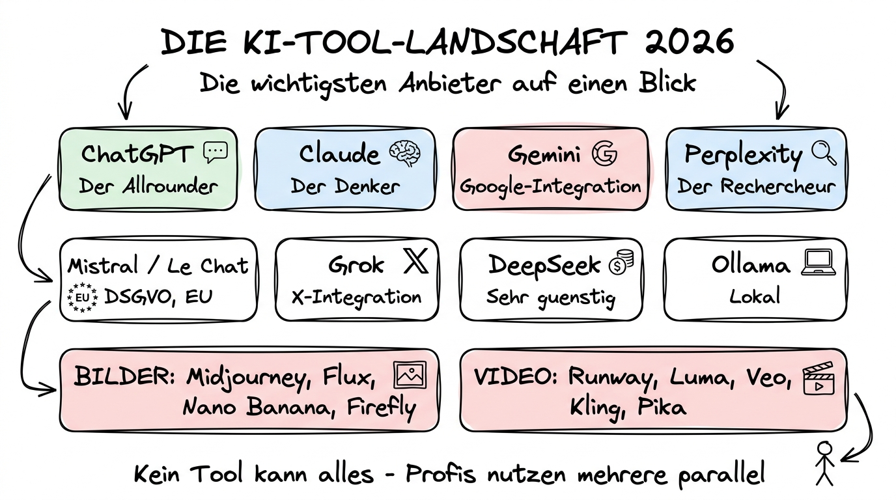

# Die KI-Tool-Landschaft 2026 — Einstieg

**Welche Tools gibt es überhaupt? Und wofür nimmt man welches?**

---

## Warum dieses Tutorial?

Vor drei Jahren gab es für die meisten Menschen genau ein KI-Tool: ChatGPT. Heute — im Frühjahr 2026 — sieht die Welt völlig anders aus. Es gibt **mindestens ein Dutzend ernstzunehmende KI-Assistenten**, mehrere spezialisierte Recherche-Tools, eine wachsende Zahl an Bild- und Videomodellen, und sogar Modelle, die Sie komplett offline auf Ihrem eigenen Rechner laufen lassen können.

Und jede Woche kommt etwas Neues dazu.

Für Einsteiger ist das ein Problem. Nicht, weil die Auswahl zu klein wäre — sondern weil sie zu groß ist. Die häufigste Frage, die ich von Kolleginnen und Kollegen höre, lautet nicht „Wie benutze ich KI?", sondern: **„Welches Tool soll ich überhaupt aufmachen?"**

Dieses Tutorial-Kapitel beantwortet genau diese Frage. Wir gehen die wichtigsten Anbieter Stück für Stück durch, vergleichen ihre Stärken und Schwächen und bauen am Ende einen praktischen Entscheidungsbaum: *Für diese Aufgabe — dieses Tool.*

**Was Sie nach diesem Kapitel wissen werden:**

- Welche KI-Anbieter 2026 relevant sind und wer hinter ihnen steht
- Die wichtigsten Modellfamilien und wofür sie gemacht sind
- Den Unterschied zwischen „Allrounder", „Denker", „Rechercheur" und „Spezialwerkzeug"
- Welche Tools für deutsche und europäische Nutzer aus Datenschutzgründen besonders interessant sind
- Wann sich ein Bezahl-Abo lohnt — und wann die kostenlose Version reicht
- Wie Sie in 60 Sekunden das passende Tool für eine konkrete Aufgabe auswählen

> **Ein wichtiger Hinweis zu Preisen und Modellnamen:** Der KI-Markt bewegt sich schneller als jedes Buch. Alle Zahlen in diesem Tutorial beziehen sich auf den Stand **April 2026**. Wenn Sie das in einem Jahr lesen, sind die Details vermutlich anders — der Grundgedanke jedes Tools bleibt aber in der Regel stabil.

---

## Die große Landkarte: Wer ist wer?

Stellen Sie sich den KI-Markt wie einen Marktplatz vor. Es gibt ein paar große Häuser, ein paar Spezialgeschäfte und ein paar exotische Ecken für Enthusiasten. So sieht die Landkarte 2026 aus:

### Die „Big Five" (Textmodelle und Assistenten)

Das sind die Anbieter, die Sie kennen sollten, wenn Sie überhaupt nur ein Kapitel dieses Tutorials lesen:

| Anbieter | Produkt | Stärke in einem Satz |
|----------|---------|----------------------|
| **OpenAI** | ChatGPT | Der bekannte Allrounder, am weitesten verbreitet, breitestes Ökosystem |
| **Anthropic** | Claude | Der analytische Denker, besonders stark bei langen Texten und Code |
| **Google** | Gemini | Tief in Google Workspace integriert, stark bei multimodalen Aufgaben |
| **Perplexity** | Perplexity | Der Recherche-Spezialist, liefert Quellen zu jeder Aussage |
| **Mistral AI** | Le Chat | Der europäische Anbieter, wichtig für DSGVO-Fragen |

Wenn Sie nichts anderes aus diesem Kapitel mitnehmen: **Diese fünf Namen sollten Sie kennen.** Wir widmen jedem einen eigenen Abschnitt.

### Die zweite Reihe (interessant, aber nicht für jeden)

- **xAI / Grok** — Das KI-Produkt von Elon Musks Firma xAI, eng mit X (Twitter) verknüpft.
- **DeepSeek** — Ein chinesischer Anbieter, der durch extrem niedrige Preise Schlagzeilen gemacht hat.
- **Meta AI** — Hinter Llama, dem bekanntesten Open-Source-Modell.

### Spezialisten

- **Midjourney, Flux, Ideogram, Leonardo, Adobe Firefly** — für Bildgenerierung.
- **Runway, Luma, Pika, Veo, Kling** — für Videogenerierung.
- **NotebookLM** — Googles Recherche-Assistent für eigene Dokumente.
- **Nano Banana** — Googles extrem schnelles Bildmodell, auch als API.

### Lokale und Open-Source-Tools

- **Ollama, LM Studio** — Apps, mit denen Sie KI-Modelle komplett offline auf Ihrem eigenen Rechner laufen lassen.
- **Llama (Meta), Mistral, Qwen, Gemma, DeepSeek** — die wichtigsten offenen Modelle, die man herunterladen kann.

---

## Das Grundproblem: Kein Tool kann alles gleich gut

Viele Einsteiger glauben, dass die KI-Assistenten sich vor allem im Preis unterscheiden. **Das ist ein Missverständnis.** Die Tools haben unterschiedliche Stärken, und wer das einmal verstanden hat, trifft bessere Entscheidungen.

Eine gute Analogie sind Werkstätten:

- **ChatGPT** ist die Allround-Werkstatt mitten in der Stadt. Man bekommt dort fast alles gemacht, die Öffnungszeiten sind gut, und man muss nicht lange erklären, was man will.
- **Claude** ist der Fachbetrieb um die Ecke, der besonders gut mit komplizierten, langen Aufträgen umgehen kann — etwa ein ganzes Buchmanuskript lektorieren oder einen Vertrag prüfen.
- **Gemini** ist die Werkstatt im Einkaufszentrum — praktisch, wenn Sie sowieso schon da sind (sprich: wenn Sie mit Google Docs, Gmail und Google Drive arbeiten).
- **Perplexity** ist die Bibliothek mit angeschlossener Rechercheabteilung. Sie bekommen hier seltener eine fertige Lösung, aber dafür Quellen, Quellen, Quellen.
- **Mistral Le Chat** ist die deutsche Handwerkskammer-Werkstatt: vielleicht nicht das lauteste Schaufenster, aber mit einem klaren europäischen Profil — und oft die einzige sinnvolle Wahl, wenn Datenschutz wirklich wichtig ist.

Niemand würde auf die Idee kommen, jede Autoreparatur bei einem einzigen Werkstatt-Typ zu machen. Bei KI-Tools ist es genauso: **Profis nutzen mehrere Tools nebeneinander.**

---

## Die vier Grundfunktionen moderner KI-Tools

Um die Tools zu vergleichen, hilft es, sich die vier zentralen Funktionen anzuschauen, die inzwischen fast alle großen Anbieter anbieten:

### 1. Der Chat

Das klassische Frage-Antwort-Gespräch. Sie schreiben etwas, die KI antwortet. Hier unterscheiden sich die Tools vor allem in **Stil**, **Genauigkeit**, **Länge des Gedächtnisses** (dem sogenannten „Kontextfenster", siehe Kapitel 00) und darin, wie gut sie mit deutschen Texten umgehen.

### 2. Dateien verarbeiten

Sie können PDF-Dateien, Excel-Tabellen, Word-Dokumente, Bilder und Tonaufnahmen hochladen und die KI fragen, was darin steht. Alle großen Anbieter können das inzwischen — aber mit deutlichen Qualitätsunterschieden.

### 3. Web-Recherche und Quellen

Die KI greift auf das aktuelle Internet zu und liefert eine Antwort mit Links zu den Fundstellen. Perplexity hat das als Erster perfektioniert, inzwischen bieten alle großen Anbieter so einen Modus — in unterschiedlicher Qualität.

### 4. Agenten und Werkzeuge

Die KI führt auf Ihren Wunsch hin eigenständig Aktionen aus: bestellt ein Flugticket, füllt eine Tabelle aus, schreibt eine E-Mail und schickt sie ab, sucht in Ihrem Google Drive nach einer Datei. 2026 ist das der heißeste Trend und gleichzeitig das, wobei die Tools sich am stärksten unterscheiden.

Wenn Sie die folgenden Kapitel lesen, halten Sie diese vier Dimensionen im Kopf. Jeder Anbieter ist in einer oder zwei davon besonders gut.

---

## Was dieses Kapitel nicht leisten kann

Zwei ehrliche Warnungen, bevor wir einsteigen:

**Erstens:** Die Preise und Modellnamen veralten schnell. Ich nenne sie trotzdem, weil eine Größenordnung hilft — aber verlassen Sie sich bei konkreten Zahlen nicht blind auf dieses Dokument, sondern schauen Sie vor dem Kauf auf der Herstellerseite nach.

**Zweitens:** Ich bin nicht neutral. Niemand, der ernsthaft mit KI arbeitet, kann das sein. Ich werde Empfehlungen aussprechen und begründen — aber Sie müssen am Ende selbst entscheiden, was zu Ihrer Arbeit passt. Wenn Sie zu einem anderen Schluss kommen als ich, ist das kein Fehler, sondern ein Zeichen dafür, dass Sie den Stoff verstanden haben.

---

## Nächste Schritte

Die nächsten sechs Tutorials gehen jeden Anbieter einzeln durch. Beginnen wir mit dem bekanntesten:

**Weiter mit:** [02 OpenAI — ChatGPT und die GPT-Familie](./02%20OpenAI%20-%20ChatGPT%20und%20die%20GPT-Familie.md)

Wenn Sie schnell zu einer Empfehlung springen wollen, ohne alle Detail-Kapitel zu lesen:

**Spring zu:** [08 Entscheidungsbaum — Welches Tool wofür?](./08%20Entscheidungsbaum%20-%20Welches%20Tool%20wofuer.md)

Und wenn Sie Kapitel 00 (Grundlagen LLMs) noch nicht gelesen haben und der Begriff „Kontextfenster" für Sie Spanisch war, empfehle ich, dort kurz nachzuschlagen — das Grundverständnis macht die Vergleiche in den folgenden Kapiteln viel verständlicher.
