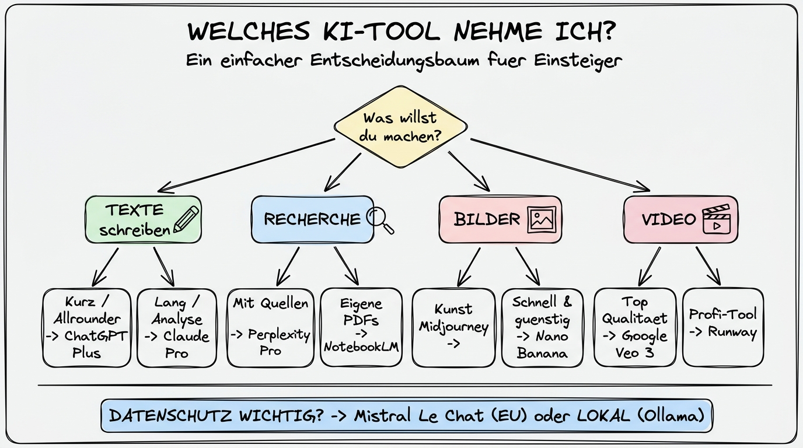

# Entscheidungsbaum — Welches Tool wofür?

**Die praktische Kurzfassung dieses Kapitels: Aufgabe → Empfehlung**

---

## Warum dieses Tutorial?

Sie haben jetzt sechs detaillierte Kapitel über verschiedene Anbieter gelesen (oder wenigstens überflogen) und sollen am Ende trotzdem eine **praktische Entscheidung** treffen können. Dieses Kapitel ist die Zusammenfassung: eine Sammlung von Fragen, die Sie sich stellen können, mit klaren Empfehlungen.

Betrachten Sie das als eine **Schnellreferenz**. Wenn Sie unsicher sind, welches Tool Sie für eine neue Aufgabe nehmen sollen — scrollen Sie hierher, finden Sie den passenden Abschnitt und wissen Sie in 30 Sekunden, wo Sie anfangen.

**Was Sie nach diesem Tutorial wissen werden:**

- Eine klare, kurze Empfehlung für die 20 häufigsten KI-Aufgaben im Alltag
- Einen visuellen Entscheidungsbaum zum Ausdrucken
- Eine Vergleichstabelle der fünf wichtigsten Anbieter auf einer Seite
- Drei Beispiel-Szenarien, die mehrere Tools kombinieren

---

## Die große Entscheidungsmatrix

Hier die Empfehlungen, sortiert nach Aufgabe. **Erstempfehlung** ist der empfohlene Startpunkt — **Alternative** ist ebenfalls eine gute Wahl, oft mit anderer Charakteristik.

### Texte schreiben und überarbeiten

| Aufgabe | Erstempfehlung | Alternative |
|---------|----------------|-------------|
| Kurze Mail schreiben | ChatGPT Plus | Claude Pro |
| Langer Artikel / Blog-Post | Claude Pro | ChatGPT Plus |
| Lektorat eines langen Textes | Claude Pro | Mistral Le Chat Pro |
| Übersetzung | ChatGPT / Claude (beide gut) | DeepL (klassisch, aber stark) |
| Pressemitteilung | Claude Pro | ChatGPT Plus |
| Roman-Entwurf / kreatives Schreiben | Claude Pro | ChatGPT Plus |
| Tweet / LinkedIn-Post | ChatGPT Plus | Claude Pro |

### Recherche und Information

| Aufgabe | Erstempfehlung | Alternative |
|---------|----------------|-------------|
| Schnelle Faktenfrage | Perplexity (Free genügt oft) | Gemini Free mit Suche |
| Marktanalyse / Wettbewerbsvergleich | **Perplexity Deep Research** | ChatGPT Deep Research |
| Wissenschaftliche Recherche | Perplexity (Academic Mode) | Claude Pro mit Web-Suche |
| Fachbücher / interne PDFs befragen | **NotebookLM** | Claude Pro mit Datei-Upload |
| Aktuelle Nachrichten | Perplexity | Gemini (mit Websuche) |
| Quellen-Zitierung für eine Hausarbeit | Perplexity | Perplexity (kein zweiter Name nötig) |

### Daten und Analyse

| Aufgabe | Erstempfehlung | Alternative |
|---------|----------------|-------------|
| Excel-Tabelle auswerten | ChatGPT Plus (Code Interpreter) | Claude Pro |
| Chart/Visualisierung aus Daten | ChatGPT Plus | Claude Pro |
| PDF-Tabelle extrahieren | Claude Pro (lange Kontexte!) | ChatGPT Plus |
| Finanzmodell bauen | ChatGPT Plus | Claude Pro |
| Statistik-Frage beantworten | Claude Pro | Perplexity (mit Academic-Fokus) |

### Bilder erzeugen

| Aufgabe | Erstempfehlung | Alternative |
|---------|----------------|-------------|
| Bild für Präsentation | Nano Banana (Gemini) | DALL·E (ChatGPT) |
| Künstlerisches Bild, Cover | **Midjourney** | Flux Pro |
| Social-Media-Grafik mit Text | **Ideogram** | Adobe Firefly |
| Logo-Konzept | Midjourney + Ideogram | Flux Pro |
| Produkt-Mockup mit präziser Vorgabe | **Flux Pro** | Nano Banana |
| Bild mit kommerzieller Rechtssicherheit | **Adobe Firefly** | — |
| Offline / Datenschutz-Bild | Stable Diffusion / Flux Dev lokal | — |
| Viele Bilder schnell und günstig | Nano Banana (API) | Flux Schnell |

### Videos erzeugen

| Aufgabe | Erstempfehlung | Alternative |
|---------|----------------|-------------|
| Kurzer Clip höchster Qualität | **Google Veo 3** (Gemini Pro) | Runway Gen-4 |
| Professionelles Video mit Kontrolle | **Runway Gen-4** | Kling |
| Schneller Experimentier-Clip | Luma Dream Machine | Pika |
| Clip mit nativem Audio | **Google Veo 3** | — |
| Bestehendes Bild animieren | Runway oder Luma | Kling |

### Code und Entwicklung

| Aufgabe | Erstempfehlung | Alternative |
|---------|----------------|-------------|
| Einfaches Script / kleine Funktion | Claude Pro | ChatGPT Plus |
| Komplexes Refactoring | **Claude Pro (+ Claude Code)** | ChatGPT Plus |
| Debugging eines Fehlers | Claude Pro | ChatGPT Plus (GPT-5 Thinking) |
| Code-Review | Claude Pro | — |
| Lokale Code-Arbeit auf eigenem Rechner | **Claude Code** (Desktop/Terminal) | — |
| Günstige API für eigene Experimente | DeepSeek API | Mistral API |

### Multitool-Aufgaben und Agenten

| Aufgabe | Erstempfehlung | Alternative |
|---------|----------------|-------------|
| „Finde mir drei Hotels und vergleiche" | ChatGPT Plus (Agent Mode) | Perplexity Pro |
| Dokumenten-Ordner automatisieren | **Claude Code** (lokal) | Cowork-Modus (Claude Desktop) |
| Mehrere Google-Dienste orchestrieren | **Gemini for Workspace** | — |
| Tiefer Recherche-Bericht | Perplexity Deep Research | ChatGPT Deep Research |

### Datenschutz-kritische Aufgaben

| Aufgabe | Erstempfehlung | Alternative |
|---------|----------------|-------------|
| Personenbezogene Daten verarbeiten | **Mistral Le Chat** oder **lokal** (Ollama) | ChatGPT Team/Enterprise |
| Interne Unternehmensdokumente | Mistral Le Chat Pro oder lokal | Claude Team |
| Sensible Mandantendaten (Anwalt, Arzt) | **Lokal** (Ollama, LM Studio) | Mistral Enterprise |
| Normale Büroarbeit ohne Personenbezug | ChatGPT Plus / Claude Pro | Alle |

---

## Der visuelle Entscheidungsbaum

Die obige Illustration fasst den wichtigsten Entscheidungspfad für Einsteiger zusammen. Für die 80/20-Regel reicht dieser Baum völlig aus.

---

## Die Vergleichstabelle auf einen Blick

| Kriterium | ChatGPT | Claude | Gemini | Perplexity | Mistral |
|-----------|---------|--------|--------|------------|---------|
| **Beste Stärke** | Allrounder, Ökosystem | Lange Texte, Code | Google-Integration, Multimodal | Recherche mit Quellen | EU-Datenschutz |
| **Kontextfenster** | Groß | **Sehr groß (1M Token)** | Sehr groß | Fokus auf Web | Groß |
| **Bildgenerierung** | Ja (DALL·E) | Nein | Ja (Imagen/Nano Banana) | Ja (rudimentär) | Ja (Pixtral) |
| **Videogenerierung** | Nein (nativ) | Nein | **Veo 3 (Top)** | Nein | Nein |
| **Agent-Mode** | Ja, stark | Ja (Claude Code) | Ja | Ja (Comet in Beta) | Begrenzt |
| **Lange PDF-Analyse** | Gut | **Sehr gut** | Gut | Gut (mit Web-Ergänzung) | Gut |
| **Deutsch-Qualität** | Sehr gut | **Sehr gut** | Gut | Sehr gut | **Sehr gut** |
| **Einfachster Einstieg** | **Ja** | Ja | Ja | Ja | Ja |
| **DSGVO-Eignung** | Nur Team/Enterprise | Nur Team/Enterprise | Workspace-Enterprise | Eingeschränkt | **Ja** |
| **Preis (Pro-Plan)** | ca. 23 € / Monat | ca. 23 € / Monat | ca. 20 € / Monat | ca. 23 € / Monat | ca. 15 € / Monat |
| **Kostenlose Nutzung** | Eingeschränkt | Eingeschränkt | Großzügig | Eingeschränkt | Großzügig |

---

## Drei realistische Kombinations-Szenarien

### Szenario 1 — Die Marketingverantwortliche in einer Mittelstand-Firma

**Aufgaben:** Social-Media-Posts schreiben, Bilder für LinkedIn erstellen, Marktrecherche für die Geschäftsführung, Pressemitteilungen verfassen, gelegentlich Excel-Analysen.

**Empfohlenes Setup:**
- **ChatGPT Plus** als Haupt-Assistent für Texte, Mails, Schnellarbeit
- **Perplexity Pro** für Recherche und Wettbewerbsanalysen
- **Nano Banana** über die Gemini App (Free genügt) für schnelle Bilder
- Gelegentlich **Midjourney Basic** (~10 USD/Monat), wenn wirklich hochwertige Bilder nötig sind

**Monatliche Kosten:** ca. 55 €
**Warum:** Die Kombi deckt 95 Prozent aller Aufgaben ab, ist bezahlbar, und jede Komponente hat einen klaren Zweck.

### Szenario 2 — Der kommunal Angestellte mit Datenschutz-Fokus

**Aufgaben:** Protokolle schreiben, Bürger-Anfragen beantworten, interne Berichte, juristische Texte überarbeiten. **Keine Option:** Amerikanische Cloud-Dienste für sensible Inhalte.

**Empfohlenes Setup:**
- **Mistral Le Chat Pro** als Haupt-Assistent (EU-gehostet)
- **NotebookLM Free** für öffentliche Dokumenten-Recherche (nicht-kritisch)
- **LM Studio mit einem Llama- oder Mistral-Modell lokal** für streng vertrauliche Inhalte
- **Perplexity Free** für öffentliche Recherche

**Monatliche Kosten:** ca. 15 €
**Warum:** Datenschutz steht im Vordergrund, Mistral deckt die Alltagsarbeit ab, lokale Modelle fangen die sensibelsten Fälle auf, und Perplexity-Free reicht für öffentliche Recherche.

### Szenario 3 — Die freiberufliche Texterin

**Aufgaben:** Lange Artikel schreiben, Kundenrecherchen, Lektorat eigener und fremder Texte, gelegentlich Bilder für Blog-Beiträge.

**Empfohlenes Setup:**
- **Claude Pro** als Haupt-Werkzeug für Schreiben und Lektorat
- **ChatGPT Plus** als Zweit-Assistent für Agent-Mode und Bildgenerierung
- **Perplexity Pro** für Recherche
- **Nano Banana** (über Gemini Free) für Blog-Bilder

**Monatliche Kosten:** ca. 65 €
**Warum:** Schreiben ist Kerngeschäft, Claude ist hier führend. ChatGPT ergänzt mit Agent-Mode und Ökosystem. Perplexity deckt Recherche ab. Bilder sind Nebensache.

---

## Drei Anti-Patterns — häufige Fehler

### Fehler 1: „Ich nehme alle Abos auf einmal"

Viele Einsteiger abonnieren aus Neugier ChatGPT, Claude, Gemini und Perplexity gleichzeitig — und geben dann 80 bis 100 € im Monat aus, ohne ein einziges Tool wirklich gut zu lernen. **Bessere Strategie:** Starten Sie mit **einem** Haupt-Werkzeug (meistens ChatGPT Plus) und fügen Sie erst nach einem Monat ein zweites hinzu, wenn Sie eine konkrete Lücke merken.

### Fehler 2: „Ich brauche immer die neueste Version"

Die Modellversionen ändern sich alle paar Monate. Wer jedes Mal sein Tool wechselt, verbringt mehr Zeit mit Umlernen als mit produktiver Arbeit. **Bessere Strategie:** Bleiben Sie bei Ihrem Stack und wechseln Sie erst dann, wenn Sie eine spürbare, konkrete Schwäche bemerken — nicht, weil ein Benchmark im Internet zeigt, dass ein anderes Modell 3 Prozent besser ist.

### Fehler 3: „Ich nutze ChatGPT für alles"

Das ist das Gegenstück zum ersten Fehler. ChatGPT ist ein hervorragender Allrounder, aber es ist nicht das beste Tool für **jede** Aufgabe. Wer nur ChatGPT kennt, verpasst enorme Produktivitätsgewinne bei Recherche (Perplexity), langen Dokumenten (Claude), Datenschutz (Mistral), eigenen Quellen (NotebookLM) und Video (Veo/Runway). **Bessere Strategie:** Nehmen Sie sich bewusst alle paar Monate eine Aufgabe vor, bei der Sie mit ChatGPT unzufrieden waren, und probieren Sie ein alternatives Tool gezielt dafür aus.

---

## Zusammenfassung in 60 Sekunden

Die Wahl des richtigen KI-Tools hängt fast immer davon ab, **was Sie erzeugen wollen**: Texte (Claude, ChatGPT), Wissen (Perplexity), multimodale Arbeit im Google-Umfeld (Gemini), Datenschutz-kritische Arbeit (Mistral oder lokal), Bilder (Nano Banana/Midjourney/Flux), Videos (Veo/Runway). Für die meisten Einsteiger ist **ChatGPT Plus oder Claude Pro + Perplexity Pro** ein sehr guter Startstack. Wer beruflich Datenschutz im Blick hat, ergänzt oder ersetzt durch **Mistral Le Chat Pro**. Alles weitere ergibt sich aus konkreten, wiederkehrenden Aufgaben.

---

## Nächste Schritte

**Weiter mit:** [09 Kosten, Abos und Datenschutz im Detail](./09%20Kosten%20Abos%20Datenschutz.md)

Das letzte Kapitel gibt eine tiefergehende Behandlung der Kosten- und Datenschutz-Frage — besonders hilfreich, wenn Sie für Ihre Organisation eine Empfehlung aussprechen sollen.
