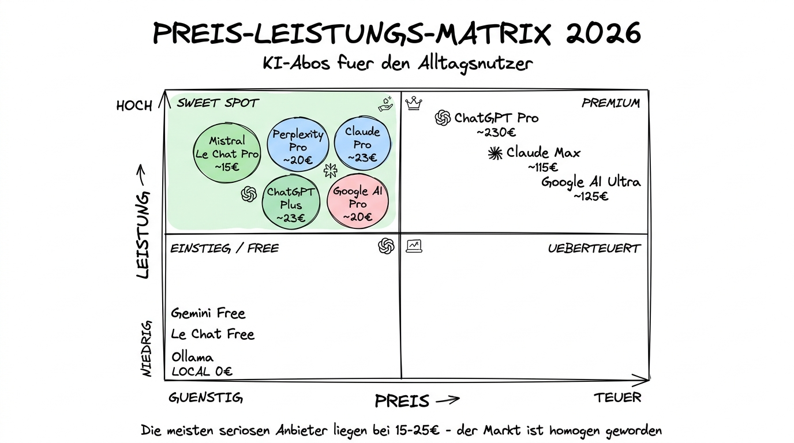

# Kosten, Abos und Datenschutz

**Das Finanz- und Rechtskapitel — so argumentieren Sie Ihre Entscheidung gegenüber der Chefin oder dem Datenschutzbeauftragten**

---

## Warum dieses Tutorial?

Die sechs vorherigen Kapitel haben Ihnen gezeigt, **welches Tool was kann**. Dieses Kapitel beantwortet zwei Fragen, die am Ende jeder Diskussion stehen:

1. **„Was kostet das alles eigentlich, und wo ist das meiste Geld wert?"**
2. **„Darf ich das in meinem Beruf / meiner Organisation überhaupt verwenden?"**

Beide Fragen sind nicht glamourös, aber sie sind entscheidend. Ich habe schon oft erlebt, dass jemand nach Wochen begeisterter Nutzung plötzlich an einer internen Datenschutz-Hürde scheitert — und dann alles vom Anfang neu denken muss. Dieses Kapitel hilft, das zu vermeiden.

**Was Sie nach diesem Tutorial wissen werden:**

- Wie Sie KI-Abos rational budgetieren — und wo der Break-Even wirklich liegt
- Die wichtigsten Preispläne im direkten Vergleich, Stand April 2026
- Welche rechtlichen Rahmenbedingungen Sie als europäischer Nutzer berücksichtigen müssen
- Was Sie Ihrem Datenschutzbeauftragten sagen können — und was besser vertraulich bleibt
- Einen praktischen Kriterien-Katalog für die Tool-Auswahl in Organisationen

---

## Teil 1 — Die Kostenstruktur verstehen

### Drei Preismodelle, die Sie unterscheiden sollten

Die meisten Einsteiger werfen „KI kostet 20 € im Monat" in einen Topf, ohne zu verstehen, dass drei verschiedene Preismodelle im Spiel sind:

**1. Abo-basierte Chat-Oberflächen** (ChatGPT Plus, Claude Pro, Gemini Pro, Perplexity Pro, Le Chat Pro)

Sie zahlen einen festen Monatsbetrag und bekommen dafür eine Chat-Oberfläche mit Mengenbegrenzung. Typischer Preis: 15–25 € pro Monat. Das ist der Plan, den die allermeisten Privatnutzer wählen sollten.

**2. Vielnutzer-Abos** (ChatGPT Pro, Claude Max)

Deutlich teurer (100–230 € pro Monat), dafür effektiv unbegrenzte Nutzung. Für Profis, die das Tool acht Stunden am Tag verwenden, kann sich das lohnen — für alle anderen ist es ein klassischer Fall von „gut gemeint, schlecht investiert".

**3. Pay-per-Use über die API** (OpenAI API, Anthropic API, Mistral API, DeepSeek API, Gemini API)

Sie zahlen pro verarbeitetem Token — also pro Wort, grob gesagt. Die Preise schwanken je nach Modell um den Faktor 50 oder mehr. Dieser Weg ist für Entwickler und Workflows relevant, nicht für normale Endnutzer — aber wichtig zu wissen, dass er existiert, weil viele Tools im Hintergrund über API abrechnen (z.B. wenn Sie eine eigene Skill oder einen Custom-Agenten bauen).

### Die realistische Jahresrechnung

Schauen wir uns an, was ein typischer professioneller Nutzer 2026 tatsächlich ausgibt. Ich rechne in Euro, Stand April 2026.

**Der Minimalist**
- 1 Abo: ChatGPT Plus ODER Claude Pro (ca. 23 €/Monat)
- Plus gelegentlich kostenlose Tools (Gemini Free, Perplexity Free)
- **Jahreskosten:** ca. 275 €

**Der Durchschnittsprofi**
- ChatGPT Plus oder Claude Pro (23 €/Monat)
- Perplexity Pro (23 €/Monat)
- Gemini Free oder Nano Banana-API (0–5 €/Monat)
- **Jahreskosten:** ca. 555 €

**Der Vielnutzer mit drei Abos**
- Claude Pro, ChatGPT Plus, Perplexity Pro, Google AI Pro (jeweils ~20 €)
- **Jahreskosten:** ca. 950 €

**Der EU-Datenschutz-Nutzer**
- Mistral Le Chat Pro (ca. 15 €/Monat)
- NotebookLM und Gemini Free für öffentliche Recherche
- Ollama lokal (kostenlos, einmalige Hardware-Investition)
- **Jahreskosten:** ca. 180 €

### Wann lohnt sich ein Abo?

Die ehrliche Rechnung für Privatpersonen: **Ein Abo für 23 € pro Monat amortisiert sich schon dann, wenn Sie mindestens einmal pro Woche mit KI eine Stunde Arbeit einsparen, die Sie sonst anders erledigt hätten.**

Eine Stunde Ihrer Zeit ist in den meisten Fällen deutlich mehr wert als der anteilige Abo-Preis (der liegt bei ca. 0,76 € pro Tag). Wenn Sie also beim ersten Ausprobieren schon merken, dass Ihnen ein Tool in einer Stunde eine andere Stunde erspart hat — abonnieren.

Wenn Sie nach zwei Wochen im Free-Plan merken, dass Sie die Grenzen dauernd spüren, ebenfalls: abonnieren. Die Free-Pläne sind bewusst zu eng geschnitten, um den Schritt zum Bezahl-Plan attraktiv zu machen.

### Wann lohnt sich ein Abo **nicht**?

- Wenn Sie KI nur maximal 2–3 mal pro Monat brauchen — dann reicht Free oder gar kein Abo.
- Wenn Sie beruflich in einer Organisation arbeiten, die bereits eine Enterprise-Lösung hat (z.B. Microsoft Copilot über M365 oder Gemini for Workspace). Prüfen Sie zuerst, was ohnehin verfügbar ist.
- Wenn Sie eigentlich ein anderes Abo brauchen würden (z.B. Perplexity Pro für Recherche), aber aus Gewohnheit einfach ChatGPT Plus bezahlen.

---

## Teil 2 — Die Preistabelle 2026 im direkten Vergleich

Die folgende Tabelle zeigt die wichtigsten Abos in den relevanten Stufen, Stand April 2026. Beachten Sie: US-Preise in USD werden grob zum Tageskurs in Euro umgerechnet; echte EU-Preise können je nach Steuerlage abweichen.

| Plan | Monatlich (ca.) | Jährlich (ca.) | Enthalten |
|------|-----------------|----------------|-----------|
| **ChatGPT Free** | 0 € | 0 € | Begrenzte Nutzung, kleines Modell |
| **ChatGPT Plus** | 23 € | 275 € | Voller Zugang, GPT-5 Thinking, DALL·E, Custom GPTs |
| **ChatGPT Pro** | 230 € | 2750 € | Unbegrenzt, Pro-Priorität, Agent-Mode |
| **ChatGPT Team** | ab 25 €/Nutzer | ab 300 €/Nutzer | Plus + Datenschutz-Zusage + Admin |
| **Claude Free** | 0 € | 0 € | Begrenzte Sonnet-Nutzung |
| **Claude Pro** | 23 € | 275 € | Voller Sonnet-Zugang, Opus begrenzt, Projects, Claude Code |
| **Claude Max (Tier 1)** | ca. 115 € | ca. 1380 € | Deutlich höhere Limits |
| **Claude Team** | ab 25 €/Nutzer | ab 300 €/Nutzer | Pro + Datenschutz + Shared Projects |
| **Google Gemini Free** | 0 € | 0 € | Gemini Flash + Begrenzte Pro-Nutzung |
| **Google AI Pro** | 20 € | 240 € | Gemini 3 Pro, Veo-Quote, NotebookLM Pro |
| **Google AI Ultra** | 125 € | 1500 € | Ultra-Modell, Vollzugriff Veo |
| **Gemini for Workspace** | ab 25 €/Nutzer | ab 300 €/Nutzer | In Docs, Gmail, Sheets eingebaut |
| **Perplexity Free** | 0 € | 0 € | Begrenzte Pro Searches, kein Deep Research |
| **Perplexity Pro** | 23 € | ca. 200 € (Jahres-Rabatt!) | Deep Research, alle Modelle |
| **Mistral Le Chat Pro** | 15 € | 180 € | Voller Zugang, EU-Hosting |
| **Mistral Enterprise** | individuell | individuell | Maßgeschneiderte EU-Lösung |
| **Midjourney Basic** | 10 USD (~9 €) | ca. 100 € | Begrenzte Bilder, Standard-Stile |
| **Midjourney Standard** | 30 USD (~28 €) | ca. 300 € | Unbegrenzt, Fast-Queue |
| **Runway Standard** | 15 USD (~14 €) | ca. 170 € | Moderate Video-Credits |
| **Runway Pro** | 35 USD (~33 €) | ca. 400 € | Mehr Credits, längere Clips |
| **Ollama / LM Studio** | 0 € | 0 € | Lokal, kein Abo |

**Hinweis:** Viele Anbieter geben bei Jahresabos einen Rabatt von 15–20 Prozent. Wer sicher ist, dass er das Tool länger nutzt, spart damit ein bis zwei Monate pro Jahr.

---

## Teil 3 — Die Preis-Leistungs-Landkarte

Die Illustration zeigt die wichtigsten Anbieter in einem 2x2-Raster: Preis (horizontal) gegen Leistung für den Durchschnittsnutzer (vertikal). Die meisten seriösen Anbieter clustern sich im mittleren Segment bei ca. 15–25 € pro Monat — der Markt ist erstaunlich homogen geworden.

---

## Teil 4 — Datenschutz: Was europäische Nutzer wissen müssen

### Die Grundfrage: Wer ist der Verantwortliche?

Wer im deutschen und europäischen Recht personenbezogene Daten verarbeitet, ist immer **Verantwortlicher** im Sinne der DSGVO — und muss sich überlegen:

- **Wer bekommt meine Daten zu sehen?** (Der KI-Anbieter)
- **Wo werden sie verarbeitet?** (USA, EU, China?)
- **Dürfen sie zum Training des Modells verwendet werden?**
- **Habe ich einen Auftragsverarbeitungs-Vertrag (AVV) mit dem Anbieter?**
- **Welche Rechtsgrundlage stützt die Verarbeitung?**

Wenn Sie das als Privatperson ausschließlich zur privaten Nutzung tun, ist vieles davon für Sie entspannt (die DSGVO adressiert nicht rein private Nutzung). Sobald Sie aber **beruflich** arbeiten, gelten die Regeln voll.

### Die Anbieter nach Datenschutz-Einordnung

Hier eine pragmatische Sortierung — ohne Rechtsberatung zu sein, aber nach meinem Verständnis der Lage im April 2026:

**Tier 1 — Für EU-Nutzung am unkritischsten**
- **Mistral AI** (EU-Anbieter, französisch) — für die meisten Aufgaben sauber nutzbar
- **Lokale Modelle** (Ollama, LM Studio) — nichts verlässt Ihren Rechner

**Tier 2 — Nutzbar mit passendem Vertrag und Aufmerksamkeit**
- **Google Workspace mit Gemini** — Google hat seit Jahren DSGVO-konforme Verträge für Unternehmenskunden. Wer Google Workspace bereits nutzt, kann Gemini meistens im gleichen Rahmen verwenden.
- **ChatGPT Team und Enterprise** — mit der vertraglichen Zusage, dass Daten nicht zum Training verwendet werden, und mit regional verfügbaren Rechenzentren.
- **Claude Team und Enterprise** — ähnliche Situation, etwas mehr Flexibilität bei Enterprise-Konditionen.

**Tier 3 — Für sensitive berufliche Nutzung eher ungeeignet**
- **ChatGPT Plus, Claude Pro, Perplexity Pro, Gemini Pro als Privatkunden-Abos** — die Verträge sind für Verbraucher gemacht, nicht für Organisationen mit DSGVO-Pflichten. Private Nutzung okay, beruflich nur mit Vorsicht und niemals für personenbezogene Daten.
- **Grok** — US-Anbieter plus X-Integration; für europäische Berufsnutzung komplex.

**Tier 4 — Nur mit sehr guten Gründen**
- **DeepSeek** — Datenverarbeitung in China, für EU-berufliche Nutzung mit sensiblen Daten nicht empfehlenswert. Offene Modelle lokal sind eine Alternative, die diesen Haken umgeht.

### Die drei Grundregeln für den Berufsalltag

Wenn Sie als Einzelperson im Beruf mit KI arbeiten und nicht in jeder Situation einen Anwalt fragen können, helfen drei einfache Regeln:

**Regel 1: Keine echten Namen oder IDs.**
Ersetzen Sie Kundennamen durch „Kunde A", Mitarbeiternamen durch „Person X", Fallnummern durch Platzhalter. Das reduziert die Datenschutz-Belastung massiv, oft sogar auf ein Niveau, bei dem die DSGVO gar nicht mehr greift.

**Regel 2: Keine Daten, die Sie auch nicht in ein externes Outlook-Postfach einfügen würden.**
Das ist eine brauchbare Faustregel. Wenn Sie einen Text in ein US-Tool kopieren, kopieren Sie ihn effektiv in die USA. Wenn das für den Text akzeptabel wäre (weil er ohnehin öffentlich ist oder keine personenbezogenen Daten enthält), dürfen Sie es mit KI tun. Wenn nicht, dann nicht.

**Regel 3: Im Zweifel Mistral oder lokal.**
Wenn Sie unsicher sind, ob ein Inhalt in ein US-Tool darf, nehmen Sie einen EU-Anbieter (Mistral) oder ein lokales Modell. Im schlimmsten Fall haben Sie etwas länger am Tool geübt, das sowieso in vielen Organisationen an Bedeutung gewinnen wird.

### Der AI Act der EU

Seit 2024 gibt es auf EU-Ebene den **AI Act** — eine Verordnung, die KI-Systeme nach Risiko-Kategorien einteilt und unterschiedliche Pflichten vorsieht. Einige Teile sind bereits wirksam, andere treten gestaffelt in Kraft. Für Endnutzer die wichtigsten Punkte:

- **Generative KI-Anbieter** müssen bestimmte Transparenz-Pflichten einhalten (Kennzeichnung von KI-Inhalten, Trainingsdaten-Zusammenfassung, etc.).
- **Hochrisiko-Anwendungen** (z.B. in der Personalauswahl oder bei Behörden-Entscheidungen) haben zusätzliche Dokumentations- und Prüfpflichten.
- **Verbotene Praktiken** (z.B. Social Scoring oder biometrische Echtzeit-Überwachung in bestimmten Kontexten) sind schon wirksam.

Für die meisten Alltagsnutzer hat der AI Act keine direkten Folgen — aber er ist der Grund, warum manche Anbieter bestimmte Funktionen in Europa anders anbieten als in den USA oder die Einführung verzögern.

---

## Teil 5 — Kriterien-Katalog für Organisationen

Wenn Sie in Ihrer Organisation eine Empfehlung aussprechen oder eine Tool-Entscheidung treffen sollen, helfen diese Fragen:

### Die zwölf Kriterien

1. **Gesamtkosten** — nicht nur der Listenpreis, sondern auch die Einführungskosten (Schulungen, Integrationen).
2. **Nutzerzahl** — wie viele Menschen brauchen das Tool?
3. **DSGVO-Compliance** — gibt es einen Auftragsverarbeitungs-Vertrag? Werden Daten in der EU verarbeitet?
4. **Verarbeitete Datenkategorien** — nur öffentliche Inhalte oder auch personenbezogene Daten?
5. **Integration in bestehende Tools** — passt es zu Ihrer Office-Suite? Gibt es APIs?
6. **Trainings-Opt-out** — werden Ihre Eingaben zum Modelltraining verwendet? Können Sie das abschalten?
7. **Admin- und Audit-Funktionen** — wer kann was sehen? Gibt es Protokolle?
8. **Single Sign-On (SSO)** — Unterstützung für Ihr Identity-System?
9. **Support und Verfügbarkeit** — ist der Anbieter im Problemfall erreichbar?
10. **Vertragliche Bindung** — monatlich kündbar oder Jahresvertrag?
11. **Zukunftsfähigkeit** — ist der Anbieter stabil genug, um in drei Jahren noch da zu sein?
12. **Ethisches Profil** — wie steht der Anbieter zu Datenschutz, Urheberrecht, Umweltaspekten?

Die ehrlichste Antwort darauf ist: **Kein Anbieter erfüllt alle zwölf Kriterien ideal.** Sie müssen priorisieren. Für eine öffentliche Verwaltung steht Kriterium 3 (DSGVO) ganz oben. Für ein Startup mit Fokus auf Geschwindigkeit steht Kriterium 5 (Integration) weiter vorne. Beide dürfen zu unterschiedlichen Ergebnissen kommen.

### Ein praktisches Beispiel

Eine deutsche Stadt mit 400 Mitarbeitenden in der Verwaltung denkt über KI-Einführung nach. Priorisierung:

- **Höchste Priorität:** DSGVO-Konformität, EU-Datenverarbeitung, DSB-Akzeptanz.
- **Mittlere Priorität:** Integration in die vorhandene Office-Suite, Admin-Features.
- **Niedrige Priorität:** Bildgenerierung, Video-Features.

Das führt zu einem klaren Ergebnis: **Mistral Enterprise als Hauptanbieter**, ergänzt durch ein **lokales Modell über Ollama** für besonders sensible Fälle, und eventuell **NotebookLM** für öffentliche Dokumenten-Recherche. Kein ChatGPT, kein Claude, kein Grok, kein DeepSeek — trotz potenziell höherer Modellqualität.

Für eine Werbeagentur mit 12 Mitarbeitenden in Berlin wäre die Priorisierung anders: Bildgenerierung und Geschwindigkeit stünden oben, Datenschutz-Anforderungen (die Agentur arbeitet mit öffentlichen Markenbildern, nicht mit Mandantendaten) wären weniger dringend. Ergebnis: **ChatGPT Team** als Haupt-Stack, **Midjourney** für Kunstrichtung, **Runway** für Video, **Perplexity Pro** für Recherche.

Beide Entscheidungen sind richtig. Sie folgen nur unterschiedlichen Prioritäten.

---

## Zusammenfassung in 60 Sekunden

Ein professionelles KI-Setup kostet 2026 zwischen **15 und 70 €** pro Monat, je nach Anbieter-Mix. Die Free-Tiers reichen für Gelegenheitsnutzer, aber jeder, der mehrmals pro Woche arbeitet, amortisiert ein 20-€-Abo sehr schnell. Datenschutzrechtlich ist **Mistral** der unkomplizierteste EU-Anbieter; **Google Workspace mit Gemini** ist für Organisationen mit passendem Vertrag eine saubere Option; **ChatGPT und Claude** sind privat und mit Team-/Enterprise-Verträgen auch beruflich gut nutzbar. **Für besonders sensitive Aufgaben** bleiben lokale Modelle (Ollama) die sicherste Option. In Organisationen sollten Sie den Kriterien-Katalog in diesem Kapitel als Checkliste verwenden und die Wahl begründet dokumentieren — das macht die spätere Diskussion mit dem Datenschutzbeauftragten deutlich einfacher.

---

## Nächste Schritte

**Das war das letzte Kapitel zur Tool-Landschaft.** Wenn Sie bis hierher gekommen sind, haben Sie ein solides Gesamtbild. Empfohlene nächste Schritte:

- **Kapitel 10 (neu)** — Claude-Infrastruktur: Cowork, Claude Code und VS Code im Detail. Wenn Sie Claude in Ihrer täglichen Arbeit wirklich produktiv einsetzen wollen, ist das die natürliche Fortsetzung.
- **Kapitel 01** — Prompt Engineering Text: Wer die Tools kennt, aber noch nicht weiß, wie man gut promptet, profitiert jetzt am meisten von diesem Kapitel.
- **Kapitel 08** — Prompt Bibliothek: 18 sofort nutzbare Prompt-Templates, die Sie mit jedem hier vorgestellten Tool ausprobieren können.

Und ein letzter Rat: **Probieren Sie die Dinge wirklich aus.** Lesen allein bringt zehn Prozent. Die anderen neunzig Prozent entstehen beim Tun. Starten Sie mit einer einzigen Aufgabe aus Ihrem Alltag und lösen Sie sie diese Woche mit einem der vorgestellten Tools. Beim nächsten Kapitel sind Sie dann schon erfahren.
