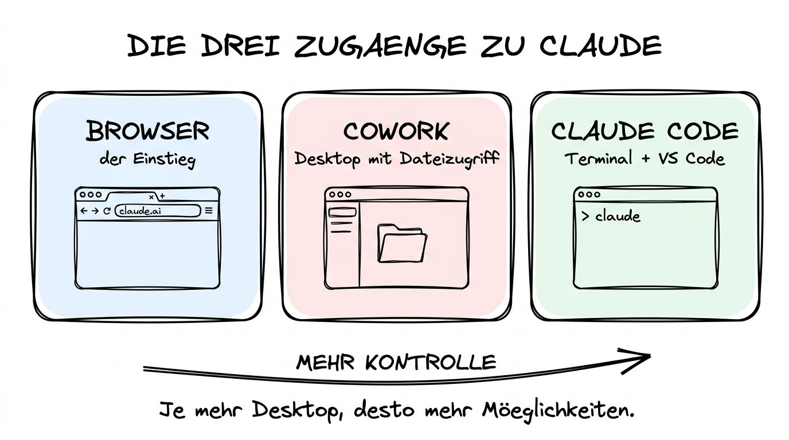

# 01 Die drei Zugänge im Überblick

**Browser, Cowork, Claude Code — und warum Sie alle drei kennen sollten.**

---

## Warum dieses Tutorial?

Die meisten Menschen begegnen Claude zum ersten Mal auf **claude.ai** — einer schlanken Weboberfläche, die wie jeder andere Chatbot funktioniert. Das ist ein guter Anfang, aber es ist nur ein Bruchteil dessen, was Claude kann. Die volle Stärke entfaltet sich erst, wenn Claude **auf Ihrem Computer** arbeiten darf: Dateien lesen, Tabellen berechnen, Ordner umorganisieren, Bilder erzeugen, Code schreiben, Präsentationen bauen — alles im direkten Zugriff auf Ihre eigene Arbeitsumgebung.

Dieses Kapitel ist die Landkarte dieser Desktop-Welt. Sie lernen die drei Haupt­zugänge kennen, die Anthropic im Frühjahr 2026 anbietet, Sie verstehen, wofür jeder einzelne gedacht ist, und Sie bekommen ein klares Bild davon, welcher Zugang für Ihre Arbeit am besten passt. In den folgenden Kapiteln (02–05) schauen wir uns die drei Zugänge dann jeweils im Detail an.

**Was Sie nach diesem Tutorial wissen werden:**

- Warum die Browser-Version nur der Ausgangspunkt ist und wo sie an ihre Grenzen stößt.
- Was Cowork, Claude Code und die VS-Code-Integration jeweils sind.
- Welcher Zugang für Nicht-Techniker, für Coding-Einsteiger und für Power-User gedacht ist.
- Wie sich die drei Zugänge technisch und preislich unterscheiden.
- Welche Aufgaben Sie nie wieder im Browser erledigen sollten, wenn ein Desktop-Tool verfügbar ist.

---

## Der Ausgangspunkt: Claude im Browser

Die Web-Version unter **https://claude.ai** ist der Ort, an dem die meisten Menschen Claude zum ersten Mal begegnen. Sie öffnen eine Seite, tippen eine Frage, bekommen eine Antwort. Kein Download, keine Installation, keine Einrichtung. Das ist sowohl die Stärke als auch die Grenze.

**Was im Browser gut funktioniert:**

- Gespräche, Recherchen, Erklärungen, Brainstorming
- Text-Entwürfe (E-Mails, Blogposts, Dokumente)
- Schnelles Hochladen einzelner Dateien (PDF, Bild, Text) zur Analyse
- Projekte (Claude Projects) für wiederkehrende Kontexte
- Artifacts (interaktive HTML-, React- oder Markdown-Ausgaben direkt im Browser)

**Wo der Browser an seine Grenzen stößt:**

- Er kennt Ihre lokalen Ordner nicht. Sie können nur Dateien hochladen, die Sie jedes Mal neu auswählen.
- Er kann keine Shell-Befehle ausführen, keine Python-Skripte starten, keine echten Dateien auf Ihrem Rechner ändern.
- Die Ergebnisse bleiben im Browser. Wenn Sie eine Excel-Datei bearbeiten lassen wollen, müssen Sie hochladen, herunterladen, ersetzen — jeden Durchgang von Hand.
- Komplexe Mehrschritt-Workflows (erst Ordner durchsuchen, dann filtern, dann umbenennen, dann zippen) sind umständlich oder unmöglich.
- Integrationen mit anderen Tools (Slack, Google Drive, GitHub) laufen nur über Connectors, die im Browser eingerichtet werden müssen.

Der Browser bleibt nützlich für Einmal-Fragen, Lernphasen und schnelle Texte. Sobald Ihre Arbeit aber **wiederholbar**, **dateigebunden** oder **mehrstufig** wird, lohnt sich der Umstieg auf einen Desktop-Zugang. Ab hier beginnt dieses Kapitel.

---

## Zugang 1: Cowork-Modus in der Claude Desktop App

Die **Claude Desktop App** ist eine native Anwendung für macOS und Windows. Sie sieht zunächst aus wie claude.ai im eigenen Fenster — aber mit einem entscheidenden Zusatz: dem **Cowork-Modus**.

**Was Cowork im Kern bedeutet:**

Sie wählen einen Ordner auf Ihrem Computer aus („mounten" ihn), und ab diesem Moment kann Claude Dateien darin lesen, bearbeiten und neue Dateien anlegen — aber nur in diesem einen Ordner, nicht in Ihrem gesamten System. Dazu kommen:

- **Skills** — wiederverwendbare Anleitungen, die Claude für bestimmte Aufgaben befolgt (PDF-Bearbeitung, Excel, Word, Präsentationen, Illustrationen, LinkedIn-Posts u. v. m.).
- **MCPs** (Model Context Protocol) — standardisierte Verbindungen zu externen Diensten wie Slack, Google Drive, Gmail, Asana, Linear, PostgreSQL.
- **Plugins** — gebündelte Pakete aus Skills, MCPs und Commands, die Sie mit einem Klick aus einer Marketplace installieren.
- **Eine sichere Shell** — Claude kann in einer abgeschotteten Sandbox Python, Node, Shell-Befehle und Tools ausführen, ohne dass Ihr Computer dadurch gefährdet wird.

**Für wen ist Cowork gedacht?**

Cowork ist bewusst für **Nicht-Techniker** gebaut. Sie müssen keine Kommandozeile bedienen, keinen Code schreiben, keine Entwickler-Umgebung einrichten. Wer bisher mit Word, Excel, PowerPoint, Outlook und Browser gearbeitet hat, findet sich in Cowork schnell zurecht. Der typische Einstieg ist: „Organisiere meinen Download-Ordner", „Fasse diese fünf PDFs zusammen", „Bau mir aus dieser Tabelle eine Präsentation".

Wir schauen uns Cowork im Detail in den Kapiteln 02 und 03 an.

---

## Zugang 2: Claude Code im Terminal

**Claude Code** ist ein Kommandozeilen-Werkzeug für Entwickler und Menschen, die gerne im Terminal arbeiten. Es wird über `npm` oder Homebrew installiert und gestartet, indem Sie in einem Projekt-Ordner einfach `claude` eintippen.

**Was Claude Code anders macht als Cowork:**

- Es lebt im Terminal, nicht in einer grafischen App.
- Es hat vollen Zugriff auf Ihr Projektverzeichnis (inklusive Unterordner, Git-Historie, Build-Tools).
- Es versteht Code-Strukturen: Es kennt Ihr Projektlayout, kann Tests laufen lassen, Build-Fehler diagnostizieren, Refactorings über mehrere Dateien hinweg durchführen.
- Es nutzt eine **Projektkonfiguration** in einer Datei namens `CLAUDE.md`, in der Sie Konventionen, Architektur-Entscheidungen und Arbeitsregeln festhalten.
- Es unterstützt **Slash Commands** (`/init`, `/help`, `/model`, `/clear`), **Subagents** (spezialisierte Unter-Assistenten für bestimmte Aufgaben) und **Hooks** (automatische Aktionen vor oder nach Ereignissen).
- Es kann dieselben MCPs nutzen wie Cowork, plus zusätzliche Entwickler-MCPs.

**Für wen ist Claude Code gedacht?**

Für Menschen, die Code schreiben, lesen oder wenigstens begleiten — also Software-Entwickler, Data Scientists, DevOps, aber auch technische Redakteure, QA-Tester und Product Manager, die ein Repository navigieren müssen. Wenn Sie noch nie ein Terminal geöffnet haben, ist Cowork der bessere Einstieg. Wenn Sie auch nur gelegentlich Code anfassen, lohnt sich Claude Code.

Wir schauen uns Claude Code im Detail in Kapitel 04 an.

---

## Zugang 3: Claude Code in Visual Studio Code

**Visual Studio Code** (kurz: VS Code) ist der mit Abstand meistgenutzte Code-Editor der Welt. Anthropic bietet dafür eine Extension an, die Claude Code direkt in den Editor bringt — als Sidebar-Chat, mit Inline-Diffs, Selection-to-Claude und einer visuellen Approve/Reject-Ansicht für Änderungen.

**Was die VS-Code-Integration zusätzlich bietet:**

- **Sidebar-Panel:** Ein Chat neben dem Editor, der genau denselben Claude Code bedient wie das Terminal — nur mit visueller Darstellung.
- **Inline-Diffs:** Änderungsvorschläge erscheinen direkt im Editor als rot/grün-Markierung, die Sie akzeptieren oder ablehnen können.
- **Selection-to-Claude:** Markieren Sie einen Code-Block, drücken Sie einen Shortcut, und Claude hat den markierten Ausschnitt sofort als Kontext.
- **Task-Panel:** Lange laufende Arbeiten (Tests, Refactorings) sehen Sie als Aufgaben-Liste und können jederzeit unterbrechen oder weiterführen.
- **Multi-File-Kontext:** Der Editor gibt Claude automatisch Signale, welche Dateien Sie gerade offen haben und woran Sie arbeiten.

**Für wen ist die VS-Code-Integration gedacht?**

Für alle, die ohnehin schon in VS Code arbeiten — und zusätzlich für Coding-Einsteiger, die den Schritt vom Terminal in den Editor machen möchten. Sie bekommen dieselbe Macht wie Claude Code im Terminal, aber mit visuellen Kontroll­elementen, die Fehler reduzieren und Vertrauen aufbauen. Für Non-Coder, die keinen Editor nutzen, bleibt Cowork der passendere Einstieg.

Wir schauen uns die VS-Code-Integration im Detail in Kapitel 05 an.

---

## Die drei Zugänge in der Gegenüberstellung

| Merkmal | Browser (claude.ai) | Cowork (Desktop) | Claude Code (Terminal) | Claude Code (VS Code) |
|---------|---------------------|------------------|------------------------|------------------------|
| **Installation** | Keine | Desktop App | `npm` oder Homebrew | Extension in VS Code |
| **Zugriff auf Ihre Dateien** | Nur Upload | Gemounteter Ordner | Projektverzeichnis | Projektverzeichnis |
| **Shell-Befehle** | Nein | Sandbox | Ja, lokal | Ja, lokal |
| **Skills / MCPs / Plugins** | Teilweise | Ja, vollständig | Ja, vollständig | Ja, vollständig |
| **CLAUDE.md-Kontext** | Nein | Nein | Ja | Ja |
| **Visuelle Diffs** | Nein | Nein | Im Terminal | Inline im Editor |
| **Zielgruppe** | Alle | Non-Coder bis Power-User | Entwickler | Entwickler |
| **Lernkurve** | Sehr flach | Flach | Mittel | Mittel |
| **Ideal für** | Gespräche, schnelle Fragen | Dateien, Dokumente, Organisation | Code-Projekte | Code-Projekte mit visuellem Feedback |

---

## Welcher Zugang für welche Rolle?

**Wenn Sie Büroarbeit machen (Office, Marketing, HR, Beratung, Forschung):**
Browser für schnelle Fragen. **Cowork** für alles, was Dateien betrifft — PDFs zusammenfassen, Tabellen auswerten, Präsentationen bauen, Ordner organisieren. Claude Code und VS Code brauchen Sie nicht.

**Wenn Sie gelegentlich Skripte oder kleine Automatisierungen bauen:**
Browser für Nachfragen. **Cowork** für Alltags-Dokumente. **Claude Code im Terminal** für alles Code-Bezogene. Die VS-Code-Integration ist optional, aber hilfreich, wenn Sie sowieso schon einen Editor verwenden.

**Wenn Sie beruflich Software entwickeln:**
**Claude Code** ist Ihr Hauptwerkzeug, idealerweise mit der **VS-Code-Integration**. Cowork nutzen Sie für alles, was nicht direkt Code ist — Dokumentation bauen, Release-Notes schreiben, Screenshots sortieren. Der Browser ist für Ad-hoc-Fragen da, wenn Sie unterwegs sind.

**Wenn Sie Entscheider oder Projektmanager sind:**
Browser und **Cowork**. Claude Code werden Sie kaum brauchen — aber es hilft, die Logik zu kennen, weil Ihr Team damit arbeitet.

---

## Ein wichtiger Hinweis zum Datenschutz

Alle drei Desktop-Zugänge arbeiten grundsätzlich nach demselben Muster: Die Anfragen, die Claude beantworten soll, werden an Anthropic geschickt, dort verarbeitet und die Antwort kommt zurück. Dateiinhalte, die Claude lesen soll, werden als Teil der Anfrage mitgesendet. Das ist wichtig zu verstehen, bevor Sie Cowork auf vertrauliche Firmen- oder Personendaten loslassen.

Anthropic verspricht für zahlende Kunden, dass Ihre Eingaben **nicht zum Training** verwendet werden. Trotzdem gilt: Was nicht in die Cloud soll, hat auf einem gemounteten Ordner nichts verloren. Kapitel 07 dieses Kapitels geht im Detail auf Datenschutz, DSGVO und sensible Daten ein — und Kapitel 09 (KI-Tool-Landschaft 2026), Datei 09 liefert die rechtliche Gesamteinordnung.

---

## Zusammenfassung in 60 Sekunden

Claude ist mehr als claude.ai im Browser. Die Desktop-Welt besteht aus drei Haupt­zugängen: **Cowork** in der Claude Desktop App für Dateiarbeit ohne Coding-Kenntnisse, **Claude Code** im Terminal für Entwickler, und **Claude Code in VS Code** für Entwickler, die lieber visuell arbeiten. Der Browser bleibt der schnellste Weg für Gespräche und Einmal-Fragen, aber sobald Ihre Arbeit dateigebunden oder mehrstufig wird, ist ein Desktop-Zugang die bessere Wahl. Non-Coder starten mit Cowork, Entwickler mit Claude Code — und in der Praxis kombinieren viele Menschen mehrere Zugänge im Alltag.

---

## Nächste Schritte

- **[02 Cowork-Modus Grundlagen](./02%20Cowork-Modus%20Grundlagen.md)** — Installation, Ordner-Mount, Privacy, erste Schritte.
- Wenn Sie Entwickler sind und sofort einsteigen wollen: **[04 Claude Code im Terminal](./04%20Claude%20Code%20im%20Terminal.md)**.
- Querverweis: **[Kapitel 03 — Anthropic und die Claude-Familie](../09%20KI-Tool-Landschaft%202026/03%20Anthropic%20-%20Claude%20und%20die%20Claude-Familie.md)** aus Kapitel 09 liefert die Modelle und Abos im Überblick.
