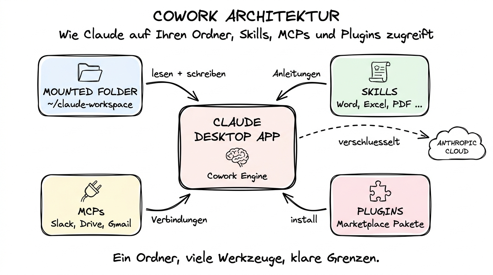

# 02 Cowork-Modus Grundlagen

**Installation, Ordner-Mount, Privacy und die ersten Schritte mit Claude auf Ihrem Desktop.**

---

## Warum dieses Tutorial?

In Kapitel 01 haben Sie den Überblick bekommen: Cowork ist der Weg, auf dem Claude direkten Zugriff auf Ihren Computer erhält — aber nur kontrolliert, nur in einem Ordner, den Sie bewusst freigeben. Dieses Tutorial führt Sie Schritt für Schritt durch die Einrichtung: Installation der Desktop-App, Aktivierung des Cowork-Modus, Auswahl eines Arbeitsordners, das Verständnis von Berechtigungen und Privacy, und schließlich Ihre ersten drei konkreten Cowork-Aufgaben.

Am Ende dieses Tutorials haben Sie einen laufenden Cowork-Modus und wissen genau, was Claude darf und was nicht. Danach geht es in Kapitel 03 weiter mit Skills, MCPs und Plugins — also mit den Werkzeugen, die Cowork erst richtig mächtig machen.

**Was Sie nach diesem Tutorial wissen werden:**

- Wie Sie die Claude Desktop App installieren (macOS und Windows).
- Was ein „Mount" ist und wie Sie einen Arbeitsordner auswählen.
- Welche Rechte Claude in diesem Ordner hat — und welche nicht.
- Was mit Ihren Dateien passiert, wenn Claude sie liest oder ändert.
- Wie Sie die ersten drei Cowork-Aufgaben selbst ausprobieren: Datei lesen, Datei erstellen, Ordner umorganisieren.
- Wie Sie Cowork wieder sauber deaktivieren, wenn Sie es nicht mehr brauchen.



---

## Schritt 1: Die Claude Desktop App installieren

Cowork ist ein Feature der **Claude Desktop App** — nicht der Website. Sie brauchen also zuerst die App auf Ihrem Computer.

**macOS:**

1. Öffnen Sie https://claude.com/download in Ihrem Browser.
2. Klicken Sie auf **Download for Mac**. Der Download enthält eine Universal-Build, die sowohl auf Apple-Silicon-Macs (M1, M2, M3, M4) als auch auf Intel-Macs läuft.
3. Öffnen Sie die heruntergeladene `.dmg`-Datei und ziehen Sie das Claude-Symbol in den **Programme**-Ordner.
4. Starten Sie Claude aus dem Launchpad oder über Spotlight (`⌘-Leertaste`, „Claude", Enter).
5. Beim ersten Start fragt macOS, ob Sie die App wirklich öffnen möchten — bestätigen Sie mit **Öffnen**.

**Windows:**

1. Öffnen Sie https://claude.com/download in Ihrem Browser.
2. Klicken Sie auf **Download for Windows**.
3. Führen Sie die heruntergeladene `.exe`-Datei aus. Windows Defender / SmartScreen meldet sich eventuell — bestätigen Sie mit **Mehr Informationen → Trotzdem ausführen**.
4. Folgen Sie dem Installer.
5. Starten Sie Claude über das Startmenü.

**Anmelden:**

Beim ersten Start meldet sich die App bei Ihnen als Browser-Fenster zur Anmeldung. Verwenden Sie denselben Account wie auf claude.ai — die App erkennt Ihre Pro- oder Team-Mitgliedschaft automatisch.

> **Kostenhinweis:** Für den Cowork-Modus brauchen Sie mindestens ein **Claude Pro**-Abo (im Frühjahr 2026: rund 20 USD/Monat). Der kostenlose Claude-Zugang funktioniert nur im Browser. Die genauen Preise finden Sie in Kapitel 07 dieses Kapitels und im Detail in Kapitel 09, Datei 09.

---

## Schritt 2: Cowork-Modus aktivieren

Nach der Anmeldung sieht die Desktop-App zuerst aus wie claude.ai in einem eigenen Fenster. Um Cowork zu aktivieren, suchen Sie in der Seitenleiste oder im Menü (je nach Version) nach **Cowork** oder **Local Agent Mode**.

Beim ersten Aufruf erscheint ein Einrichtungsdialog mit drei Schritten:

1. **Einführungsvideo oder Begrüßung überspringen.** Sie können später jederzeit zurückkehren.
2. **Ordner auswählen** (siehe nächster Abschnitt).
3. **Berechtigungen bestätigen.** macOS fragt Sie, ob Claude auf Dateien in diesem Ordner zugreifen darf. Ohne diese Bestätigung funktioniert Cowork nicht.

Nach diesen drei Klicks ist der Cowork-Modus aktiv. Sie sehen am oberen Rand des Chatfensters ein Symbol oder ein Label, das signalisiert: „Cowork läuft, Zugriff auf Ordner XY".

---

## Schritt 3: Einen Arbeitsordner „mounten"

Das Wichtigste am Cowork-Modus ist der **Arbeitsordner**. Er ist der einzige Ort, an dem Claude auf Ihrem Computer lesen und schreiben darf. Das Konzept heißt „Mount", weil Ihr lokaler Ordner für die Dauer der Session in die Arbeitsumgebung von Claude eingehängt wird — so wie man einen USB-Stick in das Dateisystem einhängt.

**Wichtige Grundsätze:**

- Claude sieht **nur** diesen Ordner und seine Unterordner. Er kann nicht in `~/Documents`, `~/Desktop` oder `C:\Users\...` stöbern, wenn diese nicht gemountet sind.
- Sie können jederzeit zwischen Ordnern wechseln. Der vorherige Mount wird beim Wechsel beendet.
- Sie können denselben Ordner in späteren Sessions wieder wählen. Claude hat aber **keinen Zwischenspeicher** über Sessions hinweg — jede Session beginnt mit einem leeren Gedächtnis, auch wenn der Ordner gleich ist.
- Änderungen, die Claude macht, passieren **sofort und echt** auf Ihrer Festplatte. Es gibt keinen „Undo-Puffer" außerhalb dessen, was Ihr Dateisystem und Ihre Backups bieten.

**Praktische Empfehlungen für die ersten Mounts:**

1. Legen Sie sich einen neuen Ordner an, der explizit für Cowork gedacht ist, z. B. `~/Documents/claude-workspace`. Das verhindert, dass Sie aus Versehen auf den Desktop oder den gesamten `Documents`-Ordner mounten und Claude zu viel sieht.
2. Beginnen Sie mit **unwichtigen Test-Dateien**, bevor Sie Cowork auf produktive Daten loslassen. Ein paar zufällige PDFs, eine alte Tabelle, ein paar Markdown-Notizen reichen, um ein Gefühl zu bekommen.
3. **Aktivieren Sie Backups.** Time Machine auf dem Mac, Dateiversionsverlauf unter Windows, oder manuelle Kopien. Cowork macht keine Fehler wahllos, aber wenn eines passiert, wollen Sie eine Rückfahrkarte haben.
4. Sensible Daten (Kontoauszüge, Arbeitsverträge, Personaldaten) gehören **nur dann** in einen gemounteten Ordner, wenn Sie die Datenschutz-Implikationen verstanden haben. Siehe Abschnitt weiter unten.

**Ordner auswählen — technische Schritte:**

In der Cowork-Oberfläche gibt es einen Button **„Ordner auswählen"** oder **„Arbeitsordner ändern"**. Klicken Sie ihn, es öffnet sich der übliche Systemdialog, navigieren Sie zu Ihrem gewünschten Ordner, bestätigen Sie. Fertig.

---

## Schritt 4: Verstehen, was Claude in diesem Ordner darf

Cowork gibt Claude drei Arten von Zugriff auf Ihren gemounteten Ordner:

**1. Dateien lesen.** Claude kann jede Datei im Ordner öffnen und den Inhalt in sein Arbeitsgedächtnis laden. Das gilt für Texte (PDF, DOCX, TXT, MD, HTML), Tabellen (XLSX, CSV), Bilder (PNG, JPG, aber keine Videos standardmäßig), Code-Dateien und vieles mehr. Beim Lesen wird der Inhalt an Anthropic gesendet, damit das Modell ihn verarbeiten kann.

**2. Dateien schreiben und ändern.** Claude kann neue Dateien anlegen und bestehende ändern. Das umfasst das Anlegen einer Word-Datei, das Einfügen einer Zeile in eine CSV, das Umbenennen eines Bildes — alles, was der Benutzer im Dateisystem auch könnte.

**3. Shell-Befehle ausführen.** Claude hat Zugriff auf eine **Sandbox** — eine kleine, abgeschottete Linux-Umgebung, in der Python, Node, Shell-Befehle und gängige Werkzeuge installiert sind. Diese Sandbox sieht den gemounteten Ordner, aber nicht den Rest Ihres Computers. Sie ist der Grund, warum Cowork Tabellen berechnen, PDFs umwandeln und Bilder bearbeiten kann, ohne dass Sie selbst Software installieren müssen.

**Was Claude im Cowork-Modus nicht kann:**

- Auf Ordner außerhalb des Mounts zugreifen.
- System-Einstellungen ändern, Programme installieren oder Dienste starten.
- Netzwerk-Verbindungen öffnen, die über seine eigenen Tools hinausgehen (Web-Zugriff läuft nur über die dafür vorgesehenen Suchwerkzeuge).
- Ohne Ihre Zustimmung Dateien löschen. Löschvorgänge fragen in den meisten Fällen explizit nach einer Bestätigung.
- Heimlich etwas tun. Jede Aktion taucht im Chat-Verlauf auf, damit Sie nachvollziehen können, was passiert ist.

---

## Schritt 5: Die ersten drei Cowork-Aufgaben

Probieren Sie die folgenden drei Aufgaben in Ihrem Test-Ordner aus. Sie zeigen Ihnen, wie sich Cowork im Alltag anfühlt.

### Aufgabe 1 — Eine Datei lesen und zusammenfassen

Legen Sie eine beliebige PDF (Rechnung, Vertrag, Artikel) in den Arbeitsordner. Tippen Sie dann im Chat:

```
Lies die Datei XY.pdf in meinem Ordner und fasse sie in
fünf Bullet-Points auf Deutsch zusammen.
```

Beobachten Sie, was passiert: Claude ruft ein Lese-Werkzeug auf, sehen Sie als kleinen Hinweis im Chat. Dann kommt die Zusammenfassung. Keine Installation, keine Website, kein Upload.

### Aufgabe 2 — Eine neue Datei erstellen lassen

Bleiben Sie im selben Chat und tippen Sie:

```
Erstelle mir in diesem Ordner eine Datei namens notizen.md
und schreibe darin einen Plan für meine nächste Woche
mit fünf Aufgaben, jede mit einem Satz Beschreibung.
```

Nach wenigen Sekunden ist `notizen.md` im Ordner. Öffnen Sie sie mit Ihrem üblichen Text-Editor und prüfen Sie den Inhalt. Das ist die einfachste Form von Cowork — und der Moment, in dem viele Menschen zum ersten Mal verstehen, was „Claude auf dem Desktop" wirklich heißt.

### Aufgabe 3 — Einen Ordner umorganisieren

Legen Sie fünf bis zehn Dateien unterschiedlicher Art in den Arbeitsordner (PDFs, Bilder, Text-Dokumente, alles gemischt). Tippen Sie dann:

```
Schau dir die Dateien in meinem Arbeitsordner an und
organisiere sie in Unterordner nach Dateityp. Erstelle
die Unterordner selbst und verschiebe die Dateien hinein.
Zeige mir am Ende, was du gemacht hast.
```

Das ist der „Hallo Welt"-Moment für Cowork als Alltagsassistent. Sie haben nie einen Befehl im Terminal getippt, nie eine Software installiert, und trotzdem ist Ihr Ordner sauber sortiert.

---

## Privacy und Datenschutz — was Sie wissen müssen

Cowork funktioniert nur, weil Ihre Dateiinhalte an Anthropic geschickt werden. Das ist kein Bug, sondern ein Feature: Das Sprachmodell läuft in der Cloud, nicht auf Ihrem Computer, und kann deswegen Inhalte nur verarbeiten, wenn es sie bekommt.

**Was das konkret bedeutet:**

- **Jede gelesene Datei wird übertragen.** Wenn Sie Claude bitten, zehn PDFs zusammenzufassen, dann verlassen diese zehn PDFs — oder zumindest die relevanten Ausschnitte — Ihren Computer.
- **Die Übertragung ist verschlüsselt** (TLS). Ein Angreifer im selben WLAN kann den Inhalt nicht mitlesen.
- **Anthropic speichert die Inhalte** für eine begrenzte Zeit zur Fehleranalyse und Missbrauchs-Erkennung (im Frühjahr 2026: in der Regel 30 Tage für Consumer-Konten, kürzer für Team/Enterprise-Kunden).
- **Für zahlende Pro-, Team- und Enterprise-Kunden** versichert Anthropic, dass die Eingaben **nicht zum Training** neuer Modelle verwendet werden. Dieser Punkt ist wichtig, wenn Sie geschäftlich arbeiten.
- **Sensible Kategorien** — Gesundheitsdaten, Finanzdaten mit Personenbezug, Personaldaten — sollten Sie mit besonderer Vorsicht behandeln und im Zweifel Ihre Datenschutz-Beauftragten einbinden.

**Eine einfache Daumenregel:**

> Wenn Sie eine Datei nicht bedenkenlos an einen externen Dienstleister schicken würden, gehört sie auch nicht in einen Cowork-Ordner.

Der DSGVO- und AI-Act-Kontext ist in Kapitel 14 (Ethik, Sicherheit und Verantwortung) im Detail beschrieben. Für die Praxis im Unternehmen gilt: Klären Sie mit Ihrer IT und Ihrem Datenschutz-Team, welche Ordner freigegeben werden dürfen, bevor Sie Cowork produktiv einsetzen.

---

## Cowork wieder sauber beenden

Wenn Sie Cowork für eine Session nicht mehr brauchen, gibt es drei Möglichkeiten:

1. **Ordner wechseln** — Sie wählen einfach einen anderen (z. B. leeren) Ordner. Der vorherige Mount wird beendet.
2. **Cowork deaktivieren** — in den Einstellungen der Desktop-App können Sie den Cowork-Modus komplett abschalten. Die App läuft dann wie claude.ai im Fenster.
3. **App schließen** — mit dem Schließen der Desktop-App endet jede Cowork-Session.

Nach dem Beenden hat Claude keinen Zugriff mehr auf den Ordner. Beim nächsten Start müssen Sie den Mount neu aktivieren.

---

## Stärken und Schwächen auf einen Blick

**Stärken:**

- Niedrige Einstiegshürde — keine Kommandozeile, keine Entwickler-Tools nötig.
- Sicherer, gekapselter Zugriff — Claude sieht nur, was Sie freigeben.
- Sofortige Ergebnisse auf echten Dateien, nicht im Browser-Upload-Karussell.
- Vorbereitet für Skills, MCPs und Plugins (Kapitel 03).

**Schwächen:**

- Kein dauerhaftes Gedächtnis zwischen Sessions.
- Pro-Abo oder höher erforderlich.
- Dateiinhalte verlassen den Computer und gehen an Anthropic — muss mit Datenschutz vereinbar sein.
- Bei sehr großen Dateien (z. B. 500-MB-CSV) oder großen Ordnern kann die Verarbeitung an Grenzen stoßen — Cowork ist für alltägliche Büro-Größenordnungen ausgelegt.

---

## Zusammenfassung in 60 Sekunden

Cowork ist der Modus der Claude Desktop App, in dem Claude direkten Zugriff auf einen von Ihnen gewählten Ordner auf Ihrer Festplatte bekommt. Sie installieren die App, melden sich mit Ihrem Pro-Account an, aktivieren Cowork, wählen einen Arbeitsordner und bestätigen die Systemberechtigungen. Ab diesem Moment kann Claude Dateien in diesem Ordner lesen, neue anlegen, bestehende ändern und kleine Shell-Befehle in einer Sandbox ausführen. Der Rest Ihres Computers bleibt unsichtbar. Dateiinhalte werden an Anthropic übertragen, deswegen gehören sensible Daten nur mit Vorsicht in einen gemounteten Ordner. Die besten Startaufgaben sind „fasse diese Datei zusammen", „erstelle mir eine neue Datei" und „organisiere meinen Ordner".

---

## Nächste Schritte

- **[03 Cowork Skills MCPs und Plugins](./03%20Cowork%20Skills%20MCPs%20und%20Plugins.md)** — die Werkzeuge, die Cowork von „nett" zu „unverzichtbar" machen.
- Wenn Sie neugierig auf die Unterschiede zu Claude Code sind: **[04 Claude Code im Terminal](./04%20Claude%20Code%20im%20Terminal.md)**.
- Querverweis: **[Kapitel 03 — Anthropic und die Claude-Familie](../09%20KI-Tool-Landschaft%202026/03%20Anthropic%20-%20Claude%20und%20die%20Claude-Familie.md)** — die Modelle Opus 4.6, Sonnet 4.6 und Haiku 4.5 im Überblick.
