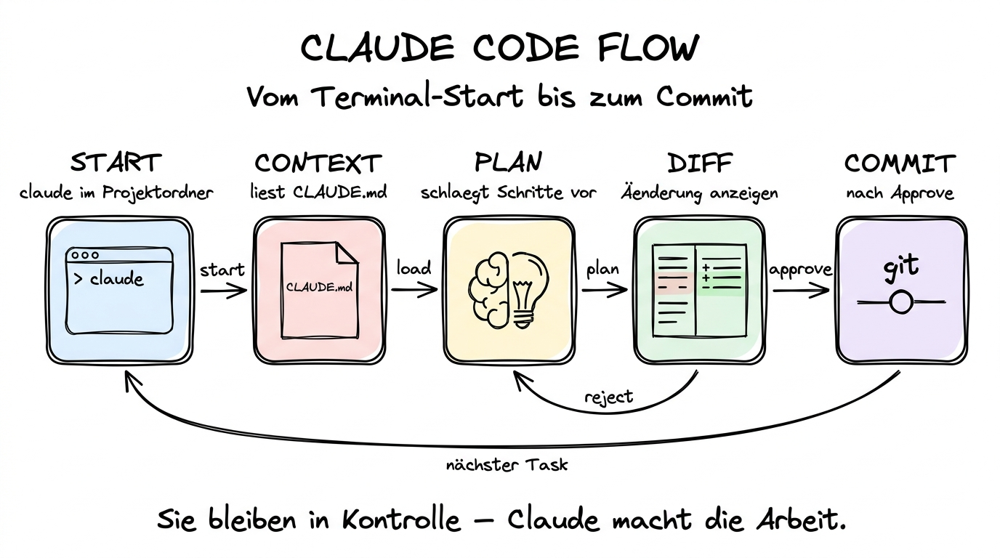

# 04 Claude Code im Terminal

**Das Kommandozeilen-Tool, das Claude zum vollwertigen Arbeitspartner in Code-Projekten macht.**

---

## Warum dieses Tutorial?

Wenn Sie in der Desktop-App zuhause sind, lebt Claude in einem Fenster, das aussieht wie ein Chatprogramm. **Claude Code** dreht das um: Claude lebt direkt in Ihrem Terminal, kennt Ihr ganzes Projekt und arbeitet mit Ihnen an Code, Tests, Dokumentation, Git-Historie und Build-Prozess. Für Entwickler ist Claude Code das produktivste Werkzeug im gesamten Claude-Universum, für Coding-Einsteiger ein mitfühlender Lehrer, der alles erklärt, und für Fortgeschrittene ein Junior-Kollege, der zuverlässig zuarbeitet.

Dieses Tutorial ist der Einstieg. Sie installieren Claude Code, starten es zum ersten Mal, lernen die wichtigsten Slash-Commands kennen, verstehen, was eine `CLAUDE.md`-Datei ist, sehen, wie Subagents und Hooks funktionieren, und bekommen ein Gefühl für den Unterschied zu Cowork.

> **Hinweis für Nicht-Coder:** Teile 4 und 5 dieses Kapitels sind optional. Wenn Sie nie Code berühren, können Sie diese beiden Teile überspringen und direkt zu **[06 Praktische Beispiele](./06%20Praktische%20Beispiele.md)** gehen. Wenn Sie aber auch nur gelegentlich Python-Skripte, SQL-Abfragen oder Website-Änderungen machen, lohnt sich Claude Code definitiv.

**Was Sie nach diesem Tutorial wissen werden:**

- Wie Sie Claude Code unter macOS und Windows installieren.
- Was beim ersten Start passiert und wie Sie sich anmelden.
- Die wichtigsten Slash-Commands (`/init`, `/help`, `/clear`, `/model`, `/agents`, `/mcp`).
- Was eine `CLAUDE.md`-Datei ist und wie Sie eine sinnvolle schreiben.
- Wie Subagents und Hooks Ihre Arbeit strukturieren.
- Wie Sie MCPs in Claude Code nutzen (und wie sich das von Cowork unterscheidet).
- Wann Plan-Mode besser ist als der normale Auto-Mode.



---

## Was Claude Code eigentlich ist

Claude Code ist ein **Terminal-Programm**, das Sie in einem beliebigen Projektordner starten. Es unterhält sich mit Ihnen wie ein Chat, hat aber zusätzlich direkten Zugriff auf alle Dateien, auf Git, auf die Shell und auf externe Tools über MCPs. Sie beschreiben auf Deutsch (oder Englisch), was getan werden soll, Claude plant die Schritte, zeigt Ihnen die Änderungen als Diff, und auf Wunsch führt er sie aus.

Die wichtigsten Unterschiede zu Cowork:

- **Kein Fenster, keine Maus.** Alles passiert im Terminal. Für viele Entwickler ist das eine Stärke, weil sie ohnehin im Terminal leben.
- **Kein Mount.** Claude Code arbeitet immer im Ordner, in dem Sie es starten. Wenn Sie Claude Code im Ordner `~/projekte/meine-website` starten, dann ist das sein Arbeitsbereich.
- **Git-Integration.** Claude Code kennt Ihren Git-Status, kann Commits vorbereiten, Pull Requests beschreiben, Branches vergleichen.
- **CLAUDE.md als persistenter Kontext.** Während Cowork zwischen Sessions vergisst, liest Claude Code bei jedem Start die `CLAUDE.md` Ihres Projekts und weiß damit dauerhaft Bescheid über Architektur, Konventionen und Arbeitsregeln.

---

## Installation

Claude Code ist im Frühjahr 2026 auf drei Wegen installierbar. Wählen Sie den, der zu Ihrer Umgebung passt.

**Weg 1 — npm (funktioniert überall, wo Node.js läuft):**

```bash
npm install -g @anthropic-ai/claude-code
```

Nach der Installation steht der Befehl `claude` auf Ihrem System bereit. Testen Sie kurz:

```bash
claude --version
```

**Weg 2 — Homebrew (macOS und Linux):**

```bash
brew install anthropic/claude/claude-code
```

Homebrew kümmert sich um Updates automatisch (`brew upgrade claude-code`).

**Weg 3 — Native Installer:**

Unter https://claude.com/download gibt es zusätzlich native Installer für macOS und Windows, die ohne vorinstalliertes Node.js auskommen. Laden Sie die passende Datei herunter und führen Sie sie aus.

**Erster Start:**

Wechseln Sie in einen Projektordner (neu oder vorhanden) und starten Sie:

```bash
cd ~/projekte/mein-projekt
claude
```

Beim ersten Start öffnet Claude Code ein Browser-Fenster zur Anmeldung mit Ihrem Anthropic-Account. Nach dem erfolgreichen Login kehren Sie zum Terminal zurück — und dort erwartet Sie ein Begrüßungs-Prompt.

---

## Die ersten Slash-Commands

Claude Code hat eine kleine, aber wichtige Palette an Slash-Commands, die Sie direkt im Chat eingeben:

**`/help`** — zeigt die vollständige Liste aller verfügbaren Commands und kurze Beschreibungen.

**`/init`** — erzeugt eine erste `CLAUDE.md`-Datei im aktuellen Projekt. Claude analysiert dazu die vorhandene Struktur (Sprache, Frameworks, Build-Tools) und schreibt einen sinnvollen Startpunkt. Das ist oft das Erste, was Sie in einem neuen Projekt tun.

**`/clear`** — setzt den Gesprächsverlauf zurück. Nützlich, wenn Sie mit einer frischen Perspektive starten wollen oder wenn der Kontext zu voll wird.

**`/model`** — wechselt das Modell. Standardmäßig läuft Claude Code mit **Sonnet 4.6**, weil das Preis-Leistungs-Verhältnis für die meisten Aufgaben ideal ist. Für sehr knifflige Refactorings oder lange Planungen können Sie auf **Opus 4.6** wechseln, für schnelle, einfache Aufgaben auf **Haiku 4.5**.

**`/agents`** — zeigt die verfügbaren Subagents und lässt Sie eigene erzeugen oder anpassen (mehr dazu weiter unten).

**`/mcp`** — listet die verbundenen MCP-Server und erlaubt das Hinzufügen neuer.

**`/plan`** — aktiviert den **Plan-Mode** (siehe Abschnitt weiter unten).

**`/config`** — öffnet die Einstellungen (Model-Overrides, Style, Tool-Preferences).

---

## CLAUDE.md — das Projekt-Gedächtnis

Der wichtigste Unterschied zwischen Cowork und Claude Code ist die **`CLAUDE.md`**. Diese Markdown-Datei liegt im Projekt-Root und wird bei jedem Start von Claude Code automatisch gelesen. In ihr halten Sie all das fest, was Claude bei jedem neuen Chat sofort wissen soll:

- **Überblick über das Projekt.** Was ist das? In welcher Sprache? Welches Framework?
- **Architektur-Entscheidungen.** Wie ist der Code organisiert? Wo liegen die Datenbank-Modelle? Wo die API-Routen?
- **Konventionen.** Welcher Code-Style? Welcher Commit-Stil? Welche Testing-Library?
- **Regeln und Verbote.** Was soll Claude nie anfassen? Welche Abhängigkeiten sind tabu? Welche Dateien dürfen nur nach Rücksprache geändert werden?
- **Typische Arbeitsabläufe.** Wie startet man den Dev-Server? Wie laufen Tests? Wie baut man einen Release?

**Ein kurzes Beispiel:**

```markdown
# Projekt: Kundendatenbank-Backend

Ein Python-FastAPI-Service, der unsere Kundendaten an interne Frontends ausliefert.

## Stack
- Python 3.12, FastAPI, SQLAlchemy, PostgreSQL
- Poetry für Dependencies, Ruff für Linting, pytest für Tests

## Konventionen
- PEP-8 über Ruff erzwungen (`ruff check .`)
- Alle API-Endpunkte brauchen OpenAPI-Beschreibungen
- Datenbank-Migrations über Alembic, niemals direkte Schema-Änderungen
- Commits im Conventional-Commits-Stil (feat, fix, chore, refactor)

## Arbeitsabläufe
- Server starten: `make dev`
- Tests: `make test`
- Neue Migration: `make migrate-new name=<kurzname>`

## Nicht anfassen
- Dateien unter `src/legacy/` — alter Code, nur auf explizite Anweisung ändern
- Die Datei `src/config/production.py` — wird im Deploy separat gemanagt
```

Sie können `CLAUDE.md` von Hand schreiben oder über `/init` als Startpunkt generieren lassen und dann von Hand verfeinern. Je besser sie gepflegt ist, desto weniger müssen Sie in jedem neuen Chat wiederholen.

**Hierarchische CLAUDE.md-Dateien:**

Claude Code liest nicht nur die `CLAUDE.md` im Projekt-Root, sondern auch welche in Unterordnern. In einem Monorepo können Sie damit pro Paket eigene Regeln hinterlegen. Außerdem kann in Ihrem Home-Verzeichnis eine globale `~/.claude/CLAUDE.md` liegen, die projektübergreifend gilt (zum Beispiel für Ihren persönlichen Code-Style).

---

## Subagents — spezialisierte Helfer im selben Projekt

Ein **Subagent** ist eine kleine, spezialisierte Variante von Claude, die für eine bestimmte Aufgabe gebaut ist. Beispiele:

- Ein **Test-Runner-Subagent**, der Tests ausführt und die Ausgabe strukturiert berichtet.
- Ein **Review-Subagent**, der Pull-Request-Diffs kritisch durchgeht und Punkte zum Verbessern sammelt.
- Ein **Doku-Schreiber-Subagent**, der bei jedem neuen Feature passende Dokumentation vorbereitet.
- Ein **Security-Reviewer**, der speziell auf gängige Sicherheits­probleme achtet.

Subagents werden in YAML-/Markdown-Dateien definiert (meist unter `.claude/agents/`) und enthalten eine eigene Rolle-Beschreibung, eigene Tools und eigene Arbeitsregeln. Mit `/agents` können Sie die vorhandenen sehen, neue anlegen oder vorhandene anpassen.

In der Praxis rufen Sie Subagents nicht manuell auf — Claude entscheidet selbst, wann einer passt („Der Test-Runner kümmert sich jetzt darum"). Sie spüren sie vor allem in der Qualität: Aufgaben, für die ein Spezialist da ist, werden merklich sauberer erledigt.

---

## Hooks — Claude Code an Ihren Rhythmus anpassen

**Hooks** sind kleine Skripte, die Claude Code automatisch vor oder nach bestimmten Ereignissen ausführt. Sie liegen unter `.claude/hooks/` und sind der Weg, Claude Code in Ihre Team-Konventionen einzubinden.

Beispiele:

- **Pre-Commit-Hook:** bevor Claude einen Commit vorbereitet, wird `ruff check` ausgeführt.
- **Post-Edit-Hook:** nach jeder Datei-Änderung wird automatisch `prettier --write` aufgerufen.
- **Pre-Tool-Hook:** bevor Claude einen Shell-Befehl ausführt, wird er in ein Log geschrieben.
- **Post-Answer-Hook:** nach jeder Antwort wird ein Screen-Reader ausgelöst oder eine Zeitmessung gestoppt.

Hooks sind ein fortgeschrittenes Feature. Für den Einstieg brauchen Sie sie nicht — aber es ist gut zu wissen, dass es sie gibt, wenn Sie später mehr Automatisierung wollen.

---

## MCPs in Claude Code

Claude Code nutzt denselben MCP-Standard wie Cowork. Das bedeutet: Wenn Sie in Cowork Slack, Google Drive oder Notion verbunden haben, können Sie dieselben Verbindungen auch für Claude Code nutzen. Die Einrichtung läuft über `/mcp` oder über eine Konfigurationsdatei unter `~/.claude/mcp.json`.

**Typische MCP-Konfiguration für einen Entwickler:**

- **GitHub** — für Pull Requests, Issues, Code-Reviews
- **Context7** — für tagesaktuelle Library-Dokumentationen, sodass Claude nicht auf veraltetes Trainingswissen angewiesen ist
- **PostgreSQL oder Supabase** — für Datenbank-Inspektion während des Refactoring
- **Firecrawl oder Playwright** — für automatisierte Web-Recherche oder End-to-End-Tests

Über `/mcp` sehen Sie den aktuellen Status und können neue Server hinzufügen. Im Gegensatz zu Cowork, wo die Verbindung oft über OAuth läuft, brauchen Sie bei Claude Code häufiger API-Tokens, die Sie einmal in die Konfiguration eintragen.

---

## Plan-Mode vs. Auto-Mode

Standardmäßig arbeitet Claude Code im **Auto-Mode**: Sie beschreiben eine Aufgabe, Claude überlegt kurz, zeigt einen Schritt-für-Schritt-Plan und beginnt sofort mit der Ausführung. Jede Datei-Änderung wird als Diff angezeigt, Sie können zustimmen oder ablehnen. Das ist der schnelle Alltagsmodus.

Der **Plan-Mode** (über `/plan` aktivierbar) arbeitet anders: Claude plant die Lösung komplett durch, zeigt den ganzen Plan, aber führt **nichts** aus. Sie lesen den Plan, geben Feedback, verfeinern ihn, und erst wenn Sie zufrieden sind, starten Sie die Ausführung. Plan-Mode ist ideal für:

- Größere Refactorings, die mehrere Dateien betreffen
- Neue Features, bei denen der Weg unklar ist
- Situationen, in denen Sie den Ansatz verstehen wollen, bevor Code geschrieben wird
- Kritische Bereiche, bei denen Sie nicht wollen, dass Claude „einfach loslegt"

Eine übliche Arbeitsweise ist: Erst im Plan-Mode den Ansatz durchdenken, dann in den Auto-Mode zurück und den Plan umsetzen lassen.

---

## Ein typischer Tag mit Claude Code

Damit Sie ein Gefühl bekommen, wie sich Claude Code im Alltag anfühlt, hier ein kondensiertes Beispiel eines Arbeitstags:

**Morgens, 9:00.** Sie öffnen das Terminal, wechseln in Ihr Projekt, tippen `claude`. Claude begrüßt Sie, liest die `CLAUDE.md`, und Sie sagen: „Schau dir die offenen Issues auf GitHub an und gib mir einen Vorschlag, mit welchem wir heute anfangen sollten."

**9:05.** Claude nutzt den GitHub-MCP, holt die Issues, priorisiert sie und begründet. Sie wählen eines aus, sagen „Gut, fangen wir mit #142 an. Lies dir den Kontext durch und schlage einen Plan vor."

**9:15.** Plan-Mode. Claude schlägt eine Aufteilung in vier Schritte vor. Sie korrigieren an einer Stelle, Claude passt an.

**9:20.** Sie schalten in den Auto-Mode. Claude legt einen neuen Branch an, schreibt die erste Änderung, zeigt den Diff, Sie akzeptieren. Das wiederholt sich für alle vier Schritte.

**10:30.** Claude ruft den Test-Runner-Subagent auf. Tests laufen durch, zwei schlagen fehl. Der Subagent berichtet strukturiert, Claude analysiert den Fehler, schlägt eine Korrektur vor, Sie akzeptieren. Tests grün.

**10:45.** Claude schlägt einen Commit-Text vor, nutzt den Conventional-Commits-Stil aus der `CLAUDE.md`, und Sie bestätigen. Commit ist im Branch.

**11:00.** „Schreib mir noch eine passende Beschreibung für den Pull Request." Claude liest den Diff und baut eine PR-Beschreibung. Sie copy-pasten sie in GitHub.

Das ist kein Zauber, sondern Alltag. Der Unterschied zu manueller Arbeit ist nicht, dass Sie weniger verstehen, sondern dass Sie weniger Zeit mit Boilerplate und Tooling verbringen.

---

## Sicherheitshinweise

Claude Code hat im Unterschied zu Cowork **vollen Zugriff** auf den Ordner, in dem es gestartet wird — inklusive der Fähigkeit, beliebige Shell-Befehle lokal auszuführen (keine Sandbox). Das ist enorm mächtig und entsprechend verantwortungsvoll zu nutzen:

- Starten Sie Claude Code nie in `~` (Ihrem Home-Verzeichnis). Halten Sie Projektordner sauber getrennt.
- Prüfen Sie Diffs bevor Sie sie akzeptieren — zumindest stichprobenartig. Blindes `yes-to-all` ist riskant.
- Nutzen Sie Git. Mit einem sauberen Git-Status vor jeder Session haben Sie jederzeit einen Rückfall-Punkt.
- Halten Sie Secrets und API-Keys aus dem Projekt heraus (oder zumindest in `.env`-Dateien, die in `.gitignore` stehen und die Sie per Konvention vor Claude schützen).
- Die `CLAUDE.md` kann und sollte explizite „Nicht anfassen"-Regeln enthalten (siehe Beispiel oben).

---

## Stärken und Schwächen auf einen Blick

**Stärken:**

- Tief in Code-Projekte integriert — Git, Tests, Build-Pipeline, Refactoring.
- Persistenter Kontext über `CLAUDE.md`.
- Subagents und Hooks für wiederkehrende Spezialaufgaben.
- Gleicher MCP-Standard wie Cowork, plus Dev-spezifische MCPs.
- Plan-Mode für kritische oder komplexe Änderungen.

**Schwächen:**

- Terminal-basiert — ohne Kommandozeilen-Erfahrung eine gewisse Einstiegshürde.
- Kein visueller Diff-Workflow außerhalb des Terminals (dafür gibt es Kapitel 05, die VS-Code-Integration).
- Volle Shell-Rechte bedeuten volle Verantwortung.
- Für reine Büro-Aufgaben (Word, Excel, E-Mails) ist Cowork schneller und einfacher.

---

## Zusammenfassung in 60 Sekunden

Claude Code ist das Kommandozeilen-Werkzeug, das Claude zum vollwertigen Arbeitspartner in Code-Projekten macht. Sie installieren es per `npm`, Homebrew oder Installer, starten es mit `claude` im Projekt-Ordner, und Claude hat sofort vollen Zugriff auf Dateien, Git, Shell und MCPs. Eine `CLAUDE.md` im Projekt-Root sorgt für persistenten Kontext über Sessions hinweg. Subagents spezialisieren sich auf wiederkehrende Aufgaben, Hooks binden Claude Code in Team-Konventionen ein, und der Plan-Mode erlaubt sorgfältige Überlegung, bevor Code geschrieben wird. Im Gegensatz zu Cowork ist Claude Code nicht gesandboxt — nutzen Sie es deshalb in sauber getrennten Projekt-Ordnern mit aktivem Git. Für Entwickler ist Claude Code das produktivste Claude-Werkzeug überhaupt.

---

## Nächste Schritte

- **[05 Claude Code in VS Code](./05%20Claude%20Code%20in%20VS%20Code.md)** — dieselbe Macht, aber mit visuellen Diffs und Sidebar-Chat im Editor.
- **[06 Praktische Beispiele](./06%20Praktische%20Beispiele.md)** — konkrete End-to-End-Workflows mit Claude Code und Cowork.
- Querverweis: **[Kapitel 03 — Anthropic und die Claude-Familie](../09%20KI-Tool-Landschaft%202026/03%20Anthropic%20-%20Claude%20und%20die%20Claude-Familie.md)** — Modellauswahl, Kontextfenster und Preise im Detail.
