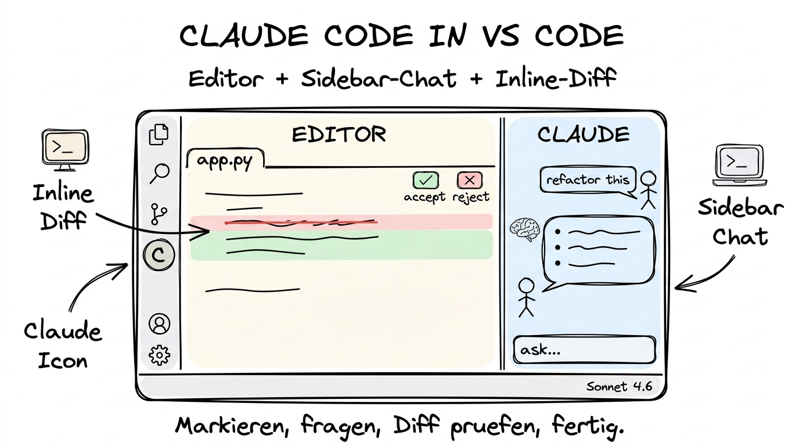

# 05 Claude Code in Visual Studio Code

**Dieselbe Macht wie im Terminal — aber mit Sidebar-Chat, Inline-Diffs und visueller Kontrolle.**

---

## Warum dieses Tutorial?

Claude Code im Terminal ist mächtig, aber minimalistisch. Für viele Menschen — vor allem für Coding-Einsteiger und visuell arbeitende Entwickler — ist ein **Editor mit Kontext** der natürliche Arbeitsplatz. **Visual Studio Code** (kurz: VS Code) ist der mit Abstand meistgenutzte Editor der Welt, und Anthropic liefert dafür eine Extension, die Claude Code direkt in den Editor bringt. Sie bekommen einen Chat in der Seitenleiste, Änderungs­vorschläge als Inline-Diff, markierten Code per Shortcut als Kontext, und können alles visuell akzeptieren oder ablehnen.

Dieses Tutorial zeigt, wie Sie die Extension installieren, wie der Chat im Editor funktioniert, wann Sie den visuellen Modus dem Terminal vorziehen sollten und wie Sie einen typischen Refactoring- oder Debug-Workflow damit durchspielen.

> **Hinweis für Nicht-Coder:** Auch dieser Teil ist optional. Wenn Sie nicht mit Code arbeiten, springen Sie zu **[06 Praktische Beispiele](./06%20Praktische%20Beispiele.md)**. Wer aber gelegentlich Skripte oder Website-Änderungen macht und sich VS Code ansehen möchte, ist hier richtig.

**Was Sie nach diesem Tutorial wissen werden:**

- Wie Sie VS Code installieren und Claude-Code-tauglich machen.
- Wie die Sidebar-Chat-Integration funktioniert.
- Wie Sie markierten Code per Shortcut in den Chat geben (Selection-to-Claude).
- Wie Inline-Diffs und der Approve/Reject-Workflow funktionieren.
- Wann der Editor-Modus dem Terminal-Modus vorzuziehen ist — und umgekehrt.
- Wie Sie einen typischen Debug- und Refactoring-Workflow im Editor durchführen.

---

## VS Code als Ausgangspunkt

Bevor wir Claude hineinbringen, ein kurzer Blick auf den Editor selbst. **Visual Studio Code** ist eine kostenlose, quelloffene Anwendung von Microsoft, die auf macOS, Windows und Linux läuft. Sie ist leichtgewichtig, schnell und lässt sich über Extensions fast beliebig erweitern — von Syntax-Highlighting über Git-Integration bis zu komplexen Debug-Umgebungen.

Wenn Sie VS Code noch nicht installiert haben, holen Sie es unter https://code.visualstudio.com. Die Installation ist unkompliziert und dauert keine zwei Minuten. Nach dem Start sehen Sie eine leere Oberfläche mit einer Seitenleiste links (Dateiexplorer, Suche, Git, Extensions) und einem großen Editor-Bereich rechts.

Öffnen Sie dann einen Projektordner über **Datei → Ordner öffnen**. Ab diesem Moment „kennt" VS Code Ihr Projekt.

---

## Die Claude-Code-Extension installieren

Die Extension finden Sie über den **Extensions-Tab** (das Icon mit den vier Quadraten in der linken Seitenleiste, Shortcut `⇧⌘X` auf dem Mac, `Ctrl+Shift+X` auf Windows).

1. Klicken Sie auf das Extensions-Icon.
2. Tippen Sie in das Suchfeld `Claude Code`.
3. Das offizielle Extension-Paket heißt **Claude Code** und trägt den Verlag **Anthropic**. Achten Sie auf den Namen und den offiziellen Verlag — es gibt Imitationen.
4. Klicken Sie auf **Install**.
5. Nach der Installation erscheint in der linken Seitenleiste ein neues Claude-Icon. Klicken Sie es an, um den Chat-Bereich zu öffnen.

**Erste Anmeldung:**

Wenn Sie Claude Code bereits im Terminal installiert und sich angemeldet haben, übernimmt die Extension die vorhandene Anmeldung automatisch. Andernfalls führt sie Sie durch denselben OAuth-Login wie die CLI. Nach erfolgreicher Anmeldung sehen Sie den Claude-Chat im Panel.

> **Hinweis zur VS-Code-Extension-Nomenklatur:** Im Frühjahr 2026 gibt es neben der offiziellen Claude-Code-Extension auch weiterführende Anthropic-Extensions und Integrationen. Wenn in Ihrer Marketplace mehrere Einträge mit ähnlichem Namen auftauchen, wählen Sie den, der von **Anthropic** veröffentlicht wurde und die meisten Downloads hat.

---

## Die Benutzeroberfläche im Überblick

Sobald die Extension aktiv ist, verändert sich VS Code in vier wichtigen Punkten:

1. **Claude-Sidebar links.** Ein neues Panel zeigt einen Chat-Bereich. Hier unterhalten Sie sich mit Claude genauso wie im Terminal, aber mit besserer Darstellung von Code-Blöcken, Diffs und Anhängen.

2. **Inline-Diff-Ansicht im Editor.** Wenn Claude eine Datei ändern möchte, zeigt VS Code die Änderung direkt im offenen Datei-Tab als rot/grün-Diff. Sie sehen sofort, was sich verändert, und können jeden Block einzeln akzeptieren oder verwerfen.

3. **Action-Leiste oben im Diff.** Im Diff-Modus erscheinen Schaltflächen für **Accept**, **Reject**, **Accept All**, **Reject All** und **Show in Terminal** (falls Sie den zugrundeliegenden Claude-Code-Call im Terminal weiterverfolgen wollen).

4. **Statusleiste unten.** Dort sehen Sie den aktuellen Claude-Status (bereit, denkt, führt aus), das aktive Modell und ggf. den Token-Verbrauch der aktuellen Session.

---

## Selection-to-Claude: markierten Code in den Chat geben

Das vielleicht nützlichste Feature der Extension ist **Selection-to-Claude**. Statt Code per Copy-Paste in den Chat zu bugsieren, markieren Sie einen Abschnitt im Editor, drücken einen Shortcut (Standard: `⌘L` auf dem Mac, `Ctrl+L` auf Windows), und der markierte Ausschnitt landet sofort als Kontext im Claude-Chat. Claude weiß dann genau, welchen Teil der Datei Sie meinen, ohne dass Sie Zeilennummern nennen müssen.

**Typische Anwendungen:**

- „Erklär mir diese Funktion Schritt für Schritt." *(markieren, `⌘L`, tippen)*
- „Schreib diese Schleife um, damit sie lesbarer wird."
- „Füge eine Fehlerbehandlung für den Fall ein, dass `response` leer ist."
- „Schreib einen Unit-Test für diese Funktion in pytest."
- „Übersetze die Kommentare in dieser Datei ins Englische."

Wichtig zu wissen: Selection-to-Claude gibt Claude den markierten Ausschnitt **plus** den Kontext, der in der Datei drumherum steht. Wenn Sie nur drei Zeilen markieren, kennt Claude trotzdem die umliegenden Zeilen und die Datei-Struktur.

---

## Inline-Diffs und der Approve/Reject-Workflow

Wenn Claude eine Datei ändern möchte, tut er das nicht direkt — er schlägt die Änderung als **Diff** vor, und Sie entscheiden. Im Editor sehen Sie:

- **Rote Zeilen** markieren, was entfernt werden soll.
- **Grüne Zeilen** markieren, was neu hinzukommt.
- **Unveränderte Zeilen** bleiben normal dargestellt.
- Oberhalb jedes Änderungs-Blocks gibt es kleine Schaltflächen: ein grünes Häkchen (akzeptieren), ein rotes X (ablehnen), ein Pfeil (erklären).

**Zwei Arbeitsweisen im Alltag:**

**Akzeptieren-pro-Block.** Bei wichtigen Änderungen gehen Sie jeden Block einzeln durch. Das ist langsamer, gibt Ihnen aber die Kontrolle und die Chance, bei jedem Schritt zu lernen. Für Refactorings in Produktions-Code die sicherste Variante.

**Akzeptieren-alles.** Bei Routine-Arbeiten (z. B. viele kleine Textänderungen, automatische Formatierung, Typo-Korrekturen) können Sie mit einem Klick alles akzeptieren. Schneller, aber nur dann angebracht, wenn Sie Claude im aktuellen Kontext vertrauen.

**Ablehnen und korrigieren.** Wenn Ihnen die vorgeschlagene Änderung nicht gefällt, lehnen Sie sie ab und sagen Claude, was anders sein soll. Claude überarbeitet den Vorschlag und zeigt einen neuen Diff. Dieser Zyklus ist schnell — Sie kommen in wenigen Runden zu einem guten Ergebnis.

---

## Terminal-Modus vs. Editor-Modus — wann was?

Sie müssen sich nicht entscheiden. Sie können Claude Code im Terminal **und** in VS Code parallel nutzen — oft im selben Projekt. Aber für typische Arbeitssituationen gibt es klare Empfehlungen:

**Editor-Modus (VS Code) ist besser für:**

- Inline-Refactorings einzelner Funktionen oder Dateien
- Code-Reviews mit visuellem Diff
- Debug-Sessions mit markiertem Fehlertext
- Lernphasen, wenn Sie Code erklären lassen wollen
- Arbeit an Frontends, bei denen Sie sofort sehen, was sich ändert

**Terminal-Modus (CLI) ist besser für:**

- Lange laufende Plan-Mode-Sessions
- Automatisierte Skripte, die Claude Code im Hintergrund nutzen
- Arbeit auf entfernten Servern über SSH
- Situationen mit vielen Shell-Befehlen (Build, Test, Deploy)
- Wenn Sie keinen Editor offen haben oder den Editor-Modus stressig finden

In der Praxis pendeln viele Menschen zwischen beiden Modi. Der Editor-Modus ist der Hauptarbeitsplatz, das Terminal übernimmt die schweren Aufgaben im Hintergrund.

---

## Task-Panel und lang laufende Arbeiten

Für Arbeiten, die länger dauern (Refactorings über viele Dateien, größere Test-Durchläufe, Migrationen), bietet die Extension ein **Task-Panel**. Claude zeigt dort:

- Was er gerade tut
- Wie weit er ist
- Welche Schritte als Nächstes kommen
- Welche Zwischen­ergebnisse schon da sind

Sie können jederzeit auf **Pause** drücken, Zwischenergebnisse prüfen, Feedback geben und dann **Weiter** klicken. Diese Kontrolle ist der Hauptgrund, warum Fortgeschrittene den Editor-Modus für Refactorings dem reinen Terminal vorziehen: Sie verlieren nie den Überblick, und Sie können jederzeit eingreifen.

---

## Ein typischer Debug-Workflow

Damit Sie ein Gefühl bekommen, hier ein alltäglicher Debug-Fall:

**Ausgangslage.** Ihre Python-Tests schlagen plötzlich fehl. Die Fehler­meldung ist unverständlich. Sie wollen die Sache im Editor verstehen.

1. Sie öffnen die Test-Ausgabe im integrierten Terminal (bleiben aber im Editor-Modus).
2. Sie markieren die Fehlermeldung, drücken `⌘L`. Claude hat jetzt den Fehler als Kontext.
3. Sie tippen: „Was könnte diesen Fehler auslösen? Schau dir die Datei an, auf die der Traceback zeigt."
4. Claude liest die genannte Datei, erklärt die wahrscheinliche Ursache, nennt eine konkrete Zeile.
5. Sie öffnen die Zeile, markieren sie, drücken `⌘L` und sagen: „Schlag eine Korrektur vor."
6. Claude schlägt einen Inline-Diff vor. Sie akzeptieren.
7. Claude führt den Test erneut aus (Extension hat Zugriff auf den integrierten Terminal), Test grün, Sache erledigt.

Der ganze Ablauf dauert wenige Minuten und fühlt sich an wie Zusammenarbeit mit einem ruhigen, gut vorbereiteten Kollegen.

---

## Ein typischer Refactoring-Workflow

Refactorings sind der Moment, in dem VS Code besonders glänzt.

**Ausgangslage.** Eine Datei ist über die Jahre gewachsen, Funktionen sind zu lang geworden, Tests gibt es kaum.

1. Sie öffnen die Datei im Editor.
2. Sie starten mit Plan-Mode im Claude-Chat: „Schau dir diese Datei an und schlag einen Refactoring-Plan vor, der die langen Funktionen in kleinere aufteilt und dabei das Verhalten nicht ändert."
3. Claude liest die Datei (weil sie offen ist, automatisch als Kontext), schlägt einen Plan mit fünf Schritten vor.
4. Sie verfeinern den Plan im Chat, dann schalten Sie auf Auto-Mode.
5. Schritt für Schritt erzeugt Claude Inline-Diffs, Sie akzeptieren jeden einzeln.
6. Zwischendurch sagt Claude: „Jetzt sollten wir Tests für die neue Struktur schreiben." Sie stimmen zu, Claude legt eine neue Testdatei an.
7. Am Ende sagt Claude: „Fertig. Ich schlage einen Commit-Text vor. OK?" Sie bestätigen.

Der Unterschied zu einem Refactoring im Terminal ist nicht die Funktionalität, sondern der Komfort — Sie sehen alles, Sie können alles prüfen, Sie behalten den Überblick.

---

## Sicherheits- und Privacy-Hinweise

Die Editor-Integration nutzt denselben Claude-Code-Kern wie das Terminal. Das heißt:

- Dateiinhalte werden zu Anthropic übertragen. Dieselben Datenschutz-Regeln wie bei Cowork und Terminal-Claude-Code gelten hier.
- Shell-Zugriff ist unverändert vorhanden. VS Code ist nicht gesandboxt — wenn Sie Claude einen Build-Befehl ausführen lassen, dann führt er ihn real auf Ihrem System aus.
- Die Extension fragt beim ersten Zugriff auf bestimmte Befehlstypen nach Ihrer Erlaubnis (Lesen, Schreiben, Ausführen). Sie können granular entscheiden, was Sie wann freigeben.
- Die `CLAUDE.md`-Regeln aus dem Terminal-Kapitel gelten auch hier. Halten Sie Ihre „Nicht-anfassen"-Bereiche explizit.

---

## Stärken und Schwächen auf einen Blick

**Stärken:**

- Visueller Diff-Workflow — sicher, verständlich, lernförderlich.
- Selection-to-Claude beschleunigt den Alltag enorm.
- Dasselbe Claude Code wie im Terminal, also dieselben Slash-Commands, Subagents, Hooks und MCPs.
- Task-Panel für lang laufende Arbeiten.
- Ideal für Einsteiger, weil alles sichtbar und kontrollierbar ist.

**Schwächen:**

- Setzt VS Code voraus — wer einen anderen Editor nutzt, muss umsteigen oder bleibt beim Terminal.
- Extensions verbrauchen Ressourcen; auf älteren Rechnern kann der Editor-Modus zäher sein als das nackte Terminal.
- Bei sehr langen Sessions füllt sich der Chat-Bereich, und Sie verlieren leichter den Überblick als im disziplinierten Terminal-Flow.

---

## Zusammenfassung in 60 Sekunden

Die VS-Code-Extension bringt Claude Code in den meistgenutzten Editor der Welt. Sie installieren die offizielle Anthropic-Extension, bekommen einen Chat in der Seitenleiste, können markierten Code per `⌘L` als Kontext geben und alle Änderungen als visuelles Inline-Diff prüfen. Unter der Haube ist es derselbe Claude Code wie im Terminal — mit allen Slash-Commands, Subagents, Hooks und MCPs — aber mit visueller Kontrolle, die sowohl Einsteigern den Einstieg als auch Fortgeschrittenen die Präzision erleichtert. Typische Einsatzgebiete sind Inline-Refactorings, Debug-Sessions, Code-Reviews und Lernphasen. Für lange Plan-Mode-Arbeiten und Skript-Integration bleibt das Terminal die bessere Wahl — in der Praxis arbeiten viele Entwickler in beiden Modi parallel.

---

## Nächste Schritte

- **[06 Praktische Beispiele](./06%20Praktische%20Beispiele.md)** — fünf konkrete End-to-End-Workflows, die Cowork, Claude Code Terminal und VS Code kombinieren.
- Wenn Sie grundlegende Commands nochmal nachlesen wollen: **[04 Claude Code im Terminal](./04%20Claude%20Code%20im%20Terminal.md)**.
- Querverweis: **Kapitel 02 (Strukturierte Prompts)** — bessere Prompts im Chat-Panel dank sauberer Struktur.
