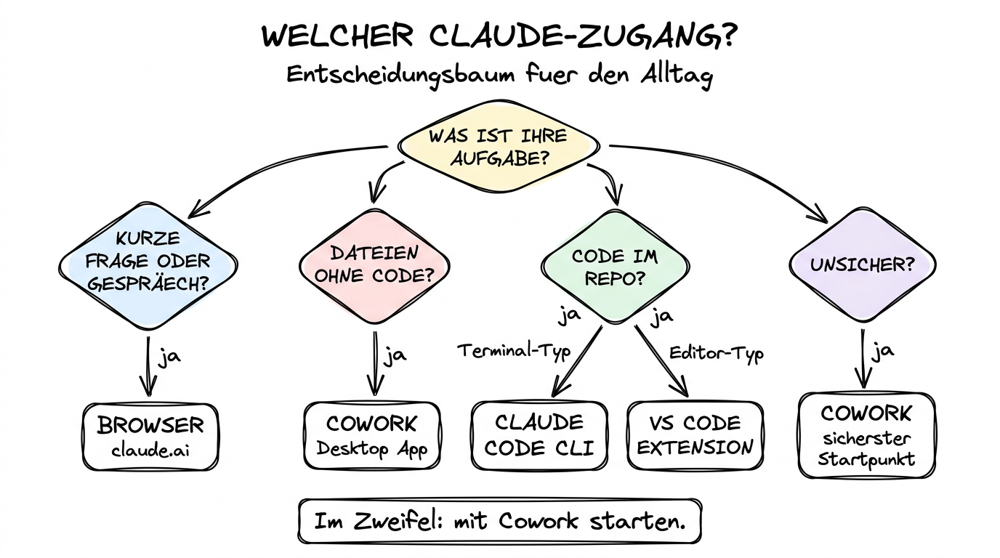

# 07 Troubleshooting, Kosten und FAQ

**Was tun, wenn etwas nicht läuft — und was kostet das alles wirklich?**

---

## Warum dieses Tutorial?

Die Teile 01 bis 06 haben Ihnen gezeigt, wie alles funktioniert, wenn es funktioniert. In diesem letzten Teil schauen wir uns an, was passiert, wenn es **nicht** funktioniert: typische Installations- und Anmelde-Probleme, Berechtigungs- und Quota-Themen, die häufigsten Stolpersteine im Alltag. Dazu kommt ein ehrlicher Blick auf die Kosten: Wie viel zahlen Sie wirklich für Pro, Team und API-basierte Claude-Code-Nutzung, und wann lohnt sich welche Variante? Am Ende steht der Entscheidungsbaum „Welcher Zugang für welche Aufgabe?" als visuelle Zusammenfassung des gesamten Kapitels.

**Was Sie nach diesem Tutorial wissen werden:**

- Wie Sie die häufigsten Installations- und Login-Probleme lösen.
- Wie Sie Berechtigungs­konflikte (macOS, Windows) erkennen und beheben.
- Wie Sie Quota- und Rate-Limit-Fehler einordnen.
- Welche Abos sich für welche Nutzung lohnen (Stand April 2026).
- Wie Sie Kosten im Blick behalten.
- Welcher Claude-Zugang für welche konkrete Aufgabe der richtige ist.

---

## Teil A — Troubleshooting

### Problem 1: Die Claude Desktop App startet nicht

**Mögliche Ursachen:**

- Das Betriebssystem hat den Start aus Sicherheitsgründen blockiert.
- Die Installation ist unvollständig.
- Eine frühere Version läuft noch im Hintergrund.

**Lösungen:**

- **macOS:** Öffnen Sie **Systemeinstellungen → Datenschutz & Sicherheit**. Scrollen Sie ganz nach unten. Wenn dort steht „Claude wurde blockiert", klicken Sie auf **Trotzdem öffnen**. Beim ersten Start nach Blockade braucht das System zwei Anläufe.
- **Windows:** Prüfen Sie den Task-Manager auf einen „Claude"-Prozess, beenden Sie ihn und starten Sie neu.
- **Beide:** Deinstallieren Sie die App komplett, laden Sie die aktuelle Version von https://claude.com/download neu und installieren Sie erneut.

### Problem 2: Anmeldung schlägt fehl

**Mögliche Ursachen:**

- Firewall oder Unternehmens-Proxy blockiert die OAuth-Umleitung.
- Ihr Browser ist so konfiguriert, dass er den OAuth-Callback nicht an die App zurückgibt.
- Sie haben mehrere Accounts und der falsche ist im Standard-Browser angemeldet.

**Lösungen:**

- Wechseln Sie in der Desktop-App von „Mit Browser anmelden" auf „Mit Link anmelden", falls verfügbar.
- Öffnen Sie den Standard-Browser, melden Sie sich manuell auf https://claude.ai an, und starten Sie die Desktop-App neu.
- In Firmen­umgebungen: Sprechen Sie mit der IT. Viele Unternehmen blockieren OAuth-Callbacks zu unbekannten lokalen Ports.

### Problem 3: „Claude kann Datei nicht lesen" im Cowork-Modus

**Mögliche Ursachen:**

- Die Datei liegt außerhalb des gemounteten Ordners.
- macOS-Berechtigungen sind nicht erteilt (Festplattenzugriff fehlt).
- Die Datei ist durch ein Unternehmenssystem verschlüsselt (z. B. FileVault-gebundene Ordner).

**Lösungen:**

- **macOS:** Öffnen Sie **Systemeinstellungen → Datenschutz & Sicherheit → Dateien und Ordner** und prüfen Sie, ob Claude dort für die richtigen Ordner berechtigt ist. Falls nicht, setzen Sie das Häkchen.
- Prüfen Sie, ob die Datei tatsächlich im gemounteten Ordner liegt (nicht nur ein Alias/Shortcut).
- Versuchen Sie, die Datei in einen Test-Unterordner zu kopieren und dort zu öffnen. Wenn das klappt, liegt es an einer geschützten Original-Datei.

### Problem 4: Claude Code startet, aber bricht sofort ab

**Mögliche Ursachen:**

- Node.js-Version zu alt (bei npm-Installation).
- Abgelaufene Anmeldung.
- Konflikt mit einer früheren Claude-Code-Version im selben PATH.

**Lösungen:**

- Prüfen Sie mit `node -v`, ob Sie mindestens Node 20 haben. Falls nicht, updaten Sie Node.
- Melden Sie sich neu an: `claude logout` gefolgt von `claude login`.
- Bei mehreren Installationen: `which claude` (macOS/Linux) oder `where claude` (Windows) zeigt, welcher Binary verwendet wird. Entfernen Sie die alten.

### Problem 5: „Rate Limit reached" oder „Quota exceeded"

**Mögliche Ursachen:**

- Ihr Abo-Kontingent ist aufgebraucht (bei Pro-Abos in der Regel nach einer Anzahl Nachrichten pro Zeitfenster).
- Sie haben eine sehr lange, kontext­schwere Session ohne Zwischen-`/clear`.
- Ihre API-Schlüssel (bei API-basierter Claude-Code-Nutzung) haben ein Budget-Limit erreicht.

**Lösungen:**

- Warten Sie das nächste Zeitfenster ab. In Pro-Abos setzen sich die Limits in der Regel alle paar Stunden zurück.
- Nutzen Sie `/clear`, um den Kontext zu verkleinern. Weniger Kontext = weniger Tokens = mehr Reichweite.
- Wechseln Sie bei anspruchsvollen Aufgaben gezielt zwischen Modellen: Routine in Haiku, Alltag in Sonnet, Knifflig in Opus.
- Falls Sie die Limits regelmäßig erreichen: Upgrade auf **Team** oder **Max** sollte geprüft werden (siehe Kosten-Abschnitt).

### Problem 6: „MCP Server failed to start"

**Mögliche Ursachen:**

- Der MCP-Server ist auf Ihrem System nicht installiert.
- Die Konfiguration (API-Key, Pfad) ist falsch.
- Netzwerk-Probleme bei Remote-MCPs.

**Lösungen:**

- Lesen Sie in der Fehlermeldung, welcher MCP betroffen ist, und prüfen Sie die zugehörige Dokumentation.
- Bei API-Key-Problemen: Prüfen Sie, ob der Key noch gültig ist und die nötigen Berechtigungen hat.
- Starten Sie die Desktop-App oder Claude Code neu — manche MCP-Fehler verschwinden nach einem Neustart.
- Im Zweifel: deaktivieren Sie den fehlerhaften MCP, arbeiten Sie ohne ihn weiter, und kümmern Sie sich später.

### Problem 7: „Der Diff sieht falsch aus, ich will zurück"

**Mögliche Ursachen:**

- Sie haben einen Diff akzeptiert, der etwas Wichtiges zerstört hat.
- Claude hat Dateien außerhalb des erwarteten Bereichs geändert.

**Lösungen:**

- **Bei Git-verwalteten Projekten:** `git status` zeigt, was geändert wurde. `git restore <datei>` macht einzelne Änderungen rückgängig, `git reset --hard HEAD` alle.
- **Ohne Git:** Hoffen Sie auf Ihr Backup. Time Machine auf dem Mac, Datei­versions­verlauf unter Windows. Ohne Backup gibt es keinen zuverlässigen Weg zurück.
- **Präventiv:** Arbeiten Sie nie ohne Git oder Backups in Claude Code. Nie.

---

## Teil B — Kosten im Überblick (Stand April 2026)

Die Preise ändern sich regelmäßig. Die folgenden Angaben sind der Stand im **April 2026** — bevor Sie ein Abo abschließen, prüfen Sie immer direkt auf https://claude.com/pricing.

### Die drei wichtigsten Consumer-Abos

**Free.** Nur Browser, eingeschränkte Nachrichten­zahl pro Tag, Zugriff auf das kleinere Haiku-Modell, keine Cowork-Nutzung. Gut zum Reinschnuppern, für produktive Arbeit zu knapp.

**Pro.** Rund **20 USD/Monat**. Vollzugriff auf Sonnet 4.6 als Standardmodell, begrenzter Zugriff auf Opus 4.6, Desktop-App mit Cowork-Modus, Projects, Artifacts. Deutlich höhere Nachrichten­grenzen als Free. Für Einzelpersonen der Standard-Einstieg.

**Max.** Rund **100–200 USD/Monat**, gestaffelt. Massiv erweiterte Nachrichten­grenzen, höhere Priorität bei Opus, inklusive Claude Code mit entsprechendem Token-Budget. Für Power-User, die regelmäßig an ihre Pro-Grenzen stoßen.

### Business- und Team-Abos

**Team.** Rund **25–30 USD/Nutzer/Monat**. Alles aus Pro, plus zentrale Verwaltung, Single Sign-On, Usage-Berichte, höhere gemeinsame Limits, gemeinsame Projekte und Skills. Für kleine bis mittlere Teams.

**Enterprise.** Individuelle Preise. Zusätzlich: erweiterte Sicherheits­funktionen, Audit-Logs, benutzer­definierte Datenspeicherung (oft regional wählbar), SSO mit SAML, SCIM für Provisionierung, dedizierter Support. Für größere Unternehmen mit Compliance-Anforderungen.

### Claude Code — zwei Abrechnungs­modelle

**Abo-basiert.** Wenn Sie ein Pro-, Max-, Team- oder Enterprise-Abo haben, ist Claude Code inkludiert — mit einem auf das Abo abgestimmten Token-Budget. Für die meisten Entwickler im Alltag die einfachste Variante.

**API-basiert.** Alternativ zahlen Sie pro verarbeitetem Token direkt über die Anthropic-API. Die Preise variieren pro Modell (grob Stand April 2026, pro 1 Mio. Tokens):

| Modell | Input | Output |
|--------|-------|--------|
| Claude Haiku 4.5 | ca. 1 USD | ca. 5 USD |
| Claude Sonnet 4.6 | ca. 3 USD | ca. 15 USD |
| Claude Opus 4.6 | ca. 15 USD | ca. 75 USD |

Die API-basierte Abrechnung lohnt sich, wenn Sie sehr intensiv und vor allem automatisiert mit Claude Code arbeiten. Für alle anderen Nutzer ist das Abo-Modell einfacher und in der Regel günstiger.

### Worauf Sie bei den Kosten achten sollten

- **Ihr Haupt-Workload.** Wer vor allem kurze Fragen stellt, kommt mit Pro sehr weit. Wer stundenlang in Claude Code mit Opus refaktoriert, braucht Max oder API-Abrechnung.
- **Team vs. Einzel.** Ab zwei Leuten im selben Unternehmen wird Team oft billiger und sicherer (zentrale Verwaltung, geteilte Projekte).
- **Opus sparen, wenn möglich.** Opus 4.6 ist das teuerste Modell. Nutzen Sie es gezielt für schwere Aufgaben, nicht für Routine — Sonnet 4.6 reicht in 80 % der Fälle.
- **Kontext schlank halten.** Lange, volle Kontexte verbrennen Tokens. `/clear` ist ein Kosten­dämpfer.
- **Monitoring.** Alle Abos zeigen Ihren Verbrauch in den Einstellungen. Schauen Sie einmal pro Woche rein, besonders in den ersten Wochen.

> **Genauer Kosten-Deep-Dive:** Das gesamte Thema ist in **[Kapitel 09, Datei 09 „Kosten, Abos, Datenschutz"](../09%20KI-Tool-Landschaft%202026/09%20Kosten%20Abos%20Datenschutz.md)** vertieft, inklusive Vergleich mit OpenAI, Google und Perplexity.

---

## Teil C — Datenschutz-Zusammenfassung

Die Datenschutz-Regeln sind in den Teilen 02 (Cowork) und 04 (Claude Code) bereits behandelt worden. Für den schnellen Überblick noch einmal die wichtigsten Punkte:

- **Alles läuft in der Cloud.** Inhalte, die Claude lesen soll, werden an Anthropic übertragen.
- **Keine Trainings­nutzung für zahlende Kunden.** Pro, Team, Enterprise: Ihre Eingaben werden **nicht** zum Training neuer Modelle verwendet. Free-Accounts: Vorsicht, hier gelten andere Regeln.
- **Speicherdauer.** Anthropic speichert Inhalte für begrenzte Zeit zur Fehler- und Missbrauchs­erkennung (30 Tage ist ein grober Richtwert; für Enterprise-Kunden oft kürzer und individuell konfigurierbar).
- **Datenresidenz.** Enterprise-Kunden können oft wählen, in welcher Region ihre Daten verarbeitet werden.
- **Löschrecht.** Sie können jederzeit einzelne Gespräche löschen, Gesamt­daten über den Support anfragen.
- **Sensible Daten.** DSGVO-relevante Informationen (Gesundheit, Finanzen, Personalien) nur nach Rück­sprache mit Ihrer Datenschutz-Verantwortlichen verwenden. Im Zweifel nicht hochladen.

Das Thema wird in **Kapitel 14 (Ethik, Sicherheit, Verantwortung)** im Detail behandelt.

---

## Teil D — Häufig gestellte Fragen

**Kann ich mehrere Claude-Accounts parallel nutzen?**
Ja. In der Desktop-App können Sie sich abmelden und mit einem anderen Account wieder anmelden. Parallelnutzung in verschiedenen Browser-Profilen ist ebenfalls möglich. In Claude Code müssen Sie sich zwischen Accounts explizit ab- und anmelden.

**Kann ich die Desktop-App offline nutzen?**
Nein. Die Modelle laufen in der Cloud. Ohne Internet­verbindung ist die App nicht nutzbar. Es gibt Drittanbieter-Wrapper für lokale Modelle (Ollama, LM Studio — siehe Kapitel 09), aber das ist dann nicht mehr Claude.

**Was passiert, wenn ich einen gemounteten Ordner umbenenne, während Cowork läuft?**
Im besten Fall: Cowork verliert die Verbindung und Sie müssen den Ordner neu auswählen. Im schlechtesten Fall: unklares Verhalten. Benennen Sie nie Ordner um, während Cowork aktiv darauf arbeitet.

**Kann ich eigene Skills mit Claude Code und Cowork gleichzeitig nutzen?**
Ja. Skills liegen in Markdown-Dateien und können sowohl von Cowork als auch von Claude Code geladen werden. Der Aufbau ist weitgehend identisch. Der `skill-creator`-Skill hilft beim Erzeugen.

**Muss ich die VS-Code-Extension extra bezahlen?**
Nein. Die Extension ist kostenlos, aber sie braucht einen aktiven Claude-Code-Zugang (also entweder ein Pro/Team/Enterprise-Abo oder API-Zugang).

**Welche Modelle sollte ich im Alltag nehmen?**
- **Haiku 4.5** für schnelle, einfache Aufgaben (z. B. Text formatieren, kurze Fragen beantworten).
- **Sonnet 4.6** für 80 % der Alltagsarbeit — der Sweet Spot aus Qualität und Geschwindigkeit.
- **Opus 4.6** für schwere Aufgaben: lange Planungen, komplexe Refactorings, anspruchsvolle Analysen.

**Kann ich Claude Code in einem Docker-Container nutzen?**
Ja, das ist sogar ein beliebter Weg, um die Auswirkungen auf das Host-System zu minimieren. Claude Code läuft im Container, hat nur Zugriff auf die gemounteten Projekt­volumes.

**Wie kündige ich mein Abo?**
In den Account-Einstellungen unter https://claude.ai/settings/billing. Die Kündigung wird zum Ende des aktuellen Abrechnungs­zeitraums wirksam.

**Gibt es einen Student- oder Non-Profit-Tarif?**
Nicht flächendeckend, Stand April 2026. Für größere Bildungs­einrichtungen und gemein­nützige Organisationen gibt es Enterprise-Sonder­konditionen auf Anfrage.

---

## Teil E — Der Entscheidungsbaum auf einen Blick

Wenn Sie nach der ganzen Lektüre nur eine Seite mitnehmen wollen, ist es die Illustration am Anfang dieses Tutorials. Sie fasst alles zusammen: Welcher Zugang für welche Aufgabe?

Als Text-Version:

**Ist Ihre Aufgabe dateigebunden und nicht Code?** → Cowork.
**Ist sie eine kurze Frage oder ein Gespräch?** → Browser.
**Betrifft sie Code in einem Repository?** → Claude Code (Terminal oder VS Code).
**Arbeiten Sie sowieso in VS Code?** → VS-Code-Extension.
**Arbeiten Sie sowieso im Terminal?** → Claude Code CLI.
**Wissen Sie es nicht?** → Starten Sie mit Cowork. Von dort ist der Weg in jeden anderen Zugang kurz.

---

## Stärken und Schwächen der Desktop-Welt — ein Fazit

**Stärken:**

- Direkter Zugriff auf echte Dateien auf Ihrem Rechner.
- Sandboxing (Cowork) und Git-Integration (Claude Code) schaffen zwei Formen von Sicherheit.
- Offene Standards (MCP) vermeiden Lock-in.
- Dieselben Modelle (Opus, Sonnet, Haiku) in allen drei Zugängen — Sie lernen Claude einmal und nutzen ihn überall.
- Transparente Preise und klare Datenschutz-Zusagen für zahlende Kunden.

**Schwächen:**

- Alle Zugänge sind cloud­abhängig. Ohne Internet kein Claude.
- Abhängigkeit von Anthropic als Anbieter — Preise und Features können sich ändern.
- Die Macht, die Claude im Terminal hat (Shell, Git, volle Dateirechte), verlangt Disziplin.
- Die Lern­kurve für die volle Desktop-Welt ist flach, aber nicht null — das vorliegende Kapitel zeigt, wie viel es zu wissen gibt.

---

## Zusammenfassung in 60 Sekunden

Die meisten Probleme mit der Claude-Desktop-Welt sind Installations- oder Berechtigungs­themen, die sich mit wenigen Klicks beheben lassen — bei macOS über **Datenschutz & Sicherheit**, bei Windows über Firewall- und Administrator-Einstellungen. Rate-Limits lassen sich durch kleineren Kontext, Modell­wechsel oder Upgrade auf größere Abos entschärfen. Kosten: **Pro** (~20 USD) deckt Einzelpersonen im Alltag, **Max** (~100–200 USD) ist für Power-User mit hohem Claude-Code-Verbrauch gedacht, **Team** und **Enterprise** lohnen sich ab mehreren Leuten oder mit Compliance-Anforderungen. API-Abrechnung ist für sehr intensive oder automatisierte Nutzung gedacht. Datenschutz: Zahlende Kunden sind vom Training ausgeschlossen, sensible Daten trotzdem mit Vorsicht handhaben. Der Entscheidungsbaum ist einfach: Datei­bezogen → Cowork, Code → Claude Code, Gespräch → Browser. Wer unsicher ist, startet mit Cowork und wächst von dort.

---

## Nächste Schritte

Sie haben das Ende von Kapitel 10 erreicht. Herzlichen Glückwunsch — Sie kennen jetzt die gesamte Claude-Desktop-Welt.

- **[Kapitel 11 — KI und Daten: Tabellen, Analyse, Dashboards](../11%20KI%20und%20Daten/)** (geplant) — der nächste logische Schritt, wenn Sie Cowork für Daten-Arbeit einsetzen möchten.
- **[Kapitel 12 — KI-Agenten und Automatisierung](../12%20Agenten%20und%20Automatisierung/)** (geplant) — eigene Skills, Plugins und Agent-Architekturen entwickeln.
- **[Kapitel 14 — Ethik, Sicherheit und Verantwortung](../14%20Ethik%20Sicherheit%20Verantwortung/)** (geplant) — DSGVO, AI Act, sensible Daten.
- **Zurück zum Überblick:** [README](./README.md).
- **Referenz zu den Tools selbst:** [Kapitel 09, Anthropic und die Claude-Familie](../09%20KI-Tool-Landschaft%202026/03%20Anthropic%20-%20Claude%20und%20die%20Claude-Familie.md).
