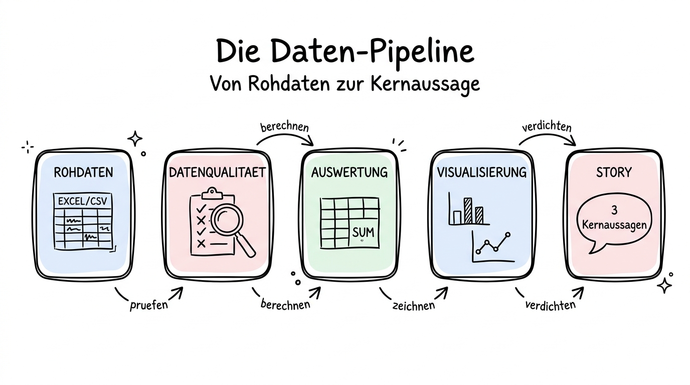

# 01 Warum KI für Daten

**Ein ehrlicher Einstieg: Was KI bei Daten richtig gut kann — und wo sie Sie in die Irre führt, wenn Sie nicht aufpassen.**

---

## Warum dieses Tutorial?

Sie kennen das: Eine Kollegin schickt Ihnen eine Excel-Datei mit 1.800 Zeilen Verkaufs­daten und der Bitte „Kannst du da mal schauen, ob du einen Trend siehst?". Früher bedeutete das: Pivot-Tabelle bauen, Formel prüfen, Diagramm machen, eventuell eine Stunde fluchen, weil die Datums­spalten im falschen Format sind. Heute bedeutet das: Datei in Claude Cowork hineinziehen, eine Frage auf Deutsch stellen, fertig.

Das ist nicht übertrieben. Die Kombination aus moderner LLM-Technik und echten Rechen­werkzeugen (Python, Pandas, Matplotlib) im Hintergrund hat die Daten­analyse für Nicht-Spezialistinnen revolutioniert. Sie brauchen keine Programmier­kenntnisse mehr, um eine saubere Kreuz­auswertung zu bekommen, einen Ausreißer zu finden oder einen Trend in einer Zeit­reihe zu erkennen. Sie brauchen nur noch zwei Dinge: **eine präzise Frage** und **ein gesundes Misstrauen** gegenüber den Antworten.

Dieses Kapitel liefert beides. Es zeigt Ihnen, wie Sie Fragen formulieren, die die KI präzise beantworten kann, und es zeigt Ihnen, wie Sie Antworten gegenprüfen, damit Sie nicht auf eine hübsche Zahl hereinfallen, die die KI sich ausgedacht hat. Der Einstieg beginnt hier — mit einer ehrlichen Bestand­saufnahme, was KI bei Daten gut kann, was sie mittel­mäßig kann und wo sie aktiv gefährlich wird.

**Was Sie nach diesem Tutorial wissen werden:**

- Welche fünf Klassen von Daten­aufgaben KI hervorragend erledigt — und welche drei Sie besser selbst machen.
- Warum moderne Werkzeuge wie Claude Cowork oder ChatGPTs Advanced Data Analysis bei Zahlen deutlich zuverlässiger sind als der reine Chat.
- Wie die Pipeline vom Roh­datensatz zur Geschichte aussieht, die Sie dann in eine Präsentation oder einen Report packen.
- Welche drei Grund­regeln Sie von Anfang an beherzigen sollten.

## Was KI bei Daten wirklich gut kann

Es gibt eine saubere Trennlinie zwischen den Aufgaben, bei denen KI heute besser ist als die meisten Menschen, und den Aufgaben, bei denen sie noch Unter­stützung braucht. Fangen wir mit der guten Seite an.

**Explorative Analyse — ein erster Blick in fremde Daten.** Sie bekommen eine Tabelle, die Sie noch nie gesehen haben. Was steht drin? Welche Spalten gibt es? Gibt es Lücken? Welche Werte kommen oft vor, welche sind Ausreißer? Wie verteilen sich die Zahlen? Das sind klassische Fragen des ersten Überblicks, und sie kosten normalerweise zwischen zehn Minuten und einer Stunde. Die KI erledigt sie in unter einer Minute — und zwar vollständig und mit Diagrammen. Dieser erste Blick ist die Paradedisziplin.

**Datenaufbereitung — die hässliche Vorarbeit.** Datum im falschen Format. Leere Zellen. Unterschiedliche Schreib­weisen für denselben Kunden („Müller GmbH", „Mueller GmbH", „müller gmbh"). Zahlen, die als Text formatiert sind. Diese Aufräum­arbeit ist zermürbend, wenn man sie von Hand macht. Die KI macht sie sauber, schnell und dokumentiert — sie sagt Ihnen hinterher, was sie geändert hat. Das allein ist schon Grund genug, sich mit Kapitel 11 zu beschäftigen.

**Pivots, Aggregationen und Kreuztabellen.** „Zeig mir den Umsatz pro Vertriebsregion pro Quartal." „Wie viele Bewerbungen kamen pro Kanal und pro Position?" „Welche Produkte haben in diesem Monat mehr verkauft als im Vormonat?" Das sind die Brot-und-Butter-Fragen des Reportings, und die KI beantwortet sie in natürlichem Deutsch zuverlässig.

**Korrelationen und einfache Muster.** Wenn Sie fragen: „Gibt es einen Zusammenhang zwischen dem Wochentag und der Anzahl der Support-Tickets?", kann die KI rechnen, visualisieren und in einem Satz zusammen­fassen. Sie können das auch selbst mit einer Pivot-Tabelle, aber es dauert viel länger.

**Visualisierungen in passender Form.** Ein Liniendiagramm für Zeitreihen, ein Balken­diagramm für Kategorien, ein Streudiagramm für zwei metrische Variablen, eine Heatmap für Korrelationen. Die KI wählt in den meisten Fällen vernünftig und liefert ein ordentliches Chart — inklusive sinnvoller Achsen­beschriftungen und Titeln, wenn Sie danach fragen.

**Kurzinterpretation einer Grafik in verständlichem Deutsch.** „Was sehe ich hier?" — und die KI erklärt es Ihnen. Das ist wahrscheinlich die unter­schätzteste Stärke. Viele Menschen haben keine Schwierigkeit, Zahlen zu berechnen, aber große Schwierigkeit, sie jemandem zu erklären, der noch nie in die Daten geschaut hat. Die KI ist ein guter erster Entwurf für solche Erklärungen.

## Was KI bei Daten nur mittel kann

**Kausalzusammenhänge.** Die KI kann Ihnen sagen: „Diese zwei Variablen korrelieren stark." Sie kann Ihnen nicht sagen, **warum**. Sie kann auch nicht erkennen, ob es sich um eine Schein­korrelation handelt, weil eine dritte, nicht in der Tabelle enthaltene Variable beide beeinflusst. Hier brauchen Sie Ihren eigenen Sach­verstand oder den einer Expertin für das Gebiet.

**Tiefe statistische Tests.** Ein einfacher Mittel­wert­vergleich funktioniert. Sobald es um Signifikanz­tests, Konfidenz­intervalle, Regressions­diagnostik oder Zeit­reihen­analyse im strengeren Sinn geht, muss jemand mit statistischem Wissen die Ergebnisse gegenlesen. Die KI rechnet die Formel oft richtig, interpretiert aber gelegentlich voreilig.

**Domain-Wissen.** Wenn in Ihrer Tabelle „EBITDA" steht und die KI fragen soll, ob der Wert normal ist, müsste sie wissen, was „normal" in Ihrer Branche bedeutet. Das weiß sie allenfalls grob. Bei Fach­sprache Ihres Unter­nehmens — internen Kürzeln, Produkt­namen, Projekt­codes — muss die KI erst instruiert werden, sonst rät sie.

## Was KI bei Daten aktiv gefährlich macht

**Zahlen im Chat ohne Tool-Unterstützung.** Wenn Sie einer KI im reinen Chat (ohne Daten­analyse-Modus, ohne Cowork, ohne xlsx-Skill) sagen: „Hier ist eine Liste von 200 Zahlen, bilde den Durchschnitt", wird sie Ihnen eine Zahl nennen. Diese Zahl kann richtig sein — oder auch nicht. Die KI rechnet dann nämlich nicht, sondern **schätzt** ein sprachlich plausibles Ergebnis. Bei kleinen Datensätzen fällt das nicht auf, bei großen oder bei exakten Summen schon. **Regel Nummer Eins dieses Kapitels: Lassen Sie die KI nie im reinen Chat über mehr als zehn Zahlen rechnen. Für alles darüber brauchen Sie ein Tool, das echten Code ausführt.**

**Selbstbewusste Falsch­aussagen über den Datensatz.** Die KI kann behaupten: „In Ihrer Tabelle sind 3.214 Einträge." Wenn es 3.217 sind, merken Sie das nur, wenn Sie gegen­prüfen. Das passiert vor allem, wenn Sie längere Gespräche führen und sich die Tabelle zwischen­zeitlich geändert hat — die KI erinnert sich an ältere Zustände, die nicht mehr gelten.

**Geistreiche Interpretationen, die die Daten nicht hergeben.** „Der Umsatz­einbruch im März lässt sich vermutlich durch den Lock­down erklären." Klingt gut, ist aber reine Spekulation der KI, solange die Tabelle keine Spalte „Lock­down ja/nein" enthält. Solche Sätze sind sprachlich flüssig und damit besonders verführerisch. Teil 07 zeigt Ihnen, wie Sie sie erkennen und wegstreichen.

## Die Daten-Pipeline in fünf Schritten

Wenn Sie sich nur eine einzige Grafik aus diesem Kapitel merken, dann diese: Die Reise einer Tabelle von den Roh­daten bis zur fertigen Geschichte hat **fünf Stationen**. Sie können Stationen überspringen, aber meistens rächt sich das später.

**Station 1: Rohdaten.** Eine CSV-, Excel- oder manchmal auch eine JSON-Datei. Sie kommt aus einem System (ERP, CRM, Umfrage­tool), ist nicht für Menschen gemacht, sondern für Maschinen. Spalten­namen sind kryptisch, Formate uneinheitlich, Codierung manchmal schief. Teil 02 zeigt, wie Sie diese Datei an die KI übergeben.

**Station 2: Datenqualität.** Bevor Sie **irgend­etwas** auswerten, lassen Sie die KI einen Qualitäts­check machen: Welche Spalten gibt es? Welche sind leer? Welche haben komische Werte? Gibt es Duplikate? Das ist der wichtigste Schritt, den die meisten Leute überspringen — und damit alles, was danach kommt, ruinieren. Teil 03 widmet sich allein dieser Station.

**Station 3: Auswertung.** Summen, Durchschnitte, Pivots, Trends, Korrelationen. Der Kern dessen, wofür Sie überhaupt mit der Datei arbeiten. Teil 04 gibt Ihnen die Prompt-Muster und zeigt typische Beispiele.

**Station 4: Visualisierung.** Aus Zahlen werden Diagramme. Die KI macht das für Sie, aber Sie müssen wissen, **welches** Diagramm zu **welcher Frage** passt. Teil 05 hat einen kleinen Entscheidungs­baum dafür.

**Station 5: Story.** Die Auswertung allein ist kein Ergebnis. Erst wenn Sie sagen können, **was die drei wichtigsten Erkenntnisse sind** und wie sie für die Empfänger­seite relevant werden, haben Sie einen verwertbaren Output. Teil 06 zeigt, wie Sie das methodisch angehen.

## Drei Grund­regeln, die Sie ab jetzt beherzigen sollten

**Regel 1: Niemals ungeprüft übernehmen.** Jede Zahl, die Sie aus einer KI-Antwort in ein Dokument oder eine Präsentation übertragen, muss mindestens einen Sanity-Check bestanden haben. Bei wichtigen Zahlen: zwei. Teil 07 zeigt, wie das systematisch geht.

**Regel 2: Echte Rechen­werkzeuge statt Kopf­rechnen.** Nutzen Sie immer ein Werkzeug, das tatsächlich Code ausführt, sobald mehr als eine Handvoll Zahlen im Spiel sind. Claude Cowork mit xlsx-Skill, ChatGPT Advanced Data Analysis und Gemini mit Google Sheets sind Ihre Freunde. Der reine Chat ist es nicht.

**Regel 3: Sensible Daten gehören in das richtige Tool.** Eine Tabelle mit Kunden­namen, Gehältern oder Gesundheits­daten ist kein Spiel­zeug für einen öffentlichen Chat­dienst. Entscheiden Sie **bevor** Sie die Datei hoch­laden, ob der Inhalt das darf. Kapitel 14 (Teil 02) hat dafür die Daten-Ampel; Teil 02 dieses Kapitels bringt die Ampel auf Ihre konkrete Datei­situation.

## Was Sie mitnehmen sollten

Die wichtigste Einsicht dieses Einführungs­kapitels ist: KI verschiebt die Arbeit, sie schafft sie nicht ab. Die Auswertung, die früher Ihre Arbeit war, erledigt die KI. Dafür wird Ihre Arbeit, die richtigen Fragen zu stellen und die Antworten kritisch zu prüfen, wichtiger. Das ist am Anfang ungewohnt, aber schnell angenehmer als die alte Welt, in der Sie die mecha­nische Pivot-Arbeit gemacht haben und dann zu erschöpft waren, um noch gute Schlüsse zu ziehen.

Wenn Sie in der Lage sind, gute Fragen zu stellen und Antworten ehrlich zu prüfen, sind Sie einer durchschnittlichen Daten­analystin heute oft schon ebenbürtig — in den Aufgaben­klassen, die dieses Kapitel behandelt. Für tiefergehende statistische Arbeit bleibt die Spezialistin natürlich besser. Aber für 80 Prozent der Fragen, die in einem normalen Arbeits­alltag auftauchen, reicht das, was Sie hier lernen, vollkommen aus.

---

**Weiter geht es mit:** [02 Tabellen an die KI übergeben](./02%20Tabellen%20an%20die%20KI%20uebergeben.md) — die verschiedenen Wege, wie eine Tabelle zur KI kommt, welche Vor- und Nachteile sie haben und wie Sie Claude Cowork mit dem xlsx-Skill produktiv einsetzen.
