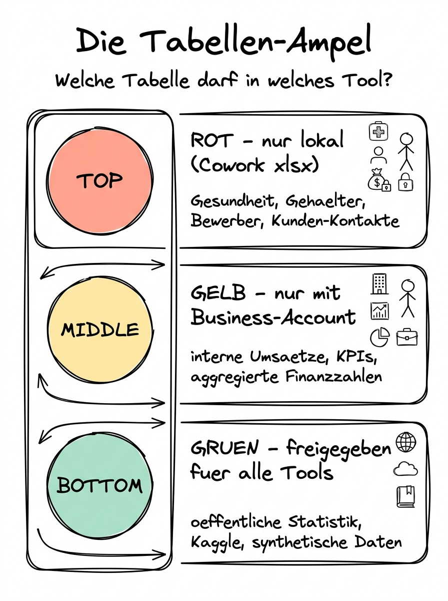

# 02 Tabellen an die KI übergeben

**Vier Wege führen zum Ziel — und einer ist für ernsthafte Arbeit klar zu bevorzugen.**

---

## Warum dieses Tutorial?

Bevor die KI Ihnen eine Tabelle auswerten kann, muss die Tabelle irgendwie zu ihr kommen. Diese scheinbar banale Frage hat überraschend viele Facetten: Datei hochladen? Inhalt in den Chat kopieren? Einen Ordner mit Cowork öffnen? Ein Skill nutzen? Und vor allem: Was passiert mit meinen Daten hinter den Kulissen?

Dieser Teil ordnet die vier wichtigsten Wege, vergleicht sie sauber und zeigt Ihnen anhand eines konkreten Beispiels, wie der empfohlene Workflow — Claude Cowork mit dem xlsx-Skill — von Anfang bis Ende aussieht. Am Ende dieses Teils wissen Sie nicht nur, **welchen** Weg Sie nehmen sollten, sondern auch **warum** und **wann** Sie eine Ausnahme machen dürfen.

**Was Sie nach diesem Tutorial wissen werden:**

- Welche vier Übergabe­wege es in der Praxis gibt und welche Eigenschaften jeweils dazugehören.
- Wann welcher Weg der richtige ist — inklusive Entscheidungs­hilfe per Daten-Ampel.
- Wie der Cowork-Workflow mit dem xlsx-Skill konkret abläuft, Schritt für Schritt.
- Welche Fall­stricke Sie bei jedem Weg kennen müssen — insbesondere rund um Datenschutz und Datei­größen.



## Die vier Wege im Überblick

**Weg 1: Inhalt direkt in den Chat kopieren.** Sie markieren eine kleine Tabelle in Excel, drücken Strg+C und fügen sie in den Chat mit Claude oder ChatGPT ein. Vorteil: schnell, kein Datei-Handling. Nachteil: Sobald die Tabelle mehr als grob 50 Zeilen hat, wird der Chat unübersichtlich, und vor allem rechnet die KI im Kopf — mit allen Genauigkeits­problemen aus Teil 01. Geeignet für wirklich winzige Daten­schnipsel, bei denen Sie nur eine schnelle Einschätzung brauchen.

**Weg 2: Datei-Upload im Browser-Chat.** Auf claude.ai können Sie Dateien direkt in den Chat hochladen — bis zu fünf gleichzeitig, pro Datei gelten Größen­grenzen, die sich regelmäßig ändern (Stand April 2026: etwa 30 MB pro Datei, insgesamt etwa 100 MB pro Chat). Claude kann Excel-, CSV- und PDF-Dateien lesen. Der Vorteil: Sie müssen keine Desktop-App installieren. Der Nachteil: Die Datei liegt kurz­zeitig auf Anthropics Servern. Wenn Sie einen Business- oder Enterprise-Account haben, gibt es strengere Datenschutz­garantien; bei privaten Accounts gilt die normale Nutzungs­bedingung. **Für personenbezogene Daten ist dieser Weg daher nur mit aktivem Business-Account akzeptabel.** Für öffentliche oder synthetische Daten dagegen völlig in Ordnung.

**Weg 3: ChatGPT Advanced Data Analysis.** Der klassische „Code Interpreter" von OpenAI. Sie laden eine Datei hoch, ChatGPT startet eine isolierte Python-Sandbox, führt echten Code aus und zeigt Ihnen Diagramme. Die Rechen­genauigkeit ist damit gelöst. Der Datenschutz-Kontext ist identisch zum Claude-Browser: ohne Business-Account keine personenbezogenen Daten. Ein kleiner Bonus: Die Sandbox lässt sich auch für kleine Datei­konvertierungen und Text­aufgaben nutzen.

**Weg 4: Claude Cowork mit dem xlsx-Skill.** Sie öffnen die Claude Desktop App im Cowork-Modus, wählen den Ordner, in dem die Excel-Datei liegt, und fordern Claude auf, die Datei mit dem xlsx-Skill zu analysieren. Claude ruft den Skill auf, führt echten Python-Code gegen die Datei aus und gibt Ihnen eine strukturierte Antwort mit Tabellen und Diagrammen zurück. Die Datei verlässt Ihren Rechner für die reine Code-Ausführung **nicht**; nur Ihre Anweisungen und die Rück­meldung von Claude gehen an den Anthropic-Server. Das ist der Weg, den wir in diesem Kapitel empfehlen und vertiefen.

## Vergleichs­tabelle

| Eigenschaft | Chat kopieren | Browser-Upload | ChatGPT ADA | Cowork + xlsx-Skill |
|-------------|---------------|----------------|-------------|---------------------|
| Rechen­genauigkeit | gering | mittel bis hoch | hoch | hoch |
| Max. Datei­größe | sehr klein | ca. 30 MB | ca. 500 MB | praktisch unbegrenzt |
| Datei bleibt lokal | ja | nein | nein | ja (nur Anweisungen an Server) |
| Personenbezogene Daten | nein | nur mit Business | nur mit Business/Enterprise | ja, mit Sorgfalt |
| Installationsaufwand | keiner | keiner | keiner | Desktop App |
| Typischer Use Case | schnelle Frage zu 20 Zahlen | kleiner, nicht sensibler Datensatz | wie links, auf OpenAI-Seite | jede ernsthafte Analyse |

Diese Tabelle ist das Rück­grat der Entscheidung: Je weiter rechts Sie in der Tabelle landen, desto mehr können Sie machen und desto sicherer ist der Datenschutz. Je weiter links, desto niedriger die Einstiegs­hürde.

## Die Daten-Ampel als Entscheidungshilfe

Diese Ampel ist eine Weiter­entwicklung der Ampel aus Kapitel 14, Teil 02 — angepasst auf den speziellen Fall von Tabellen­daten.

**Rot — darf nicht in einen Chat-Upload.** Gesundheits­daten, Sozial­versicherungs­nummern, Gehalts­listen mit Namen, Bewerber­daten mit Bewerbungs­freitext, interne Strategie­dokumente mit Wettbewerbs­information, Kunden­listen mit Kontakt­daten ohne Einwilligung, Polizei- oder Gerichts­daten. Diese Daten dürfen bei einem normalen privaten Account gar nicht hochgeladen werden. Mit einem gebuchten Business-/Enterprise-Account (Claude for Work, ChatGPT Enterprise, Teams mit DPA) sind manche dieser Fälle erlaubt, wenn die vertragliche Grund­lage stimmt und die Auftrags­verarbeitungs­vereinbarung existiert. **Empfehlung: Für rote Daten Cowork lokal verwenden und den xlsx-Skill nutzen, sodass die Datei das System nicht verlässt.**

**Gelb — mit Business-Account und Vorsicht.** Interne Umsatz­zahlen ohne Kunden­bezug, aggregierte Finanz­daten, Projekt­status­listen, Team-KPIs, Zufriedenheits­umfragen mit anonymisierten Antworten, Pipeline-Daten. Diese Daten sind nicht „rot", aber Sie wollen auch nicht, dass sie irgendwo öffentlich auftauchen. Mit einem Business-Account ist das okay, bei privaten Accounts pseudonymisieren oder lokal arbeiten.

**Grün — dürfen überall hin.** Öffentliche Statistiken vom Statistischen Bundesamt, Börsen­daten, Kaggle-Datensätze, Wetter­daten, synthetische Test­daten, anonymisierte Umfragen mit mindestens zehn Befragten pro Zelle, komplett öffentliche Daten­sätze aus der Wissenschaft. Diese Daten können Sie bedenkenlos in jedes der vier Verfahren geben.

Für die meisten Leserinnen und Leser dieses Kapitels gilt: **Ihre typische Arbeits­tabelle ist gelb.** Das ist der Normalfall im Arbeits­alltag — keine Gesundheits­daten, aber auch nicht völlig frei zu teilen. Und genau deshalb ist der Cowork-Weg mit xlsx-Skill der Standard, den wir in diesem Kapitel nutzen.

## Der Cowork-Workflow mit dem xlsx-Skill, Schritt für Schritt

Angenommen, Sie haben eine Excel-Datei `verkaeufe_2025.xlsx` mit 1.800 Zeilen — eine Spalte mit dem Datum, eine mit dem Produkt, eine mit dem Kunden­namen, eine mit dem Umsatz, eine mit der Region. Sie wollen wissen, wie sich der Umsatz pro Region über die Quartale entwickelt hat. So läuft der Workflow ab.

**Schritt 1: Datei an den richtigen Ort.** Die Datei liegt in einem Ordner auf Ihrer Festplatte, den Sie der Claude Desktop App als Arbeits­ordner zugewiesen haben. In Kapitel 10, Teil 02 haben Sie gesehen, wie das geht — Sie klicken in der Cowork-Oberfläche auf „Ordner auswählen" und wählen dann zum Beispiel `~/Dokumente/Auswertungen`. Claude sieht ab sofort die Dateien in diesem Ordner, darf sie lesen und bearbeiten.

**Schritt 2: Prompt formulieren.** Sie öffnen einen neuen Chat in der Cowork-Ansicht und tippen:

```
In meinem Arbeitsordner liegt die Datei verkaeufe_2025.xlsx. Bitte öffne
sie mit dem xlsx-Skill, gib mir zuerst einen Überblick über die Spalten
und Zeilenzahl und prüfe die Datenqualität. Danach warten wir die nächste
Anweisung ab.
```

Warum diese zweistufige Herangehensweise? Weil Teil 03 dieses Kapitels es Ihnen so einbläuen wird: **Erst Qualität prüfen, dann auswerten.** Niemand sollte blind eine Auswertung anfordern, ohne vorher gesehen zu haben, ob die Daten überhaupt sauber sind.

**Schritt 3: Claude ruft den Skill auf.** Sie sehen im Chat, wie Claude zunächst die Datei liest (der xlsx-Skill hat dafür eigene Funktionen), dann die Struktur analysiert und Ihnen eine strukturierte Antwort liefert. Typisch ist eine Tabelle mit den Spalten­namen, einer Beispiel­zeile, der Anzahl der Datenzeilen, dem Anteil leerer Zellen pro Spalte und einer kurzen Bewertung: „Alle Datums­werte gültig", „42 Zeilen haben leere Werte in der Spalte 'Region'", „Kunden­namen kommen in unter­schiedlicher Schreib­weise vor (Beispiele: Müller, Mueller, Mueller GmbH)".

**Schritt 4: Entscheidung — aufräumen oder direkt auswerten?** Wenn die Qualitäts­prüfung Mängel zeigt, reinigen Sie die Daten zuerst — entweder über einen weiteren Prompt („Bitte korrigiere die Schreib­weise der Kunden­namen und speichere die bereinigte Datei als verkaeufe_2025_bereinigt.xlsx in denselben Ordner") oder manuell. Teil 03 geht tief in diesen Schritt.

**Schritt 5: Die eigentliche Auswertung.** Wenn die Daten sauber sind, folgt die Kern­anfrage:

```
Bitte berechne aus verkaeufe_2025.xlsx den Umsatz pro Region pro Quartal.
Gib das Ergebnis als Tabelle und als Liniendiagramm aus. Das Diagramm
soll vier Linien haben (eine pro Region) und auf der X-Achse die Quartale
Q1 bis Q4. Speichere das Diagramm als PNG im Arbeitsordner.
```

Claude führt den Skill-Code aus, die Rechnung passiert in einer lokalen Python-Umgebung, das Ergebnis landet im Chat als Tabelle und als Bild. Die PNG-Datei wird tatsächlich in Ihrem Ordner gespeichert — Sie können sie sofort in eine Präsentation ziehen.

**Schritt 6: Ergebnis prüfen.** Bevor Sie die Zahlen in einen Report übernehmen, machen Sie einen Sanity-Check: Stimmt die Summe über alle Regionen und Quartale mit der Summe, die Sie vorher aus der Datei kennen (oder mit einer Stichprobe aus Excel berechnen können)? Sieht das Diagramm plausibel aus? Sind die Regionen korrekt beschriftet? Teil 07 widmet diesem Schritt eine eigene Checkliste.

## Was der xlsx-Skill im Hintergrund tut

Der xlsx-Skill ist eine Sammlung von Anweisungen und Python-Helfer­funktionen, die Claude beim Umgang mit Excel-Dateien unterstützen. Er nutzt im Kern die Bibliotheken `openpyxl` für Excel-Dateien und `pandas` für die Analyse. Das Schöne an einem Skill gegenüber einem manuellen Vorgehen: Die Best Practices für typische Operationen — Datenbereinigung, Pivot, Diagramm­erzeugung — sind bereits im Skill dokumentiert. Claude muss nicht jedesmal raten, wie man eine Zeit­achse richtig formatiert. Es steht im Skill.

Wenn Sie den Skill noch nicht aktiviert haben: Die Skills sind in der Cowork-App unter „Skills" im Seitenmenü zu finden und lassen sich per Klick aktivieren. In Kapitel 10, Teil 03, ist das Skill-System ausführlich beschrieben.

## Fallstricke und typische Probleme

**Die Datei ist in einem anderen Ordner als dem Arbeits­ordner.** Claude kann in der Cowork-Standard­konfiguration nur auf den ausgewählten Ordner zugreifen. Wenn die Datei woanders liegt, kopieren Sie sie erst in den Arbeits­ordner oder wählen den übergeordneten Ordner neu aus.

**Die Datei hat mehrere Arbeits­blätter.** Ein Standard-Prompt liest nur das erste Blatt. Sagen Sie explizit: „Lies das Arbeits­blatt 'Q1-Daten'" oder „Lies alle Arbeits­blätter und nenne die Namen".

**Die Datei hat verbundene Zellen oder Kopf­zeilen über mehrere Ebenen.** Solche „schönen" Excel-Tabellen sind für Maschinen­lesen schlecht. Der Skill kommt damit oft zurecht, aber nicht immer. Wenn Sie Probleme haben, bitten Sie Claude, die Datei zuerst in eine flache Form mit einer einzigen Kopfzeile umzuwandeln und als neue Datei zu speichern.

**CSV statt Excel.** Der xlsx-Skill heißt zwar so, kommt aber auch mit CSV-Dateien zurecht, weil pandas beides lesen kann. Nennen Sie im Prompt nur den Datei­namen und Claude erkennt das Format am Suffix.

**UTF-8 vs. Windows-1252.** Wenn in Ihrer CSV die Umlaute kaputt sind (also als `ü` statt `ü` angezeigt werden), ist die Datei in Windows-1252 kodiert. Sagen Sie Claude im Prompt: „Die CSV ist vermutlich Windows-1252 kodiert, bitte beim Einlesen entsprechend behandeln." Das klappt in der Regel auf Anhieb.

**Sehr große Dateien.** Excel-Dateien mit über 500.000 Zeilen können die Verarbeitung verlangsamen. In solchen Fällen bitten Sie Claude, zunächst nur eine Stichprobe zu analysieren, oder arbeiten mit einem aggregierten Teil­datensatz, den Sie vorher in Excel oder einem anderen Tool erstellt haben.

## Zusammenfassung — welchen Weg für welchen Fall?

Für den **Alltag eines normalen Wissens­arbeiters** ist Cowork + xlsx-Skill der Standardweg. Sie haben damit die höchste Rechen­genauigkeit, den besten Datenschutz und die meisten Funktionen. Die Lern­kurve für die Cowork-App ist überschaubar — nach ein, zwei Sitzungen haben Sie den Dreh raus.

Für **Einzel­personen ohne Desktop-App** ist der Browser-Upload auf claude.ai der pragmatische Zweit­weg — solange die Daten nicht rot in der Ampel sind und die Datei nicht zu groß.

Für **OpenAI-Umgebungen** ist ChatGPT Advanced Data Analysis das funktionale Äquivalent zum Cowork-Weg, mit dem einzigen wesentlichen Unter­schied, dass die Datei die OpenAI-Server erreicht.

Für **wirklich winzige Zahlenfragen** („Ich habe hier fünf Werte, bitte den Mittelwert"), wenn Sie gerade unterwegs sind und keine Desktop-Software zur Hand haben, ist auch der reine Chat-Weg okay — aber wirklich nur dann.

---

**Weiter geht es mit:** [03 Datenqualität vor der Analyse](./03%20Datenqualitaet%20vor%20der%20Analyse.md) — warum „Müll rein, Müll raus" der wichtigste Satz der Daten­analyse ist, und wie Sie in zwei Prompts prüfen, ob Ihre Tabelle überhaupt auswertbar ist.
