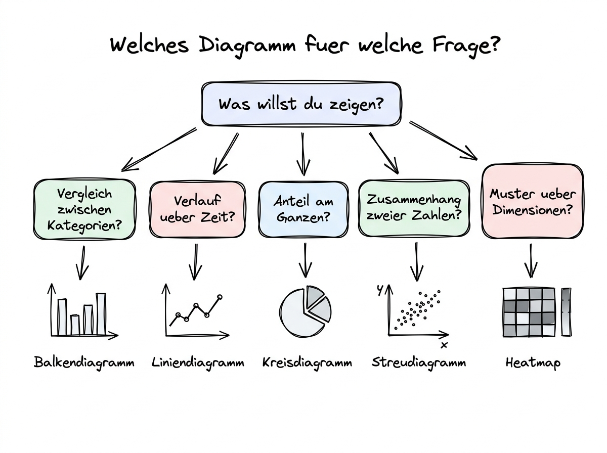

# 05 Visualisierungen und Diagramme

**Welches Diagramm für welche Frage — und wie Sie verhindern, dass Ihre KI eine hübsche, aber völlig unpassende Grafik baut.**

---

## Warum dieses Tutorial?

Eine gute Visualisierung ersetzt oft einen ganzen Absatz Text. Eine schlechte Visualisierung ist schlimmer als gar keine — sie verwirrt, sie irre­führt und sie bleibt länger hängen als die Zahl, die sie eigentlich zeigen sollte. Die moderne KI erzeugt Diagramme auf Knopfdruck. Das ist ein Fluch und ein Segen zugleich: Der Segen ist, dass Sie in Sekunden eine Grafik haben. Der Fluch ist, dass die KI gelegentlich den falschen Diagrammtyp wählt, die Achsen unglücklich skaliert oder Informationen weglässt, die entscheidend wären.

Dieser Teil gibt Ihnen einen knappen, aber belastbaren Leitfaden: Welches Diagramm für welche Frage­art? Worauf müssen Sie bei KI-generierten Charts achten? Und wann lassen Sie die Grafik noch­mal neu machen, weil sie nicht das zeigt, was Sie brauchen?

**Was Sie nach diesem Tutorial wissen werden:**

- Welche sechs Diagrammtypen 95 Prozent aller Daten­fragen abdecken.
- Ein Entscheidungs­baum, der Ihnen sagt, welcher Typ zu welcher Frage passt.
- Die fünf Regeln für gute Diagramme, die auch gelten, wenn eine KI sie erstellt.
- Wie Sie eine KI-Grafik systematisch prüfen, bevor Sie sie veröffentlichen.



## Die sechs Diagrammtypen, die Sie brauchen

**Balken­diagramm.** Der universelle Vergleich zwischen Kategorien: Umsatz pro Region, Anzahl Bewerbungen pro Kanal, Verkäufe pro Produkt. Jede Kategorie bekommt einen Balken, die Länge des Balkens entspricht dem Wert. Balken­diagramme sind robust, leicht zu lesen und fast nie falsch. Als Variante: horizontales Balken­diagramm, wenn die Kategorien­namen lang sind.

**Linien­diagramm.** Der Zeit­verlauf: Umsatz pro Monat, Besucher pro Tag, Aktien­kurs. Eine Linie pro Serie, die X-Achse ist Zeit, die Y-Achse der Wert. Linien­diagramme sind gut, wenn Sie mehrere Serien gleichzeitig zeigen wollen (zum Beispiel Umsatz pro Region über die Zeit). Faustregel: nicht mehr als fünf bis sechs Linien gleich­zeitig, sonst wird es ein Knäuel.

**Gestapeltes Balken­diagramm.** Zwei Dimensionen auf einmal: Umsatz pro Region, aufgeschlüsselt nach Produkt­gruppe. Jeder Balken ist ein Stapel aus Teil­stücken. Gut, wenn Sie sowohl die Gesamt­summe pro Kategorie als auch die innere Zusammen­setzung zeigen wollen. Falle: Wenn es zu viele Teil­stücke gibt, werden sie zu dünn und unlesbar.

**Kreis- und Ring­diagramm.** Ein Anteil eines Ganzen: Markt­anteile, Budget­aufteilung. Kreis­diagramme haben einen schlechten Ruf bei Daten­profis, weil Menschen Winkel schlecht vergleichen. Aber bei sehr wenigen Kategorien (drei bis fünf) und klaren Größen­unter­schieden sind sie gut lesbar. Bei mehr Kategorien sollten Sie ein Balken­diagramm bevorzugen.

**Streu­diagramm.** Zwei metrische Variablen gegen­einander: Rabatt vs. Umsatz, Alter vs. Gehalt, Werbe­ausgaben vs. Verkäufe. Jeder Punkt ist eine Beobachtung. Gut, um Zusammen­hänge, Cluster und Ausreißer zu sehen. Faustregel: Bei mehr als ein paar hundert Punkten wird es eine Wolke; lassen Sie dann die KI mit Transparenz arbeiten oder Heat­maps erzeugen.

**Heatmap.** Eine zweidimensionale Tabelle mit farbigen Zellen: Umsatz pro Region pro Monat, Aktivität pro Wochen­tag pro Stunde. Gut für Muster-Erkennung über zwei Dimensionen hinweg — besonders für periodische Muster wie Wochen­rhythmen.

Diese sechs Typen decken fast alles ab, was Sie im Arbeits­alltag brauchen. Nicht auf der Liste: 3D-Diagramme (fast immer schlechter als ihre 2D-Pendants), Radar-/Spinnen­diagramme (schwer zu lesen), Word Clouds (sehen hübsch aus, sagen wenig). Wenn die KI Ihnen eine 3D-Pivot-Chart vorschlägt: Lassen Sie sie das in 2D neu machen.

## Der Entscheidungs­baum

Wenn Sie unsicher sind, welchen Typ Sie nehmen sollen, laufen Sie diesen Baum durch. Er ist bewusst einfach gehalten und deckt die meisten Fälle.

**Frage 1: Wie viele Dimensionen habe ich?**

- **Eine Dimension (Kategorien):** Geht es um Anteile an einem Ganzen? → Kreis­diagramm (nur bei wenigen Kategorien) oder Balken­diagramm (immer sicher). Geht es um Vergleich absoluter Werte zwischen Kategorien? → Balken­diagramm.
- **Zwei Dimensionen:** Ist eine davon Zeit? → Linien­diagramm. Sind beide Kategorien? → Gestapeltes Balken­diagramm oder Heatmap (bei vielen Ausprägungen). Sind beide metrisch (Zahlen)? → Streu­diagramm.
- **Drei oder mehr Dimensionen:** Heatmap mit Farbcodierung, kleine Diagramm-Matrix („facet grid"), oder teilen Sie das in mehrere separate Diagramme auf. Drei Dimensionen in einer einzigen Grafik sind fast immer anstrengend.

**Frage 2: Was ist die eigentliche Botschaft?**

- **„Etwas ist größer als etwas anderes":** Balken­diagramm, absteigend sortiert.
- **„Etwas ändert sich über die Zeit":** Linien­diagramm.
- **„Etwas ist ein Anteil eines Ganzen":** Kreis- oder Ring­diagramm, oder horizontales Balken­diagramm.
- **„Zwei Größen hängen zusammen":** Streu­diagramm mit Trend­linie.
- **„Hier gibt es ein Muster, das nur sichtbar wird, wenn man beide Achsen sieht":** Heatmap.

## Die fünf Regeln für gute Diagramme

**Regel 1: Eine klare Botschaft pro Diagramm.** Wenn Sie mehr als einen Punkt zeigen wollen, machen Sie mehrere Diagramme. Ein Diagramm, das gleich­zeitig drei Botschaften transportiert, transportiert am Ende gar keine.

**Regel 2: Achsen starten bei Null — außer wenn es begründete Ausnahme gibt.** Bei Balken­diagrammen ist das Pflicht, sonst sind Verhältnisse verzerrt. Bei Linien­diagrammen darf die Y-Achse beschnitten sein, wenn der interessante Wert­bereich sehr klein relativ zum Absolut­wert ist — dann aber mit klarer Beschriftung und Warn­hinweis.

**Regel 3: Sortierung hilft beim Lesen.** Balken­diagramme sind fast immer besser, wenn sie nach Wert sortiert sind (absteigend). Ausnahme: Wenn die Reihen­folge inhaltlich wichtig ist (zum Beispiel Wochen­tage oder Quartale).

**Regel 4: Farbe ist Information.** Nicht jedes Balken­diagramm braucht zehn verschiedene Farben. Oft reicht eine einzige Farbe, mit einem Highlight-Balken in einer Kontrast­farbe für den wichtigen Wert. Farbe sollte erzählen, nicht dekorieren.

**Regel 5: Beschriftung schlägt Legende.** Wenn Sie eine Kategorie direkt am Balken oder an der Linie beschriften können, tun Sie das. Legenden zwingen das Auge, hin und her zu wandern.

## Wie Sie die KI instruieren, dass sie das richtige Diagramm macht

Der beste Weg, ein passendes Diagramm zu bekommen, ist ein **expliziter Prompt**. Die KI rät sonst gelegentlich falsch, insbesondere wenn Sie nur „zeig mir das als Grafik" sagen.

**Schlecht:**

```
Zeig mir den Umsatz pro Region als Grafik.
```

Das ist mehrdeutig. Balken­diagramm? Kreis­diagramm? Welche Farbe? Sortiert oder nicht?

**Besser:**

```
Erstelle ein Balkendiagramm mit folgenden Eigenschaften:

- Daten: Summe Umsatz pro Region, sortiert absteigend.
- Orientierung: horizontal (weil die Regionsnamen lang sind).
- Farbe: einheitliches Dunkelblau, die höchste Region in Orange
  hervorgehoben.
- X-Achse startet bei Null.
- Y-Achse: Region-Namen, nach Wert sortiert.
- Titel: „Umsatz nach Region, 2025".
- Beschriftung direkt am Balkenende mit dem Wert in Euro (Tausender-
  Trennung).
- Keine Legende.

Speichere als umsatz_nach_region.png im Arbeitsordner. Größe:
1600x900 Pixel, 150 dpi.
```

Ja, dieser Prompt ist lang. Aber er liefert in einem Schritt das Diagramm, das Sie wollen, statt in fünf Durchgängen „ein bisschen dunkler, etwas größer, anders sortiert". Mit der Zeit entwickeln Sie Ihre eigenen Standard-Prompts und kopieren sie nur noch an.

## Typische Probleme bei KI-Diagrammen

**Problem: Die Achsen sind schlecht skaliert.** Ein Umsatz-Diagramm, das von 490.000 bis 510.000 geht — der optische Unter­schied wirkt riesig, obwohl der tatsächliche Unter­schied winzig ist. Lösung: „Die Y-Achse bitte bei Null beginnen lassen."

**Problem: Zu viele Kategorien.** Alle 80 Produkte in einem Balken­diagramm nebeneinander — unlesbar. Lösung: „Zeige nur die Top 15 Produkte, den Rest unter 'Sonstige' zusammenfassen."

**Problem: Farben ohne System.** Die KI wählt fünf fröhliche Farben, aber keine davon hebt die wichtige Kategorie hervor. Lösung: Farben explizit vorgeben, wie im Beispiel­prompt oben.

**Problem: Titel und Beschriftungen auf Englisch.** Die Grafik soll in einen deutschen Report — also müssen Titel, Achsen­beschriftungen und Legenden auf Deutsch sein. Lösung: „Alle Beschriftungen auf Deutsch."

**Problem: Verzerrte Verhältnisse durch beschnittene Achsen.** Ein Balken­diagramm, bei dem die Y-Achse nicht bei Null beginnt, macht aus fünf Prozent Unter­schied gefühlt fünfzig. Das ist eine klassische Manipulations­technik — ohne böse Absicht, aber mit gefährlicher Wirkung. Immer prüfen, ob die Achsen ehrlich sind.

**Problem: Die Grafik sieht schön aus, zeigt aber nicht das, was Sie gefragt haben.** Die KI hat „Umsatz über Region" als „Anteil pro Region" interpretiert statt als absolute Summe, oder umgekehrt. Lösung: Immer einen Blick auf die konkreten Zahlen in der zugehörigen Tabelle werfen. Wenn die Tabelle zu den Zahlen im Chart passt, ist die Grafik in Ordnung.

## Die Prüf-Routine für eine KI-Grafik

Bevor Sie eine KI-generierte Grafik in einen Bericht oder eine Präsentation übernehmen, gehen Sie diese sieben Punkte durch:

1. **Zeigt das Diagramm, was Sie wissen wollten?** Stimmt die eigentliche Aussage?
2. **Beginnen die Achsen bei Null?** Falls nicht, ist das gerechtfertigt und klar markiert?
3. **Ist die Sortierung sinnvoll?** Würde eine andere Sortierung die Aussage klarer machen?
4. **Sind Titel, Achsen und Einheit verständlich?** Hat der Titel die Aussage, nicht nur das Thema?
5. **Sind die Farben funktional?** Erzählen sie etwas oder sind sie nur Dekoration?
6. **Passen die Zahlen zum dazugehörigen Datensatz?** Spot-Check einer oder zweier Werte gegen die Roh­tabelle.
7. **Würde jemand, der die Daten nicht kennt, die Grafik verstehen?** Wenn nicht, ist etwas zu verbessern.

Die sieben Punkte klingen nach viel, lassen sich aber in einer Minute abarbeiten. Wer diese Routine verinnerlicht, vermeidet die typischen Grafik-Unfälle, die in vielen Firmen­berichten zu finden sind.

## Eine kleine Ehrenrettung für Mermaid

Neben den klassischen Chart-Typen gibt es ein weiteres Format, das in KI-Workflows oft unterschätzt wird: **Mermaid-Diagramme**. Mermaid ist eine Text­beschreibung, aus der Flow­charts, Organigramme, Gantt-Diagramme und einfache Sequenz­darstellungen erzeugt werden. Claude kann Mermaid-Code produzieren, der in Markdown-Dateien, GitHub-READMEs und vielen Wiki-Systemen direkt gerendert wird.

Für Datenpunkte mit Zahlen sind Mermaid-Diagramme nicht geeignet — dafür nutzen Sie die oben genannten Typen. Für Prozesse, Zusammen­hänge und Entscheidungs­bäume dagegen sind sie fantastisch. Ein Prompt wie „Erzeuge ein Mermaid-Flussdiagramm, das den Freigabe­prozess zeigt" liefert in Sekunden ein sauberes Diagramm, das sich in jede Markdown-Datei einbetten lässt.

## Was Sie mitnehmen sollten

Sechs Diagrammtypen, fünf Regeln, ein Entscheidungs­baum, eine Prüf-Routine — mehr brauchen Sie im Arbeits­alltag nicht. Die KI erledigt die Handwerks­arbeit des Zeichnens, Sie übernehmen die Regie: Welche Botschaft soll rüber­kommen, welcher Typ, welche Skalierung, welche Farben. Wenn Sie diese Regie bewusst führen, sind KI-Diagramme eine enorme Hilfe. Wenn Sie sie der KI überlassen, bekommen Sie im Durch­schnitt mittel­mäßige Grafiken, die manchmal sogar irre­führen.

Der nächste Teil geht einen Schritt weiter: Auch die beste Grafik ist wertlos, wenn Sie am Ende nicht sagen können, **was sie bedeutet**. Wie aus Zahlen und Bildern eine Geschichte wird, die Entscheidungen leitet, lernen Sie in Teil 06.

---

**Weiter geht es mit:** [06 Daten-Storytelling](./06%20Daten-Storytelling.md) — wie Sie aus einer Auswertung eine Geschichte machen, die bei Empfängerinnen und Empfängern wirklich ankommt.
