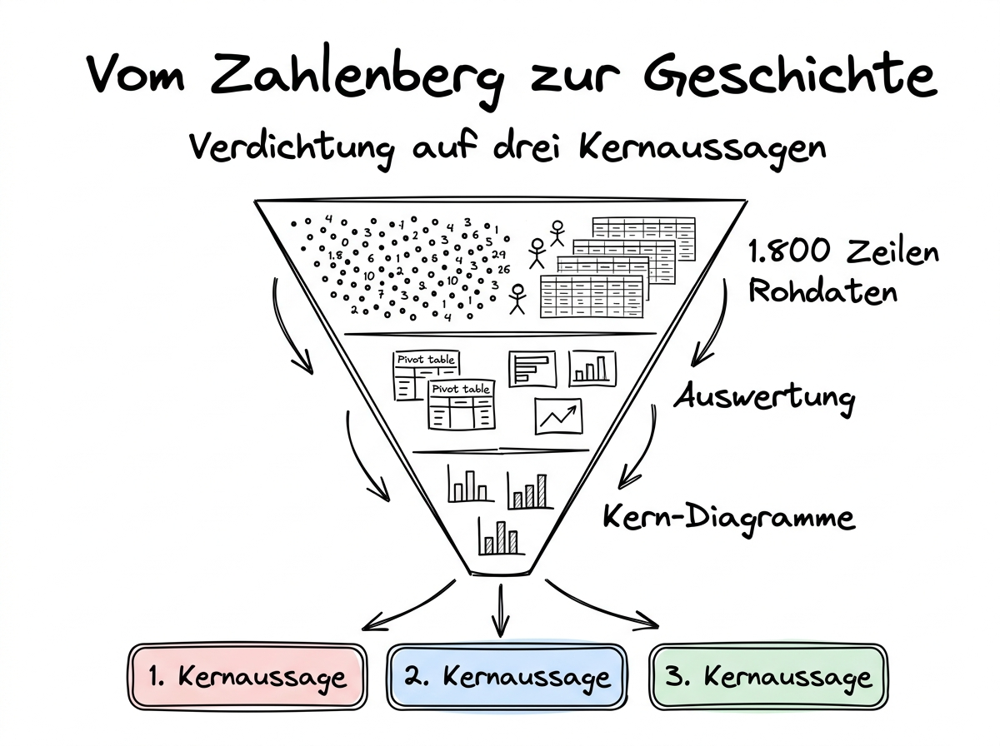

# 06 Daten-Storytelling

**Vom Zahlenberg zur Kernaussage — wie Sie aus einer Auswertung eine Geschichte machen, die beim Empfänger ankommt.**

---

## Warum dieses Tutorial?

Stellen Sie sich vor, Sie schicken jemandem eine 40-seitige Tabelle mit 1.800 Zeilen Verkaufs­daten. Was macht der Empfänger damit? Im besten Fall nichts, im schlechtesten Fall irgend­eine falsche Schluss­folgerung, weil er nicht weiß, worauf er schauen soll. Das Gleiche gilt für zehn Pivot-Tabellen und fünf Diagramme ohne Kommentar: Sie sind technisch korrekt, aber praktisch wertlos, weil sie nicht erzählen, was sie eigentlich zeigen.

Daten-Storytelling ist die Brücke zwischen Auswertung und Wirkung. Es ist die Fähigkeit, aus einem Daten­satz die drei oder vier Aussagen zu destillieren, die für die Empfänger­seite wichtig sind, und sie in eine klare, nach­vollziehbare Abfolge zu bringen. Die gute Nachricht: Das ist kein Zauber­kunst­stück. Es ist ein Hand­werk, das sich lernen lässt — und die KI ist dabei ein ausgezeichneter Sparrings­partner, wenn Sie sie richtig fragen.

Dieser Teil zeigt Ihnen die grund­legende Struktur einer Daten-Geschichte, die drei Kern­regeln der Verdichtung und einen konkreten Prompt-Workflow, um aus einer fertigen Auswertung eine verwert­bare Erzählung zu machen.

**Was Sie nach diesem Tutorial wissen werden:**

- Wie eine gute Daten-Geschichte aufgebaut ist und welche Elemente sie immer enthält.
- Warum die Verdichtung auf drei Kern­aussagen die wichtigste Disziplin des Storytellings ist.
- Wie Sie Ihre Empfänger­seite so kennen­lernen, dass Sie ihre Fragen antizipieren können.
- Welche drei Prompt-Muster Ihnen helfen, aus Rohdaten eine Erzählung zu machen.



## Die Grund­struktur einer Daten-Geschichte

Eine gute Daten-Geschichte hat drei Teile, und sie sind in dieser Reihen­folge am wirksamsten.

**Teil 1: Die Frage.** Womit fängt die Geschichte an? Mit dem Problem oder der Frage, die zur Analyse geführt hat. Nicht mit „Hier sind die Zahlen". Sondern mit „Wir haben uns gefragt, ob der Rückgang im letzten Quartal strukturell war oder saisonal". Die Empfänger­seite muss verstehen, warum Sie die Mühe überhaupt investiert haben. Ohne diese Rahmung bleibt jede Zahl beliebig.

**Teil 2: Die Antwort.** Nicht „die Daten", sondern die **Antwort** auf die Frage — verdichtet auf einen oder zwei Sätze. Das ist die Kern­aussage, um die sich alles dreht. Die Empfänger­seite soll nach diesem Satz wissen, was los ist, ohne noch einen einzigen Chart angesehen zu haben. Alles andere ist Beweis­führung.

**Teil 3: Die Beweis­führung.** Drei bis fünf Zahlen, Diagramme, Beispiele, die die Antwort stützen. Nicht alle Zahlen, die Sie berechnet haben, sondern die drei bis fünf **wichtigsten**. Jeder weitere Datenpunkt, den Sie hinzu­fügen, verdünnt die Geschichte.

Am Ende, optional, ein vierter Teil: **Die Implikation.** Was folgt daraus? Welche Entscheidung ist jetzt möglich oder nötig? Wer sollte was tun? Dieser Teil ist nur dann angebracht, wenn Sie die Kompetenz haben, Empfehlungen zu geben. Bei reinem Reporting (zum Beispiel einem monatlichen KPI-Bericht) lassen Sie ihn weg oder beschränken ihn auf „Punkte zur Diskussion".

## Die Kunst der Verdichtung

Die häufigste Schwäche selbst­gebauter Datenberichte ist: zu viel. Jede Zahl, die berechnet wurde, findet ihren Weg in den Bericht. Der Empfänger ertrinkt, gibt auf und gewinnt am Ende nichts. Verdichtung ist die Disziplin, sich zu trauen, die überflüssigen 95 Prozent weg­zu­lassen.

Drei Regeln helfen dabei.

**Regel 1: Drei Kern­aussagen, nicht mehr.** Wenn Sie versuchen, zehn Punkte gleich zeitig rüber­zubringen, merkt sich niemand einen davon. Zwingen Sie sich, die drei wichtigsten auszuwählen. Alles andere ist Anhang. Wenn Sie sich nicht entscheiden können, welche drei das sind — das ist ein Zeichen, dass Sie die Daten noch nicht verstanden haben. Zurück zur Analyse.

**Regel 2: Die 30-Sekunden-Zusammen­fassung muss funktionieren.** Wenn jemand Ihren Bericht 30 Sekunden lang überfliegt und nichts anderes liest als die Überschrift und den ersten Absatz — weiß er dann, was los ist? Falls nein: Überschrift und erster Absatz sind nicht die richtigen. Bei vielen Führungs­kräften haben Sie übrigens wirklich nur diese 30 Sekunden, bevor die Aufmerksamkeit weiter wandert.

**Regel 3: Eine Zahl pro Satz.** Ein Satz mit drei verschiedenen Zahlen, Zeit­räumen und Prozent­werten ist unverständlich. Ein Satz mit einer einzelnen, klaren Zahl bleibt hängen. „Im März sind die Verkäufe um 12 Prozent gefallen" ist besser als „Im März sind die Verkäufe um 12 Prozent gegenüber dem Vormonat und um 8 Prozent gegenüber dem Vor­jahres­monat gefallen, wobei der Rückgang in Nord­europa mit 18 Prozent besonders stark war." Wenn Sie mehrere Zahlen brauchen, machen Sie mehrere Sätze.

## Die Empfänger­seite ernst nehmen

Eine Daten-Geschichte ist kein Monolog — sie ist eine Antwort auf eine Frage, die die Empfänger­seite hat. Wenn Sie die Empfänger­seite nicht kennen, schießen Sie ins Dunkel und hoffen, dass etwas trifft.

Bevor Sie eine Geschichte schreiben, beantworten Sie sich in zehn Sekunden drei Fragen: **Wer liest das? Was weiß diese Person schon? Was soll sie nach der Lektüre tun können?**

**Beispiel A:** Die Geschäfts­führung liest den monatlichen Verkaufs­bericht. Sie kennt die Zahlen des Vormonats, sie hat wenig Zeit, sie will schnell wissen, ob etwas aus dem Ruder läuft und ob sie handeln muss. Sie schreiben eine einseitige Zusammen­fassung mit drei Kern­aussagen, einem einzigen Highlight-Chart und einem klaren Handlungs­hinweis am Ende.

**Beispiel B:** Das Vertriebs­team will wissen, welche Produkte im Trend liegen. Es kennt den Markt, es will viele konkrete Produkte genannt haben, es will eigene Schlüsse ziehen. Sie schreiben einen Bericht mit einer Top-20-Tabelle, einem Heatmap-Diagramm und lassen Ihre eigenen Schluss­folgerungen bewusst knapp — die Kollegen wollen nicht bevormundet werden.

**Beispiel C:** Der Datenschutz­beauftragte will eine Dokumentation Ihres Bewerber­auswahl-Algorithmus, um den AI Act einzuhalten. Er will Detail, Nach­vollziehbarkeit und Quellen. Sie schreiben einen langen, strukturierten Bericht, in dem jede Zahl und jede Methode erklärt ist, und Sie lassen die Storytelling-Verdichtung bewusst aus.

Die drei Berichte sprechen **unter­schiedliche Leserinnen und Leser** an. Wenn Sie sie verwechseln, scheitern alle drei.

## Der Prompt-Workflow für eine Daten-Geschichte

Hier ein konkreter Drei-Schritt-Workflow, mit dem Sie aus einer fertigen Auswertung eine Geschichte machen. Vorausgesetzt ist, dass Teil 04 (Auswertung) erledigt ist und die relevanten Zahlen im Chat liegen.

### Prompt 1: Die drei Kern­aussagen finden

```
Basierend auf den bisher berechneten Auswertungen der Datei
verkaeufe_2025.xlsx:

Finde die drei wichtigsten Aussagen, die sich aus den Zahlen ableiten
lassen. Formuliere jede Aussage in einem einzigen, vollständigen Satz
mit genau einer zentralen Zahl.

Wichtige Regeln:
- Keine Interpretation, die über die Daten hinausgeht (keine
  Spekulation über Ursachen).
- Jede Aussage muss durch eine konkrete Zahl aus der Auswertung
  belegt sein.
- Priorisiere nach Relevanz für ein Management-Publikum.
- Wenn mehrere Aussagen gleich wichtig sind, wähle die, die am
  ehesten zu einer Handlung führt.
```

Dieser Prompt zwingt die KI — und indirekt Sie —, eine saubere Auswahl zu treffen. Oft bekommen Sie eine gute erste Version und können darauf aufbauen.

### Prompt 2: Die Geschichte drum herum

```
Schreibe aus diesen drei Kernaussagen einen zusammenhängenden
Kurz-Bericht für die Geschäftsführung. Struktur:

1. Einleitung (2 Sätze): Was war die Frage, die der Auswertung
   zugrunde lag?
2. Hauptaussage (1 Satz): Die wichtigste der drei Aussagen, so
   formuliert, dass sie auch isoliert verständlich ist.
3. Beweisführung (3 Abschnitte, je 2-3 Sätze): Die drei
   Kernaussagen, jede mit der zentralen Zahl und einem kurzen
   Kontext, warum sie wichtig ist.
4. Einzuordnende Besonderheiten (max. 3 Sätze): Wenn es Ausreißer,
   Unsicherheiten oder Einschränkungen gibt, benenne sie hier offen.

Kein Marketing-Deutsch, keine unbelegten Behauptungen, keine
Superlative ohne Beleg. Siezen.
```

Die letzten Sätze sind wichtig: Sie setzen den Ton und schützen vor der Versuchung der KI, zu werblich zu formulieren.

### Prompt 3: Den Critic-Review

```
Stell dir vor, du bist eine kritische Leserin aus der Geschäftsführung,
die wenig Geduld für Marketing-Sprache hat und gleichzeitig ungeduldig
auf das Wesentliche wartet. Lies den Bericht oben und sag mir:

1. Welche Aussage ist nicht ausreichend belegt?
2. Welche Zahl könnte falsch interpretiert werden?
3. Welcher Satz klingt nach Interpretation, die über die Daten
   hinausgeht?
4. Was fehlt, um die Aussagen handlungsfähig zu machen?
5. Welcher Satz ist überflüssig und sollte gestrichen werden?

Sei direkt, aber nicht zynisch.
```

Dieser dritte Schritt ist der Trick, den die meisten Leute überspringen. Er lässt die KI in die Rolle einer kritischen Leserin schlüpfen — und sie findet in der Regel erstaunlich gute Kritik­punkte an ihrem eigenen vorigen Text. Der Umweg über Kritik macht den Bericht messbar besser.

## Wenn die Geschichte gegen den Erwartungs­wert geht

Manchmal sagen die Daten etwas, das Sie selbst nicht erwartet haben — oder das jemandem im Unternehmen nicht gefallen wird. Zum Beispiel: Die teure Marketing-Kampagne hatte keinen erkennbaren Umsatz­effekt. Die Einführung eines neuen CRM hat die Produktivität kurzfristig gesenkt. Das Lieblings­produkt der Geschäfts­führung verliert Markt­anteile.

In solchen Momenten ist es verführerisch, die Geschichte so zu verpacken, dass die unbequeme Wahrheit weich aussieht. Tun Sie das nicht. Die Stärke der Daten­analyse liegt darin, dass sie einen harten, nicht verhandelbaren Anker gibt. Wer diesen Anker weich­bügelt, macht die Analyse wertlos.

Was Sie stattdessen tun können: Formulieren Sie die Aussage klar, aber nicht triumphierend. Nennen Sie die Einschränkungen der Analyse (vielleicht war der Zeit­raum zu kurz, vielleicht gab es Confounding-Effekte). Und — das ist das Wichtigste — **präsentieren Sie keine Interpretation**, wenn Sie nicht sicher sind, dass die Daten sie tragen. „Die Kampagne hatte im beobachteten Zeit­raum keinen messbaren Umsatz­effekt" ist korrekt. „Die Kampagne hat versagt" ist eine Interpretation, die Sie mit den Daten allein nicht belegen können.

## Was Sie mitnehmen sollten

Daten-Storytelling ist der Schritt, der rohe Zahlen in nützliche Information verwandelt. Er ist keine Kosmetik, sondern der eigentliche Wert­schöpfungs­schritt der Daten­analyse. Ohne diesen Schritt haben Sie Excel-Tabellen, und Excel-Tabellen entscheiden nichts.

Drei Dinge sollten Sie aus diesem Teil mitnehmen: **Erstens**, jede Geschichte braucht eine klare Frage, eine klare Antwort und eine knappe Beweisführung — in dieser Reihenfolge. **Zweitens**, Verdichtung auf drei Kernaussagen ist schwerer als es aussieht, aber sie macht den Unterschied zwischen einem nutzlosen und einem nützlichen Bericht. **Drittens**, die KI ist ein guter Sparringspartner, wenn Sie sie zuerst zur Verdichtung und dann zur Selbst­kritik zwingen — beides Aufgaben, für die sie gut geeignet ist.

Der nächste und letzte Teil dieses Kapitels schließt den Kreis: Jede Geschichte, jede Zahl, jedes Diagramm muss vor der Veröffentlichung eine letzte Hürde nehmen — den Sanity-Check. Wie Sie Halluzinationen bei Zahlen entdecken und welche Checklisten Sie für den Arbeits­alltag mitnehmen können, kommt jetzt.

---

**Weiter geht es mit:** [07 Sanity-Checks und Praxisleitfaden](./07%20Sanity-Checks%20und%20Praxisleitfaden.md) — die letzte Verteidigungs­linie gegen Halluzinationen bei Zahlen, plus Checklisten und Team-Routinen, die Sie direkt in den Alltag übernehmen können.
