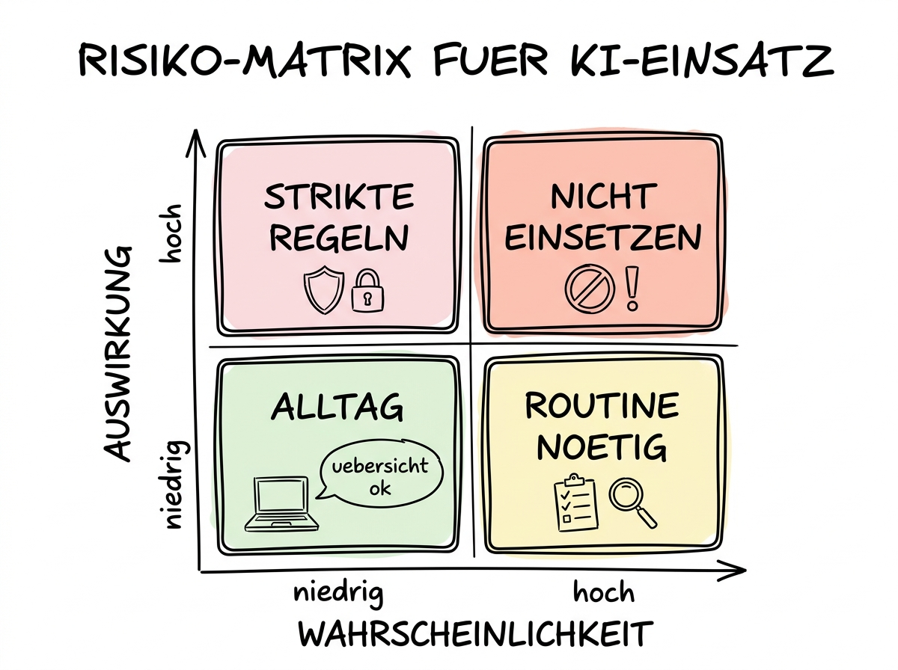

# 01 Warum Ethik im KI-Zeitalter

**Ein ehrlicher Einstieg: Was schief gehen kann — und warum das trotzdem kein Grund ist, KI zu meiden.**

---

## Warum dieses Tutorial?

Sie haben in den bisherigen Kapiteln gelernt, wie Sie mit KI produktiv arbeiten: Prompts schreiben, Bilder generieren, Tabellen auswerten, Claude als Desktop-Assistenten nutzen. All das funktioniert — und es funktioniert oft besser, als Sie am Anfang erwartet haben. Genau das ist der Moment, in dem die unangenehmen Fragen auftauchen.

Darf ich die Kunden­liste überhaupt in ChatGPT hineinkopieren, um eine Segmentierung zu bekommen? Wem gehört das Logo, das mir Nano Banana generiert hat, wenn mein Kunde es für seine Marke verwenden will? Darf die Personal­abteilung Bewerbungen automatisch von Claude bewerten lassen? Was ist mit der Stimme, die im Podcast­tutorial geklont wurde — darf ich die ohne Zustimmung der Sprecherin nutzen? Und wenn die KI mir eine Zahl nennt und ich sie in einen Geschäfts­bericht übernehme — wer haftet, wenn sie falsch ist?

Die Antworten auf diese Fragen sind nicht immer eindeutig, aber sie sind eindeutiger, als viele glauben. Die meisten Fallstricke lassen sich mit ein paar klaren Regeln und einer Handvoll Gewohn­heiten vermeiden. Dieses Kapitel liefert die Regeln, die Gewohn­heiten und die rechtlichen Grundlagen, damit Sie mit gutem Gewissen und auf rechtssicherer Basis arbeiten können.

**Was Sie nach diesem Tutorial wissen werden:**

- Welche drei großen Risiko­felder beim KI-Einsatz relevant sind und wie Sie sie voneinander unter­scheiden.
- Warum die rechtliche Lage Sie nicht lähmen muss — wenn Sie sie kennen.
- Wie dieses Kapitel aufgebaut ist und in welcher Reihen­folge Sie es am besten lesen.
- Welche Fehler­klassen Sie mit einfachen Regeln komplett vermeiden können.

## Die drei Risiko­felder

Wenn Sie mit KI arbeiten, laufen im Hinter­grund drei unterschiedliche Risiko­felder mit. Sie sind unabhängig voneinander, und sie treffen Sie in unterschiedlichen Situationen. Wer alle drei auseinander­halten kann, hat schon die Hälfte der Arbeit gemacht.

**Das Rechtliche.** Hier geht es um Daten­schutz (DSGVO), den EU AI Act, Urheber­recht und Haftungs­fragen. Die Regeln sind komplex, aber sie sind geschrieben — Sie können sie nachlesen. In diesem Feld sind die Konsequenzen von Fehlern klar: Bußgelder, Abmahnungen, Unter­lassungs­klagen. Die gute Nachricht: Rechtliche Risiken sind vorher­sagbar. Wenn Sie wissen, was Sie dürfen und was nicht, kommen Sie normaler­weise gar nicht in die Situation, in der es kritisch wird. Dieses Feld wird in den Teilen 02, 03 und 05 behandelt.

**Das Fachliche.** Hier geht es um Halluzinationen, falsche Fakten und Bias. Die KI sagt Ihnen mit voller Über­zeugung etwas, das nicht stimmt. Sie übernehmen es unreflektiert — und in Ihrem Vortrag steht eine Zahl, die es nie gegeben hat. Oder die KI bevorzugt in einer Vorauswahl männliche Kandidaten, weil sie auf historischen Daten trainiert wurde, in denen Männer die Mehrheit waren. Dieses Feld ist heimtückischer als das rechtliche, weil die Fehler nicht laut scheppern. Sie wirken erst später und oft unauffällig. Teile 04 und 06 zeigen, wie Sie das erkennen und dagegen­steuern.

**Das Persönliche und Organisatorische.** Hier geht es darum, wie Sie und Ihr Team mit KI umgehen — als Kompetenz­erweiterung, als Blackbox oder als Auto­piloten, dem Sie blind vertrauen. Es geht um Kompetenz­verlust, wenn Sie Dinge nicht mehr selbst können, weil die KI sie Ihnen abnimmt. Es geht um Vertrauen im Team, wenn unklar ist, wer einen Text eigentlich geschrieben hat. Und es geht um Transparenz gegenüber Ihren Kundinnen und Kunden, wenn die mit einem KI-Text anstelle einer persönlichen Antwort abgespeist werden. Dieses Feld ist am wenigsten reguliert, aber langfristig oft am folgen­reichsten. Es taucht durch alle Teile hindurch und wird in Teil 07 explizit aufgegriffen.

## Eine Matrix, die Ihnen das Denken erleichtert

Stellen Sie sich eine einfache 2×2-Matrix vor: Auf der einen Achse die Wahrscheinlichkeit, dass etwas schiefgeht, auf der anderen die Schwere der Folgen, wenn es passiert. Sie bekommen vier Quadranten:

**Niedrige Wahrscheinlichkeit, geringe Folgen.** Das ist der Alltag: Sie lassen ChatGPT eine Überschrift für einen Blog­beitrag vorschlagen. Die Überschrift ist mittel­mäßig, Sie nehmen eine bessere. Kein Problem. Hier müssen Sie sich kaum Gedanken machen.

**Hohe Wahrscheinlichkeit, geringe Folgen.** Das sind die kleinen Reibungs­punkte: Die KI halluziniert eine Quelle, Sie merken es beim Gegen­lesen, korrigieren. Kostet etwas Zeit, richtet aber keinen Schaden an. Hier brauchen Sie eine Routine — einen Faktencheck-Reflex —, um die kleinen Fehler konsequent abzufangen. Aufwand: niedrig, Nutzen: hoch.

**Niedrige Wahrscheinlichkeit, hohe Folgen.** Das sind die Ereignisse, die selten auftreten, aber richtig weh tun: Sie kopieren versehentlich eine Patienten­liste in ein nicht-DSGVO-konformes Tool, eine Aufsichts­behörde erfährt davon. Oder Sie veröffentlichen ein KI-generiertes Bild, das einen echten urheber­rechtlich geschützten Stil zu deutlich imitiert, und werden abgemahnt. Hier müssen Sie mit strikten Regeln arbeiten, die Sie ausnahms­los einhalten — nicht, weil die Wahrscheinlichkeit hoch ist, sondern weil die Konsequenzen katastrophal sind. Die „Ampel für sensible Daten" in Teil 02 ist genau dafür gebaut.

**Hohe Wahrscheinlichkeit, hohe Folgen.** Hier sollten Sie KI gar nicht erst einsetzen — oder nur mit massiven Schutz­maßnahmen. Beispiel: Vollautomatische Entscheidungen über Bewerbungen ohne menschliche Endkontrolle. Das ist nicht nur riskant, es ist nach AI Act oft auch verboten oder streng reguliert. In dieses Feld fällt wenig, wenn Sie die Grund­regeln befolgen. Aber genau diese wenigen Fälle sind der Grund, warum es überhaupt einen AI Act gibt.

Die Illustration oben visualisiert diese vier Quadranten. Sie werden sie durch das gesamte Kapitel als Denkmodell wieder­finden.

## Warum dieses Kapitel Sie nicht lähmen soll

Eine häufige Reaktion auf ein Kapitel über Ethik, Recht und Sicherheit ist: „Dann nutze ich KI lieber gar nicht erst, das ist mir zu heiß." Das ist verständlich, aber es ist eine falsche Schluss­folgerung.

Die Alternative zu „KI verantwortlich nutzen" ist nicht „kein Risiko" — sie ist „Risiko durch Nicht­nutzung". Wer heute KI meidet, während andere in der eigenen Branche sie produktiv einsetzen, läuft anderen Risiken entgegen: Zeit­verlust, Wettbewerbs­nachteil, Ab­gehängt­sein bei Methoden­kompetenz. Das gilt besonders im Mittelstand und im Bildungs­sektor, die beide von KI massiv profitieren können.

Die richtige Frage lautet nicht: „Darf ich KI benutzen?" Sie lautet: „Unter welchen Bedingungen darf ich welchen KI-Anwendungs­fall umsetzen?" Und die Antwort auf diese Frage ist fast immer: „Ja, wenn Sie folgendes beachten ..."

Dieses Kapitel ist so geschrieben, dass Sie am Ende genau wissen, welches „wenn" in Ihrer Situation gilt. Es ist kein Horror­kabinett und keine Liste von Dingen, die Sie Angst machen sollen. Es ist ein Werk­zeugkasten, damit Sie aufrecht stehen können, wenn Ihr Datenschutz­beauftragter Sie fragt: „Warum nutzen Sie das Tool eigentlich, und wie stellen Sie sicher, dass keine personen­bezogenen Daten abfließen?"

## Die wichtigsten drei Grund­regeln vorab

Bevor Sie in die Einzel­teile einsteigen, hier sind drei Regeln, die Sie schon jetzt übernehmen können. Sie sind die Kern­essenz des gesamten Kapitels, konden­siert auf drei Sätze.

**Regel 1: Nie personen­bezogene oder vertrauliche Daten in ein Tool, mit dem Sie keinen Auftrags­verarbeitungs­vertrag haben.** Die einfachste Faust­regel überhaupt. Kunden­namen, E-Mail-Adressen, Gesundheits­daten, Gehalts­listen — nichts davon in ChatGPT Free, Claude Free, Gemini Free. Wenn Sie einen dieser Dienste nutzen wollen, brauchen Sie die bezahlte Team- oder Enterprise-Version mit AVV, oder Sie arbeiten mit anonymisierten Daten. Teil 02 zeigt die Details.

**Regel 2: Jedes Fakt, jede Zahl, jede Quelle, die Ihre KI Ihnen nennt, wird vor der Weiter­verwendung unabhängig geprüft — besonders wenn es um Zahlen, Gesetze, Personen oder Daten geht.** Nicht weil die KI faul oder bös­willig ist, sondern weil sie technisch nicht unterscheiden kann, ob sie etwas weiß oder ob sie etwas plausibel klingendes halluziniert. Der Faktencheck ist kein Misstrauens­votum, sondern ein Arbeits­schritt wie das Korrektur­lesen. Teil 04 zeigt, wie.

**Regel 3: Bei jeder nicht-trivialen KI-Nutzung im beruflichen Kontext fragen Sie sich: „Würde mir diese Entscheidung, dieser Output, diese Auto­matisierung auch dann gefallen, wenn sie über *mich* entschieden würde?"** Das ist der ethische Kompass hinter allem. Die Frage ist nicht: „Ist es legal?" Die Frage ist: „Ist es fair, transparent und würdevoll?" Wenn die Antwort „nein" lautet, dann ist es egal, ob es erlaubt wäre — Sie sollten es nicht tun.

Diese drei Regeln allein verhindern wahrscheinlich 90 % aller Probleme, die Ihnen mit KI im beruflichen Kontext begegnen könnten. Die restlichen 10 % sind die Nuancen, für die das Rest­kapitel da ist.

## Wie Sie dieses Kapitel lesen

Das Kapitel ist so gebaut, dass jeder Teil auch einzeln funktioniert. Sie können es also als Nachschlage­werk verwenden, wenn Sie ein konkretes Problem haben. Für die meisten Leserinnen und Leser empfehlen wir aber die Lese­reihen­folge 01 → 02 → 07, weil Sie damit in unter 45 Minuten den kompletten praktischen Kern abdecken.

Teile 03 (AI Act), 04 (Halluzinationen), 05 (Urheber­recht) und 06 (Bias) sind dann die „Vertiefung", die Sie je nach Ihrer Rolle und Ihrem Schwer­punkt lesen können. Wer in einem Unternehmen Governance-Verantwortung trägt, sollte 03 auf jeden Fall lesen. Wer beruflich Texte oder Bilder veröffentlicht, sollte 05 lesen. Wer Entscheidungen über Menschen trifft (Personal, Kredite, Noten), sollte 06 gründlich lesen.

Ein Hinweis zum Ton: In diesem Kapitel siezen wir Sie wie im gesamten Tutorial, aber wir schreiben nicht juristisch. Die juristischen Begriffe werden erklärt, sobald sie auftauchen, und wo wir Gesetze zitieren, tun wir das in der Form, die für Sie als Anwenderin oder Anwender relevant ist — nicht in der Form, die Sie in einem Kommentar­werk zum UrhG finden würden.

## Ein ehrliches Wort zur recht­lichen Verbind­lichkeit

Die Autorinnen und Autoren dieses Tutorials sind keine Juristen. Dieses Kapitel ist sorg­fältig recherchiert auf Stand April 2026, aber Recht ist lebendig, und die Anwendung im Einzel­fall hängt immer von Details ab, die in einem allgemeinen Tutorial nicht vorkommen können.

Wir geben hier einen Überblick, Daumen­regeln und praktische Werk­zeuge. Wir geben keine Rechts­beratung. Wenn Sie vor einer Entscheidung stehen, die rechtliche oder ethische Trag­weite hat, dann ist dieses Kapitel der richtige Anfang — aber nicht das Ende. Das Ende ist ein Gespräch mit einer Daten­schutz­beauftragten, einer IT-Rechts­anwältin, dem Betriebs­rat oder einer vergleichbaren Stelle in Ihrer Organisation.

Diesen Hinweis werden wir in den späteren Teilen nicht mehr wiederholen. Er gilt implizit für das gesamte Kapitel.

## Zusammen­fassung in 60 Sekunden

KI bringt drei Arten von Risiken: rechtliche (DSGVO, AI Act, Urheber­recht), fachliche (Halluzinationen, Bias) und persönlich-organi­satorische (Kompetenz, Transparenz, Fairness). Die meisten Probleme vermeiden Sie mit drei Grund­regeln: niemals personen­bezogene Daten in Tools ohne AVV; jeden von der KI genannten Fakt unabhängig prüfen; jede KI-Anwendung mit der Frage „wäre es fair, wenn über mich so entschieden würde?" gegentesten. Dieses Kapitel liefert die Details zu allen drei Feldern und endet mit einem praktischen Leitfaden inklusive Check­listen und Muster-Prompts. Lesen Sie in Eile 01 → 02 → 07; lesen Sie gründlich alle sieben Teile in Reihen­folge.

## Nächste Schritte

Als Nächstes geht es in Teil 02 um das Feld, das die meisten unmittel­baren Konsequenzen für Ihren Arbeits­alltag hat: den **Datenschutz**. Dort klären wir, welche Daten in welches Tool dürfen, was ein Auftrags­verarbeitungs­vertrag ist, warum Sie ihn brauchen, und Sie lernen die Ampel kennen, die Sie in Zukunft bei jedem Upload im Kopf haben sollten.

- **Weiter zu:** [02 DSGVO und KI — Was darf in welches Tool](./02%20DSGVO%20und%20KI.md)
- **Vertiefung nach Kapitel 09:** Kapitel 09 vergleicht die Datenschutz-Profile der großen Anbieter im Detail. Wenn Sie nach Teil 02 noch mehr wollen, ist dort die richtige Adresse.
- **Rückverweis:** Die Verweise aus Kapitel 10 (Cowork) zum Thema „welche Daten gehören nicht in einen Cowork-Ordner" werden in Teil 02 dieses Kapitels konkret beantwortet.
