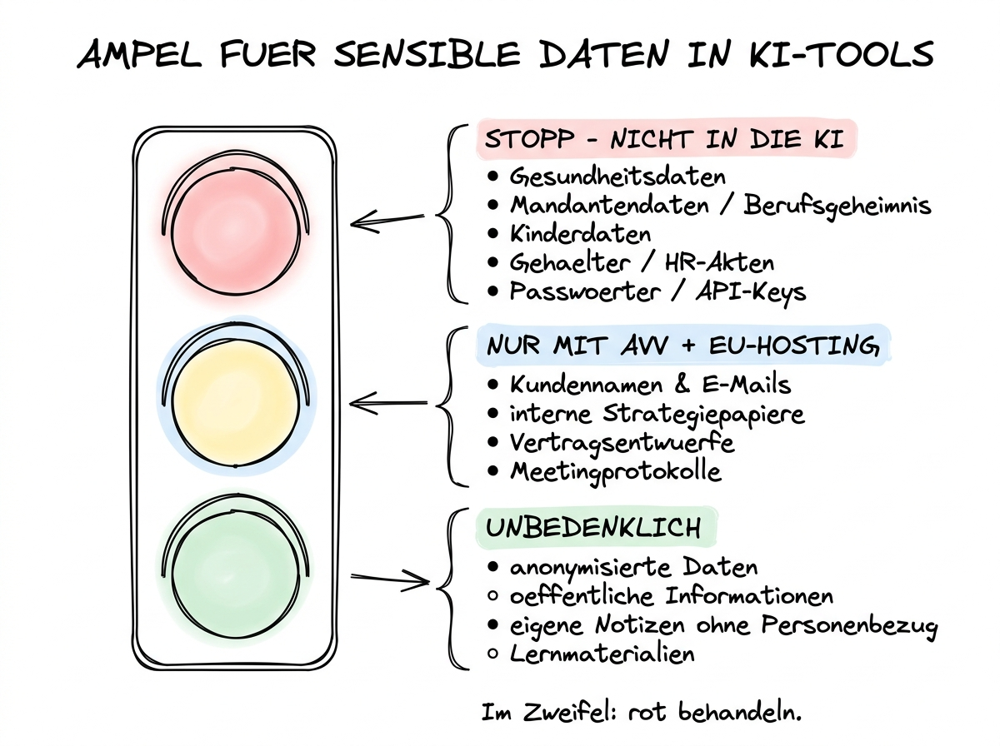

# 02 DSGVO und KI — Was darf in welches Tool

**Der Kern­teil für alle, die im Berufs­leben mit KI arbeiten: personen­bezogene Daten, Auftrags­verarbeitung und die Ampel für den Alltag.**

---

## Warum dieses Tutorial?

Wenn Sie in Deutschland oder in der EU arbeiten, dann ist die DSGVO der Rahmen, in dem sich Ihr KI-Einsatz bewegen muss. Das klingt abstrakt, ist aber erstaunlich konkret: Es geht um die Frage, welche Informationen Sie in ein KI-Tool eintippen dürfen und welche nicht. Es geht darum, was passiert, wenn eine Aufsichts­behörde bei Ihnen anfragt, warum Sie Kundendaten in ein amerikanisches Tool gefüttert haben. Und es geht um den Moment, in dem Sie in Cowork einen Ordner auswählen und sich fragen: „Darf das, was da drin liegt, überhaupt von Claude gelesen werden?"

Dieser Teil ist bewusst pragmatisch geschrieben. Wir erklären die DSGVO-Logik nur so weit, wie Sie sie brauchen, um die Entscheidungen in Ihrem Alltag zu treffen. Alles andere findet sich in Fach­büchern und Kommen­taren, die wir am Ende verlinken.

**Was Sie nach diesem Tutorial wissen werden:**

- Was „personen­bezogene Daten" im Sinne der DSGVO genau bedeutet und warum die Definition so weit ist.
- Warum ein Auftrags­verarbeitungs­vertrag (AVV) der Schlüssel zu allem Legalen ist und welche Anbieter ihn bieten.
- Welche Daten­kategorien niemals in ein Konsumenten-Tool dürfen und welche mit Schutz­massnahmen hineindürfen.
- Wie die Ampel für sensible Daten funktioniert und wie Sie sie in Ihren Arbeits­alltag übernehmen.
- Welche konkreten Schritte Sie in Cowork, Claude Code und Browser-KI machen müssen, damit die rechtliche Seite stimmt.

## Personen­bezogene Daten — was zählt alles dazu?

Die DSGVO schützt „personen­bezogene Daten". Der Begriff ist in Artikel 4 definiert und lautet sinngemäß: *alle Informationen, die sich auf eine identifizierte oder identifizier­bare natürliche Person beziehen.* Das ist absichtlich weit gefasst. In der Praxis heißt das: Fast alles, was sich auf einen Menschen mit Namen beziehen lässt, ist personen­bezogen.

Typische Beispiele:

- Namen, Anschriften, E-Mail-Adressen, Telefon­nummern
- Standort­daten, IP-Adressen, Geräte­kennungen
- Personal­nummern, Mitarbeiter-IDs, Bewerber-Identifikationen
- Leistungs­beurteilungen, Zeugnisse, Zeiten­erfassungen
- Foto- und Video­aufnahmen, in denen jemand erkennbar ist
- Stimm­aufnahmen, Biometrie, Finger­abdrücke
- Inhalte persön­licher Nachrichten, Chat-Verläufe, E-Mails

Auch scheinbar harmlose Informationen können personen­bezogen werden, sobald sie in einem Kontext stehen, der eine Person identifizier­bar macht. Die Kunden­liste Ihres Arbeit­gebers ist personen­bezogen, selbst wenn Sie nur Vor­namen und Umsätze enthält — im Kontext der Firma lassen sich die Personen zuordnen. Die Bewer­bungen, die auf Ihrem Schreibtisch liegen, sind personen­bezogen, auch wenn Sie sie in eine KI kopieren, um Recht­schreib­fehler prüfen zu lassen. Das Protokoll des letzten Mitarbeiter­gesprächs ist personen­bezogen. Die Liste der kranken Kolleginnen, die sich für die Abwesenheits­planung auf Ihrem Rechner liegt, ist personen­bezogen und zusätzlich sogar Gesund­heits­daten.

**Besondere Kategorien personen­bezogener Daten** (Art. 9 DSGVO) haben nochmal einen schärferen Schutz. Dazu gehören:

- Rassische oder ethnische Herkunft
- Politische Meinungen, religiöse oder weltan­schauliche Überzeugungen
- Gewerkschafts­zugehörigkeit
- Genetische und biometrische Daten
- Gesundheits­daten
- Daten zum Sexual­leben oder zur sexuellen Orientierung

Für diese Kategorien gilt: ohne sehr spezifische Rechts­grundlage und ohne ausdrückliche Ein­willigung der betroffenen Person dürfen Sie damit gar nichts machen — auch nicht mit einem AVV, auch nicht mit einem EU-gehosteten Tool. Der einzige halbwegs sichere Pfad ist: vollständige Anonymi­sierung vor dem Upload, oder gar nicht.

Neben den DSGVO-Kategorien gibt es noch Berufs­geheimnisse, die strafrechtlich geschützt sind (§ 203 StGB): ärztliche Schweige­pflicht, Anwalts­geheimnis, Seelsorger­geheimnis. Wenn Sie in einem dieser Berufe arbeiten, sind die Anforderungen nochmal strenger. Für Berufs­geheimnisträger gilt: Konsumenten-KI praktisch überhaupt nicht verwenden, selbst mit AVV ist die rechtliche Lage heikel.

## Der Schlüssel zu allem: der Auftrags­verarbeitungs­vertrag

Wenn Sie ein externes Tool verwenden, das personen­bezogene Daten für Sie verarbeitet — und das tut jedes KI-Tool, das Ihre Eingaben in der Cloud verarbeitet —, dann braucht es einen **Auftrags­verarbeitungs­vertrag**, kurz AVV oder englisch DPA (Data Processing Agreement). Der AVV regelt, dass Sie der „Verantwortliche" sind (die Person oder Firma, bei der die Daten ursprünglich sind) und der Anbieter der „Auftrags­verarbeiter" (der die Daten nach Ihren Weisungen verarbeitet). Ohne AVV ist der Einsatz in einem beruflichen Kontext in aller Regel nicht DSGVO-konform.

Die Krux: **Nicht jeder Tarif jedes Anbieters kommt mit einem AVV.** Das ist der Grund, warum ChatGPT Free oder Claude Free für beruflichen Einsatz mit echten Daten grund­sätzlich ausscheiden. Stand April 2026 sieht die AVV-Verfügbarkeit bei den großen Anbietern so aus:

| Anbieter | Consumer-Tarif | Business-/Team-Tarif | Enterprise / API |
|---|---|---|---|
| **OpenAI (ChatGPT)** | kein AVV | ChatGPT Team/Business: AVV | Enterprise/API: AVV, seit Januar 2026 optional mit EU-Inference |
| **Anthropic (Claude)** | kein AVV, Trainings­opt-out seit September 2025 möglich | Claude Team/Work: AVV | Enterprise/API: AVV, Zero Data Retention optional |
| **Google (Gemini)** | kein AVV in der Consumer-App | Workspace-Integration mit AVV | Google Cloud Vertex AI: AVV, EU-Regionen verfügbar |
| **Microsoft (Copilot)** | kein AVV in Free | M365 Copilot: über M365-Hauptvertrag abgedeckt | Azure OpenAI: AVV, regionales Hosting wählbar |
| **Mistral (Le Chat)** | eingeschränkt | Le Chat Team: AVV, EU-Hosting in Paris | Mistral Enterprise: AVV, volle EU-Kontrolle |
| **Perplexity** | kein AVV | Perplexity Enterprise Pro: AVV | Enterprise: AVV |

Die Tabelle ist eine Moment­aufnahme und entwickelt sich schnell. Die Grund­regel bleibt aber robust: **Für beruflichen Einsatz in Deutschland mit realen Daten brauchen Sie immer die bezahlte Business-Stufe des Anbieters oder besser.** Und Sie brauchen einen AVV, der vor dem ersten Einsatz abgeschlossen ist — nicht „Wir sollten dem­nächst mal einen abschließen", sondern bevor zum ersten Mal ein Kunden­name ins Tool fließt.

## EU-Hosting und Zero Data Retention — sind sie Pflicht?

Zwei technische Begriffe, die Sie in Anbieter-Dokumentationen häufig lesen, sollten Sie kennen.

**EU-Hosting** bedeutet, dass die Daten während der Verarbeitung physisch auf Servern in der EU bleiben. Das ist nicht per se DSGVO-Pflicht, aber es vereinfacht die Rechts­lage enorm, weil Daten­transfers in Dritt­staaten (insbesondere in die USA) eine eigene rechtliche Begründung brauchen. Seit dem EU-US Data Privacy Framework von 2023 sind Transfers in die USA wieder möglich, wenn der amerikanische Anbieter unter dem Framework zertifiziert ist — aber die Rechts­lage ist volatiler, als deutsche Aufsichts­behörden es gerne hätten. Wer auf Nummer sicher gehen will, wählt EU-Hosting.

**Zero Data Retention (ZDR)** bedeutet: Der Anbieter speichert Ihre Eingaben und die Antworten nicht oder nur extrem kurz (zum Beispiel zur Missbrauchs­prüfung und dann sofort gelöscht). Das ist kein Ersatz für einen AVV, aber es ist eine wertvolle Zusatz­sicherung. Wenn ein Anbieter Zero Data Retention anbietet, heißt das: Selbst wenn bei ihm ein Leak passiert, sind Ihre Daten gar nicht erst in den betrof­fenen Systemen. Zero Data Retention ist Stand April 2026 typischer­weise nur in Enterprise-Tarifen verfügbar: Claude Enterprise, OpenAI API mit „zdr"-Flag, Mistral Enterprise.

**Eine wichtige Nuance:** EU-Hosting und Zero Data Retention sind zwei unabhängige Dimensionen. Ein Tool kann in der EU gehostet sein und trotzdem Ihre Daten speichern (weil der Anbieter sie für Training oder Weiter­entwicklung nutzen möchte). Ein Tool kann in den USA gehostet sein und Zero Data Retention haben (weil die Daten zwar durch US-Infrastruktur laufen, aber nicht dort bleiben). Für die Entscheidung müssen Sie beide Dimensionen einzeln prüfen.

Für Detail­vergleiche der einzelnen Anbieter verweisen wir auf Kapitel 09, wo wir die Datenschutz-Profile von OpenAI, Anthropic, Google und anderen im Kontext besprechen.

## Die Ampel für sensible Daten

Jetzt wird es praktisch. Die folgende Ampel ist das wichtigste Werk­zeug dieses Kapitels. Sie beantwortet die Frage, die Sie sich bei jedem Upload stellen sollten: **„Darf das hier rein?"**

### Rot — niemals in ein KI-Tool

Diese Kategorien dürfen nie in ein öffent­liches oder halb-öffent­liches KI-Tool. Auch nicht mit AVV. Auch nicht anonymi­siert, wenn der Anonymi­sierungs­schritt nicht sauber gemacht wurde.

- **Besondere Kategorien nach Art. 9 DSGVO** (siehe oben): Gesund­heits­daten, biometrische Identi­fikation, genetische Daten, religiöse oder politische Ansichten, sexuelle Orientierung, Gewerk­schafts­daten. Ausnahme: explizite schrift­liche Einwilligung der betrof­fenen Person in genau diesen KI-Einsatz.
- **Berufsgeheimnisse nach § 203 StGB**: ärztliche Patientendaten, Mandats­akten, Beicht­geheimnisse. Hier ist der Einsatz von Cloud-KI außer in speziell zertifizierten Branchen­lösungen faktisch nicht möglich.
- **Kinder- und Jugend­daten** unterhalb des Alters der Einwilligungs­fähigkeit, jedenfalls nicht ohne elter­liche Einwilligung.
- **Identifizier­bare polizei­liche oder straf­rechtlich relevante Daten** (Anzeigen, Straf­anzeigen, Fall­akten).
- **Roh-Bank­daten**: Kontonummern zusammen mit Inhabern, Trans­aktions­historien einzelner Personen, Kredit­würdigkeits­informationen zu identi­fizier­baren Personen.
- **Pass- und Ausweis­nummern** in Verbindung mit dem Foto oder dem Namen.

### Gelb — nur mit Vorbereitung

Diese Kategorien dürfen unter bestimmten Bedingungen in ein KI-Tool. Die Bedingungen sind: bezahlter Business-/Enterprise-Tarif mit AVV, idealerweise EU-Hosting und Zero Data Retention, plus eine vorherige Prüfung durch die zuständige Daten­schutz­stelle Ihrer Organisation.

- **Normale personen­bezogene Daten**: Kunden­namen mit Kontakt­daten, Mitarbeiter­listen, Bewerbungen, Lieferanten­kontakte. Mit AVV und unter der Bedingung, dass Sie einen legitimen Zweck haben und die Datenver­arbeitung in Ihrem Verarbeitungs­verzeichnis dokumentiert ist.
- **Interne Geschäfts­dokumente** mit verweisen auf einzelne Personen: Meeting-Protokolle, Kunden-Feedback, Ver­trags­entwürfe. Gleiche Bedingungen.
- **Finanz­daten ohne Personen­bezug** (aggregierte Umsätze, Budgetplanungen ohne Mitarbeiter­bezug). Rechtlich weniger heikel, aber strategisch wertvoll und gehört deshalb trotzdem nur in vertrauens­würdige Tools.
- **Geschäfts­geheimnisse und interne Strategie­dokumente**: Pro­dukt-Road­maps, M&A-Pläne, interne Zahlen. Rechtlich nicht DSGVO, aber ein vertraulich­keits­rechtliches Problem — dieselbe Ampel­logik anwenden.

### Grün — unbedenklich

Diese Kategorien können Sie in praktisch jedes Tool geben, auch in kostenlose Versionen, solange Sie sicher sind, dass der Inhalt wirklich unpersön­lich ist.

- **Vollständig anonymi­sierte Daten**: Ab dem Moment, in dem keine Person mehr identi­fizierbar ist. Vorsicht: Anonymi­sierung ist schwerer, als die meisten denken. Siehe unten.
- **Öffentlich zugäng­liche Informationen**: Presse­mitteilungen, veröffent­lichte Artikel, Wikipedia-Inhalte, Ihre eigenen Blog­beiträge.
- **Allgemeine Fach­fragen**: „Erkläre mir, wie Transformer funktionieren", „Schreibe mir einen Prompt für Produkt­beschreibungen", „Welche Vor- und Nachteile hat Clean Architecture?".
- **Eigene Texte und Gedanken ohne Personen­bezug**: Brain­storming, Gliederungen, Lernmaterial, Buchbesprechungen.
- **Synthetische oder erdachte Beispiel­daten**: Test­daten, erfundene Personas, fiktive Szenarien.

### Eine Warnung zur Anonymi­sierung

„Anonymi­sierung" ist ein Wort, bei dem sich viele Nutzer sicherer fühlen, als sie es sollten. Echte Anonymi­sierung ist technisch anspruchs­voll: Es reicht nicht, den Namen zu entfernen, wenn im Text „die Geschäfts­führerin der Bäckerei Wimmelsdorf" steht — das ist eine eindeutige Identi­fikation. Es reicht auch nicht, Spalten­über­schriften aus einer Excel-Tabelle zu löschen, wenn die Zeilen weiterhin einzelne Personen beschreiben.

Als pragma­tische Faust­regel: Wenn Sie nicht beweisen können, dass auch mit zusätz­lichem Wissen kein Dritter eine Person aus dem Datensatz rekonstruieren kann, dann ist der Datensatz nicht anonym, sondern nur pseudonymi­siert — und pseudonymi­sierte Daten bleiben personen­bezogen im Sinne der DSGVO. Für den KI-Alltag heißt das: Sie können anonymi­sieren, aber Sie sollten Anonymi­sierung eher als „Schaden reduzieren" verstehen denn als „rechtlich alles geklärt".

## DSGVO-Grund­lagen in drei Sätzen

Für die Vollständigkeit: Jede Verarbeitung personen­bezogener Daten braucht nach Art. 6 DSGVO eine Rechts­grundlage. Die fünf häufigsten im beruflichen KI-Einsatz sind:

- **Einwilligung** (Art. 6 Abs. 1 lit. a): Die betrof­fene Person hat freiwillig und informiert zugestimmt. Selten praktikabel für KI-Analysen.
- **Vertrag** (lit. b): Die Verarbeitung ist zur Durchführung eines Vertrags nötig. Zum Beispiel bei KI-gestützter Auftrags­bearbeitung.
- **Recht­liche Verpflichtung** (lit. c): Das Gesetz verlangt es. Selten direkt für KI relevant.
- **Berechtigte Interessen** (lit. f): Ihre legitimen Interessen überwiegen die Interessen der betrof­fenen Person. Häufig für interne Analysen, aber immer mit Abwägungs­prüfung (Drei-Stufen-Test).
- **Spezial­regelungen** für Beschäftigten­daten (§ 26 BDSG) oder wissen­schaftliche Zwecke.

Die EDPB (der Europäische Daten­schutz­ausschuss) hat in ihrer Opinion 28/2024 vom Dezember 2024 klar­gestellt, dass „berechtigte Interessen" auch für das Training von KI-Modellen heran­gezogen werden können — aber nur unter einer strengen Abwägungs­prüfung. Das ist für Sie als Anwender weniger relevant als für Anbieter, zeigt aber, dass die Aufsichts­behörden das Thema sehr genau beobachten.

Die deutsche **Datenschutz­konferenz (DSK)**, das Gremium der Daten­schutz­aufsichts­behörden von Bund und Ländern, hat zwei Orientierungs­hilfen zu KI veröffentlicht, die Sie kennen sollten: „Künstliche Intelligenz und Datenschutz" vom 6. Mai 2024 und die spezifischere „Datenschutz­rechtliche Anforderungen an KI-Systeme" vom Juni 2025. Beide sind öffentlich verfügbar unter https://www.datenschutzkonferenz-online.de und sind der aktuelle deutsche Stand, wenn Sie eine Diskussion mit einem Datenschutz­beauftragten führen.

## Konkrete Anwendung in Cowork, Claude Code und Browser-KI

Weil dieses Kapitel an Kapitel 10 anschließt, hier die drei wichtigsten prak­tischen Konse­quenzen für die dort beschriebenen Werk­zeuge.

### Cowork und Claude Desktop

Wenn Sie in Cowork einen Ordner auswählen, wird Claude alles darin potenziell lesen. Dazu gehören auch Dateien, die Sie vergessen hatten. Daraus folgen drei Regeln:

1. **Wählen Sie als Cowork-Ordner niemals Ihr Downloads-Verzeichnis oder Ihr Desktop-Verzeichnis**, wenn diese vermischt sind mit persön­lichen oder geschäft­lich-sensiblen Dateien. Legen Sie stattdessen einen gezielten Arbeits­ordner an (zum Beispiel `~/Cowork-Arbeit/`), in dem nur die Dateien liegen, die Sie bewusst mit Claude teilen wollen.
2. **Prüfen Sie die Ampel auf jeden Ordner­inhalt**, bevor Sie ihn mounten. Wenn da ein Ordner mit Gehalts­listen, Bewerbungen oder Gesundheits­protokollen liegt, dann muss dieser vorher raus — egal wie praktisch es wäre, ihn mitzuhaben.
3. **Claude Consumer vs. Claude Team/Enterprise**: Für beruflichen Cowork-Einsatz mit realen Daten brauchen Sie einen Team- oder Enterprise-Tarif von Anthropic, damit der AVV greift. Das ist Stand April 2026 etwa 25 US-Dollar pro Nutzer und Monat für Claude Team.

### Claude Code im Terminal

Claude Code bekommt nicht nur den Ordner zu sehen, sondern darf auch Shell-Befehle ausführen. Das erhöht die Aufmerksamkeit, die Sie der Ampel widmen müssen:

- **CLAUDE.md-Dateien niemals mit Secrets füllen**. Keine API-Schlüssel, keine Passwörter, keine Verbindungs­zeichen­folgen im Klar­text. Diese gehören in `.env`-Dateien, die explizit nicht in Cowork/Claude Code-Sitzungen gelesen werden sollten.
- **Keine Produktions­datenbanken anbinden**, wenn darin echte Kunden­daten liegen. Für Tests eignen sich anonymi­sierte Kopien oder Daten­bank­container mit synthetischen Daten.
- **Log-Dateien sind oft sensibel**: Fehler­logs enthalten E-Mail-Adressen, IP-Adressen und Nutzer-IDs. Prüfen Sie, was in einem Log wirklich steht, bevor Sie Claude bitten, „das Log zu analysieren".

### Browser-KI (claude.ai, chatgpt.com, gemini.google.com)

Die Browser-Versionen sind am einfachsten in der Handhabung und deshalb am gefährlichsten: Die Schwelle, etwas schnell in den Chat zu kopieren, ist niedrig. Drei Gewohn­heiten, die Sie sich angewöhnen sollten:

- **„Zwei-Sekunden-Regel" vor jedem Paste**: Bevor Sie Strg+V drücken, eine knappe Sekunde nachdenken: Welche Ampel­farbe hat das, was ich einfüge? Wenn rot oder gelb → nicht im Browser-Consumer.
- **Niemals eine vollständige Datei per Drag&Drop hochladen, die Sie nicht komplett durchgesehen haben**. PDF-Uploads landen in voller Länge im Kontext des Modells. Wenn in der PDF auf Seite 7 eine Kunden­liste versteckt ist, haben Sie sie soeben in ChatGPT Free hochgeladen.
- **Chats mit sensiblen Inhalten am Ende der Sitzung löschen**, auch wenn der Anbieter „Training opt-out" hat. Gelöschte Chats sind nach kurzer Frist wirklich weg, nicht gelöschte bleiben länger in den Systemen des Anbieters.

## Was Sie tun, wenn etwas schiefgegangen ist

Sagen wir, Sie haben versehentlich eine Kunden­liste in ChatGPT Free kopiert und merken es zwei Stunden später. Das ist unangenehm, aber kein Welt­untergang, solange Sie strukturiert reagieren. Sechs Schritte:

1. **Nichts vertuschen.** Auch wenn es verlockend ist.
2. **Sofort den Chat löschen** und, wenn möglich, beim Anbieter die Löschung der Daten in der Nutzerverwaltung anstoßen.
3. **Dokumentieren**, was passiert ist: Wann, welche Daten, welches Tool, wie es bemerkt wurde.
4. **Datenschutz­beauftragten Ihrer Organisation informieren**. Je nach Schwere muss eine Meldung an die Aufsichts­behörde nach Art. 33 DSGVO erfolgen — und zwar innerhalb von 72 Stunden, nachdem die Organisation davon Kenntnis hat.
5. **Ursachen analysieren**: War es ein Bedien­fehler, eine unklare Richt­linie, ein fehlendes Tool-Training? Schließen Sie die Lücke, bevor es wieder passiert.
6. **Lernen und dokumentieren** — im Sinne einer Feedback-Schleife, die das gesamte Team besser macht.

Der kritische Schritt ist Nummer eins. Versuche, Vorfälle zu vertuschen, machen sie fast immer schlimmer. Eine zeitnah gemeldete und sauber bearbeitete Panne ist für Aufsichts­behörden oft ein Zeichen funktionierender Organisations­strukturen. Eine zwei Monate später entdeckte, vertuschte Panne ist fast immer ein Bußgeld.

## Stärken und Schwächen der DSGVO-Perspektive auf einen Blick

**Stärken:**

- Klarer Rahmen, der für alle Anbieter gleicher­maßen gilt.
- Schützt tatsäch­lich wert­volle Güter: Privat­sphäre, Selbst­bestimmung, Vertrauen in digitale Systeme.
- Gibt Ihnen als Anwenderin ein Argument gegenüber Vorgesetzten oder Kunden, warum bestimmte Praktiken nicht gehen: „Das ist nicht DSGVO-konform."

**Schwächen:**

- Technisch und rechtlich an vielen Stellen kompliziert; ohne Expertise schnell überfordert.
- Die Aufsichts­behörden sind unter­besetzt, was zu langer Rechts­unsicher­heit führt.
- Bußgelder treffen selten kleine Anwender, häufiger die Anbieter — die dann die Komplexität an die Nutzer durchreichen.
- Anonymi­sierung wird oft unter­schätzt, pseudo­nymi­sierte Daten werden fälschlich für anonym gehalten.

## Zusammen­fassung in 60 Sekunden

Jede Verarbeitung personen­bezogener Daten braucht eine Rechts­grundlage und — bei Cloud-KI — einen Auftrags­verarbeitungs­vertrag mit dem Anbieter. Consumer-Tarife haben keinen AVV und scheiden für beruf­liche Nutzung mit echten Daten aus. Die Ampel für sensible Daten unterscheidet drei Farben: rot (niemals, auch nicht mit AVV — Gesundheits­daten, Berufs­geheimnisse), gelb (nur mit Business-/Enterprise-Tarif und AVV — normale personen­bezogene Daten) und grün (anonyme Daten, öffent­liche Inhalte, all­gemeine Fach­fragen). In Cowork wählen Sie gezielt einen Arbeits­ordner aus, der die rote Ampel nicht enthält. In Claude Code halten Sie Secrets raus. In der Browser-KI gilt die Zwei-Sekunden-Regel vor jedem Paste. Wenn etwas schiefgeht: dokumentieren, Datenschutz­beauftragten informieren, nicht vertuschen.

## Nächste Schritte

Nachdem Sie die DSGVO-Seite kennen, geht es in Teil 03 um die **zweite große rechtliche Säule**: den EU AI Act. DSGVO und AI Act ergänzen sich — DSGVO schützt Daten, der AI Act reguliert die KI-Systeme selbst und ihren Einsatz. Beide zusammen sind der juristische Rahmen für verantwortungs­vollen KI-Einsatz in Europa.

- **Weiter zu:** [03 Der EU AI Act — Risikoklassen und Pflichten](./03%20Der%20EU%20AI%20Act.md)
- **Vertiefung:** Die DSK-Orientierungs­hilfen unter https://www.datenschutzkonferenz-online.de sind der deutsche Gold­standard für KI-Datenschutz­fragen. Wenn Sie ein Thema wirklich tief verstehen wollen, sind sie der richtige Ort.
- **Querverweis:** Kapitel 09 vergleicht die Datenschutz-Profile der einzelnen Anbieter im Detail, Kapitel 10 zeigt die Tool-spezifischen Einstellungen in Cowork und Claude Code.
