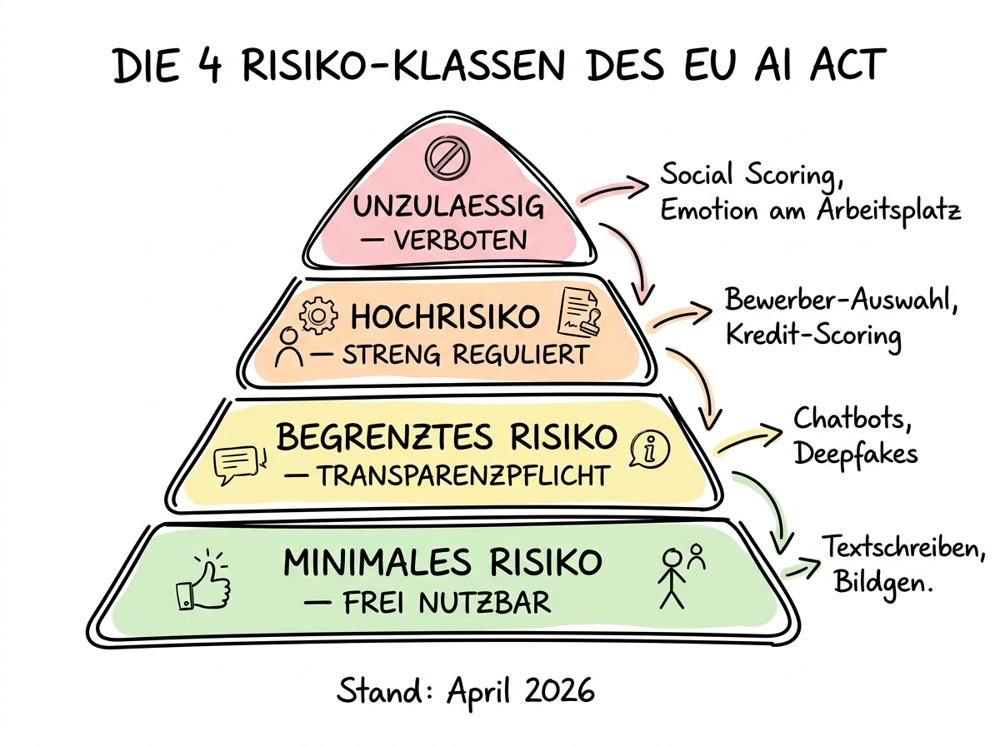

# 03 Der EU AI Act — Risikoklassen und Pflichten

**Die zweite große recht­liche Säule: Was reguliert der AI Act, wen betrifft er — und was müssen Sie als Anwender konkret tun?**

---

## Warum dieses Tutorial?

Der **EU AI Act** (offiziell: Verordnung (EU) 2024/1689) ist das erste umfassende KI-Gesetz weltweit. Er wurde im Mai 2024 verabschiedet und wird in mehreren Phasen zwischen Februar 2025 und August 2026 wirksam. Stand April 2026 sind die ersten beiden Phasen bereits in Kraft; die dritte Phase — mit den zentralen Pflichten für Hoch­risiko-Systeme — folgt am 2. August 2026.

Der AI Act ist für viele Anwender ein großes Rätsel. Die meisten Erklär­artikel sprechen über die Pflichten der Anbieter (OpenAI, Anthropic, Google) und lassen offen, was für Sie als Nutzerin oder Nutzer gilt. Dieses Kapitel schließt diese Lücke: Wir erklären, wann Sie vom AI Act betroffen sind, welche Pflichten Sie als sogenannter „Deployer" haben — und welche Einsatz­felder schon jetzt unter­sagt oder streng reguliert sind.

Die Kurzfassung für Eilige: **Die allermeisten Alltags­einsätze von KI (Texte schreiben, Brain­storming, Bilder generieren, Präsen­tationen vorbereiten) sind AI-Act-rechtlich unproblematisch.** Kritisch wird es, wenn Sie Entscheidungen über Menschen automatisieren — und genau dann greift der AI Act.

**Was Sie nach diesem Tutorial wissen werden:**

- Wie die vier Risikoklassen des AI Act funktionieren und welche Beispiele in jede Klasse fallen.
- Warum der Unter­schied zwischen „Provider" und „Deployer" wichtig ist und welche Pflichten Sie als Deployer haben.
- Was der Zeit­plan bis August 2026 bedeutet und was Sie dafür vorbereiten sollten.
- Welche Bußgelder drohen und welche Behörde in Deutschland zuständig ist.
- Wie Sie als Einzel­person, als KMU und als Mittelständler pragmatisch mit dem AI Act umgehen.

## Die vier Risikoklassen

Der AI Act verfolgt einen **risiko­basierten Ansatz**: Nicht jede KI wird gleich streng reguliert, sondern je nachdem, wie groß das Risiko für Grund­rechte, Sicherheit und Gesund­heit der betrof­fenen Personen ist. Das Ergebnis sind vier Klassen, die Sie sich wie eine Pyramide vorstellen können: ganz oben die wenigen, aber streng verbotenen Systeme; ganz unten die große Masse an alltäg­lichen KI-Anwendungen mit minimalen Pflichten.

### Klasse 1: Unzulässiges Risiko (verboten seit Februar 2025)

An der Spitze der Pyramide stehen KI-Systeme, die die EU für unver­einbar mit Grund­rechten hält. Diese sind seit dem **2. Februar 2025 vollständig verboten** — und die Sanktionen bei Verstößen sind die höchsten überhaupt. Dazu gehören:

- **Social Scoring durch staatliche oder private Stellen**, bei dem Menschen auf Grundlage ihres Verhaltens bewertet und bei Ent­scheidungen benachteiligt werden (Kredit­vergabe, Wohnungs­vergabe, Versicherungs­abschlüsse).
- **Unterschwellige Manipulation** von Personen ohne deren Wissen, die zu nachteiligen Entscheidungen führen kann.
- **Emotions­erkennung am Arbeitsplatz und in Bildungs­einrichtungen**. Wichtige Ausnahme: medizinische und Sicherheits­anwendungen (zum Beispiel Müdigkeits­erkennung bei LKW-Fahrern) sind erlaubt.
- **Biometrische Kategori­sierung**, die sensible Merkmale wie Rasse, politische Überzeugung oder sexuelle Orientierung ableiten soll.
- **Echtzeit-Gesichtserkennung im öffentlichen Raum** durch Strafver­folgungs­behörden, bis auf sehr enge Ausnahmen (Suche nach vermissten Kindern, Abwehr konkreter Terror­anschläge).
- **Predictive Policing** auf Individual­basis, wenn es ausschließlich auf Profiling beruht.
- **Ungerichtetes Scraping von Gesichts­bildern** aus dem Internet oder aus Überwachungs­kameras, um Gesichtserkennungs-Datenbanken aufzubauen.

Für die meisten Leserinnen und Leser dieses Tutorials ist diese Klasse nicht unmittelbar relevant — Sie werden sehr wahr­scheinlich keines dieser Systeme aufbauen oder einsetzen. Aber Sie sollten wissen, dass es sie gibt, und dass bereits Ideen wie „Wir lassen die KI die Stimmung im Team­meeting analysieren" im Graubereich landen.

### Klasse 2: Hohes Risiko

Das ist die inhalt­lich wichtigste Klasse des AI Act. **Hoch­risiko-KI-Systeme** sind solche, die in sensiblen Anwendungs­feldern eingesetzt werden und für die Betroffenen erhebliche Folgen haben können. Die Liste dieser Felder ist in Anhang III des AI Act definiert. Die wichtigsten:

- **Biometrische Identifikation und Kategori­sierung** von Personen (soweit nicht verboten).
- **Kritische Infra­strukturen**: Verkehr, Wasser, Gas, Strom, digitale Infra­strukturen, wenn die KI zur Steuerung oder Sicherheit verwendet wird.
- **Bildung und Berufs­ausbildung**: Zugang, Bewertung, Prüfungs­bewertung, Zulassung.
- **Beschäftigung und Personal­management**: Rekrutierung, Bewer­berauswahl, Leistungs­beurteilung, Kündigungs­entscheidungen, Aufgaben­verteilung.
- **Wesentliche private und öffent­liche Dienste**: Kredit­würdigkeits­prüfung, Lebens- und Kranken­versicherungs­scoring, Sozial­leistungs­vergabe, Notruf­bearbeitung, Priori­sierung in Notauf­nahmen.
- **Strafverfolgung**: Beweis­bewertung, Zuverlässigkeits­prüfung von Personen.
- **Migration, Asyl, Grenzkontrolle**: Risiko­bewertungen, Echtheits­prüfung von Reise­dokumenten.
- **Justiz und demokratische Prozesse**: Unter­stützung von Richtern in der Rechts­findung, Beeinflussung von Wahlen.

**Was bedeutet Hochrisiko konkret?** Wenn Sie ein KI-System in einem dieser Felder einsetzen, dann müssen Sie ab dem 2. August 2026 eine Reihe von Anforderungen erfüllen:

1. **Risiko­management­system** einrichten und dokumentieren.
2. **Daten­qualität** sicherstellen: Die Trainings- und Test­daten müssen repräsen­tativ, frei von Verzerrungen und zweckge­eignet sein.
3. **Technische Dokumentation** erstellen, aus der sich die Funktions­weise, die Grenzen und die Konformität ergeben.
4. **Protokollierung (Logs)**: Das System muss automatisch protokollieren, was es tut. Sie müssen diese Logs mindestens sechs Monate aufbewahren.
5. **Transparenz­pflicht**: Die Personen, die vom System betroffen sind, müssen darüber informiert werden.
6. **Menschliche Aufsicht**: Ein Mensch muss in der Lage sein, das System zu über­wachen und zu korrigieren. Vollständig automatisierte Entscheidungen ohne Eingriffs­möglichkeit sind in vielen Fällen nicht zulässig.
7. **Robust­heit, Genauig­keit und Cyber­sicherheit**: Nachweisbar.
8. **Konformitäts­bewertung** und gegebenen­falls **CE-Kennzeichnung**, **Registrierung in der EU-Datenbank**.

Das ist ein erheblicher Aufwand, vor allem für kleine Organi­sationen. Die gute Nachricht: Wenn Sie als Anwender ein fertiges Tool nutzen, das der Anbieter bereits als Hochrisiko-System zertifiziert hat, dann übernimmt der Anbieter den größten Teil dieser Pflichten. Ihre Aufgabe als Deployer (siehe unten) ist dann deutlich schmaler.

### Klasse 3: Begrenztes Risiko

Hier geht es um KI-Systeme mit **Transparenz­pflichten**, aber ohne die strengen Hochrisiko-Anforderungen. Drei typische Fälle:

- **Chatbots und Konversations­systeme**: Die Nutzer müssen erkennen können, dass sie mit einer KI und nicht mit einem Menschen interagieren. Eine kleine Einblendung „Sie chatten mit einer KI" reicht in den meisten Fällen.
- **Emotion­erkennungs­systeme und biometrische Kategori­sierung** (soweit überhaupt erlaubt): Die betrof­fenen Personen müssen informiert werden.
- **Deep­fakes und KI-generierte Bilder/Videos/Audios**: Müssen als künstlich erzeugt gekennzeichnet sein, wenn sie reale Personen, Ereig­nisse oder Orte darstellen oder imitieren. Ausnahmen gibt es für offen­sichtlich künstlerische, satirische oder fiktionale Werke.

Diese Klasse ist für Content-Ersteller relevant: Wenn Sie ein KI-generiertes Foto in einem Blog­beitrag oder einer Social-Media-Kampagne verwenden und es als echte Foto­graphie präsen­tieren, dann bewegen Sie sich im Graubereich. Eine kleine Kennzeich­nung „KI-generiertes Bild" oder ein Hinweis im Impressum schützen Sie.

### Klasse 4: Minimales oder kein Risiko

Hier landen **über 80 % aller KI-Anwendungen** im beruf­lichen Alltag: ChatGPT als Schreib­assistent, Claude als Brain­storming-Partner, Nano Banana für Illustrationen, Perplexity für Recherche, Grammarly als Sprach­korrektur. All diese Systeme fallen in die Klasse „minimales Risiko" und unterliegen nach dem AI Act **keinen besonderen Pflichten**. Sie können sie einsetzen, wie Sie wollen — natürlich unter Beachtung der anderen Gesetze (DSGVO, Urheber­recht, Berufs­recht).

Das ist wichtig, weil die öffent­liche Wahrnehmung des AI Act oft den Eindruck vermittelt, jeder Einsatz von KI wäre jetzt streng reguliert. Das stimmt nicht. Der AI Act zielt auf die Fälle, in denen KI über Menschen entscheidet oder kritische Systeme steuert. Für alle anderen Fälle gilt: Weiter­machen wie bisher.

## Provider, Deployer und was das für Sie bedeutet

Der AI Act unter­scheidet mehrere Rollen. Die beiden wichtigsten sind:

- **Provider** (Anbieter): Die Person oder das Unter­nehmen, das ein KI-System entwickelt oder in Verkehr bringt. OpenAI ist Provider von ChatGPT. Anthropic ist Provider von Claude. Sie selbst werden nur dann Provider, wenn Sie ein eigenes KI-System bauen — zum Beispiel, indem Sie ein Open-Source-Modell feintunen und unter Ihrem Namen verteilen.

- **Deployer** (Anwender, Nutzer): Die Person oder das Unter­nehmen, das ein KI-System in eigener Verantwortung einsetzt. Wenn Sie ChatGPT in Ihrer Firma verwenden, sind Sie Deployer. Wenn Sie Claude in Cowork produktiv nutzen, sind Sie Deployer. Das gilt auch dann, wenn die KI im Hinter­grund läuft — zum Beispiel, weil Sie ein Tool gekauft haben, das intern eine KI verwendet.

**Die meisten Leserinnen und Leser dieses Tutorials sind Deployer.** Provider werden Sie nur, wenn Sie eigene Modelle bauen oder Open-Source-Modelle wesentlich verändern und weiter­vertreiben.

### Deployer-Pflichten in der Übersicht

Was müssen Sie als Deployer konkret tun? Das hängt davon ab, in welche Risiko­klasse das System fällt, das Sie einsetzen:

**Bei minimalem Risiko (ChatGPT, Claude, Gemini im normalen Einsatz):**
- Keine konkreten AI-Act-Pflichten.
- Indirekt aber: **AI-Literacy-Pflicht** (Art. 4 AI Act), die seit 2. Februar 2025 gilt. Sie müssen sicherstellen, dass Ihre Mitarbeiterinnen und Mitarbeiter, die KI einsetzen, über die nötige Kompetenz verfügen, um die Systeme angemessen zu verstehen.

**Bei begrenztem Risiko (Chatbot, Deepfakes):**
- Transparenz­pflichten erfüllen: Nutzer informieren, KI-Inhalte kennzeichnen.

**Bei hohem Risiko (Bewerber­auswahl, Kredit­scoring, Leistungs­beurteilung):**
- Sicherstellen, dass das eingesetzte System vom Provider als konform zertifiziert ist.
- Eigenes **Risiko­management** betreiben: Monitoring, Protokollierung (mindestens sechs Monate Log-Aufbewahrung).
- **Menschliche Aufsicht** gewährleisten: Mitarbeitende mit aus­reichender Kompetenz und Befugnis zur Über­steuerung einsetzen.
- **Betroffene Personen informieren**, wenn sie einem Hoch­risiko-System ausgesetzt sind.
- In manchen Fällen eine **Grundrechte-Folgenabschätzung** durchführen — insbesondere öffent­liche Stellen und in Bereichen wie Sozial­leistungen.
- **Eingangs­daten­qualität** prüfen, soweit Sie Kontrolle darüber haben.

### Die AI-Literacy-Pflicht im Detail

Die AI-Literacy-Pflicht (Art. 4) ist die einzige AI-Act-Pflicht, die praktisch alle beruf­lichen KI-Nutzer heute schon betrifft. Sie lautet sinngemäß: *„Anbieter und Deployer von KI-Systemen treffen Maßnahmen, um nach bestem Wissen sicher­zustellen, dass ihre Mitarbeiter und andere für sie tätige Personen, die mit dem Betrieb und der Nutzung von KI-Systemen befasst sind, über ausreichende KI-Kompetenz verfügen."*

Was heißt das praktisch? Es gibt keine zentrale Vorschrift, was genau geschult werden muss. Aber die Aufsichts­behörden und Juristinnen, die den AI Act kommentieren, sind sich einig, dass folgende Themen dazugehören:

- Grundlegendes Verständnis, wie KI funktioniert (wie die Tutorials 00 bis 03 dieses Repos vermitteln).
- Kenntnis der Stärken, Schwächen und Grenzen der eingesetzten Systeme (Halluzinationen, Bias, Kontext­fenster).
- Kenntnis der rechtlichen Rahmen­bedingungen (DSGVO, AI Act, branchen­spezifische Regelungen).
- Fähigkeit, Ergebnisse der KI zu bewerten und nicht blind zu übernehmen.
- Sensibili­sierung für ethische Implikationen.

Dieses gesamte Tutorial-Repo kann als Beitrag zur Erfüllung der AI-Literacy-Pflicht verstanden werden — es deckt genau diese Themen ab. Für Ihr Unter­nehmen sollten Sie aber eine formelle Dokumentation anlegen: Wer wurde wann in welchen Themen geschult? Das ist das, was eine Aufsichts­behörde bei einer Prüfung sehen möchte.

## GPAI-Modelle und was der AI Act für OpenAI, Anthropic und Google bedeutet

Die großen generativen KI-Modelle — ChatGPT, Claude, Gemini, Mistral — werden im AI Act als **GPAI-Modelle** (General Purpose AI, allgemeine Zweck-KI) behandelt. Für diese Klasse gelten seit August 2025 eigene Regeln, die für Sie als Nutzer meistens unsichtbar sind, aber im Hinter­grund die Produkt­gestaltung der Anbieter beeinflussen.

Zu den Provider-Pflichten der GPAI-Modelle gehören:

- **Technische Dokumentation** über Trainings­daten, Methoden und Leistungs­fähigkeit.
- **Urheberrechtliche Compliance**: Der Provider muss erklären, dass die Trainings­daten urheber­rechtlich zulässig verwendet wurden.
- **Transparenz­bericht**: Eine öffent­lich zugängliche Zusammen­fassung der Trainings­daten (auf Basis einer EU-Vorlage).
- **Zusätzliche Pflichten** für „systemische" GPAI-Modelle — also solche mit besonders hoher Rechen­leistung, die als potenziell gefährlich einge­stuft werden. Das betrifft Stand April 2026 die Top-Modelle von OpenAI, Anthropic, Google und xAI.

Für Sie als Nutzer heißt das indirekt: Die Anbieter liefern immer mehr standardi­sierte Dokumente mit, die Sie in Ihrer eigenen Compliance verwenden können. Zum Beispiel das Anthropic „Model Card"-Dokument für Claude 4, das die bekannten Grenzen und Risiken des Modells beschreibt. Diese Dokumente sind der Aus­gangs­punkt für Ihre eigene Risiko­einschätzung.

## Zeit­plan und was bis wann passiert

Der AI Act hat einen mehrstufigen Zeit­plan:

| Datum | Phase | Was gilt |
|---|---|---|
| **2. Feb 2025** | Phase 1 | Verbote unzulässiger Praktiken (Klasse 1); AI-Literacy-Pflicht (Art. 4). |
| **2. Aug 2025** | Phase 2 | GPAI-Regeln für Provider; Governance-Strukturen (Mitglied­staaten benennen Behörden); Sanktions­fähigkeit beginnt. |
| **2. Feb 2026** | EU-Leit­linien | EU-Kommission veröffentlicht Leit­linien zur Risiko­klassi­fizierung. |
| **2. Aug 2026** | Phase 3 | Vollständige Hoch­risiko-Pflichten greifen; Registrierungs­pflicht in der EU-Datenbank; Konformitäts­bewertungen. |
| **2. Aug 2027** | Phase 4 | Erweiterte Pflichten für bestimmte High-Risk-Systeme, die bereits vor 2026 eingesetzt wurden. |

**Stand April 2026 leben wir zwischen Phase 2 und Phase 3.** Die GPAI-Provider haben ihre Pflichten bereits umgesetzt oder arbeiten daran. Die EU-Kommission bereitet die Leit­linien für die Risiko­klassi­fizierung vor. Für Sie als Anwender ist das die Vorbereitungs­phase: Wenn Sie in einem Hoch­risiko-Feld arbeiten (Personal, Kredit, Bildung, medizinische Diagnostik), sollten Sie jetzt anfangen, die Compliance-Strukturen aufzubauen, damit Sie am 2. August 2026 bereit sind.

In Deutschland wird die **Bundesnetz­agentur (BNetzA)** zur zentralen Behörde für die Umsetzung des AI Act. Sie übernimmt die Rolle als „Koordinierungs- und Kompetenz­zentrum für KI und Vorschriften­konformität" (KoKIVO). Daneben bleiben die daten­schutz­rechtlichen Aufsichts­behörden (die Länder­datenschutz­beauftragten und der BfDI) für alles zuständig, was die DSGVO betrifft — und das ist oft parallel zum AI Act relevant.

## Bußgelder und Sanktionen

Die Bußgelder im AI Act sind gestaffelt und orientieren sich am Schwere­grad:

- **Verstöße gegen die verbotenen Praktiken** (Klasse 1): bis zu **35 Millionen Euro** oder **7 % des weltweiten Jahres­umsatzes** — je nachdem, welcher Betrag höher ist.
- **Verstöße gegen Hochrisiko-Anforderungen** (Klasse 2): bis zu **15 Millionen Euro** oder **3 % des Jahres­umsatzes**.
- **Verstöße gegen die Bereit­stellung falscher Infor­mationen** an Behörden: bis zu **7,5 Millionen Euro** oder **1 % des Jahres­umsatzes**.

Für kleine und mittlere Unter­nehmen und Start-ups gelten redu­zierte Staffel­werte — die konkreten Grenzen werden von den nationalen Behörden festgelegt.

Stand April 2026 sind noch keine Bußgelder nach dem AI Act öffent­lich bekannt. Die ersten Verfahren werden erwartungs­gemäß in der zweiten Hälfte 2026 auftauchen, nachdem Phase 3 in Kraft getreten ist. Wer bis dahin seine Hausauf­gaben gemacht hat, kann gelassen bleiben.

## Praktische Empfehlungen nach Organisations­typ

### Einzel­person oder Freiberuflerin

Sie sind in praktisch allen Fällen im Bereich „minimales Risiko" unterwegs. Ihre konkreten Pflichten:

- AI-Literacy: Halten Sie sich informiert, lesen Sie Tutorials wie dieses.
- Bei Content­veröffent­lichungen mit KI-generierten Bildern oder Videos: Kennzeichnen Sie sie als KI-generiert, wenn sie realistisch wirken und reale Personen oder Orte darstellen.
- Keine weiteren Pflichten.

### KMU mit bis zu 50 Mitarbeitenden

- AI-Literacy-Pflicht erfüllen: Ein internes Schulungs­dokument anlegen und doku­mentieren, welche Mitarbeitenden welche Themen beherrschen.
- Wenn Sie KI für Bewerber­auswahl, Leistungs­beurteilung oder Kündigungs­entscheidungen einsetzen: Stopp. Das ist Hoch­risiko, und Sie brauchen eine saubere Compliance-Struktur, die bis August 2026 steht.
- Wenn Sie keines der Hoch­risiko-Felder berühren: Weiter wie bisher, mit einem schrift­lichen AI-Nutzungs-Leitfaden für Mitarbeitende.
- Einen Verantwort­lichen benennen, der das Thema im Auge behält — nicht zwingend der Daten­schutz­beauftragte, aber gerne in Personal­union.

### Mittelständler und Konzerne

- AI-Governance-Struktur aufbauen: Rollen definieren, interne Richt­linien verabschieden, Prozess für AI-Anwendungs­freigaben einrichten.
- Alle einge­setzten KI-Systeme inventari­sieren und klassi­fizieren (welche Risiko­klasse, welcher Anbieter, welcher Vertrag).
- Bei Hoch­risiko-Einsätzen: Konformitäts­bewertung mit dem Anbieter abstimmen, eigene Risiko­beurteilung dokumentieren.
- AI-Literacy-Schulungen formali­sieren: E-Learning oder Präsenz­schulungen für alle Mitarbeitenden, die regel­mäßig KI einsetzen.
- Bezug zum Betriebs­rat herstellen: Die Einführung von KI-Systemen zur Mitarbeiter­beurteilung ist praktisch immer mitbestimmungs­pflichtig nach § 87 BetrVG.

## Häufige Missverständ­nisse

**„Der AI Act verbietet Chat­GPT in Europa."** Falsch. ChatGPT ist ein GPAI-Modell und unterliegt den Provider-Pflichten, die OpenAI erfüllen muss. Als normaler Nutzer können Sie es weiter­verwenden.

**„Jede KI-Nutzung im Unter­nehmen muss jetzt dokumentiert werden."** Falsch. Sie müssen AI-Literacy dokumen­tieren und Hoch­risiko-Systeme compliance-gerecht betreiben. Eine Notiz „Ich habe Claude zur Recherche genutzt" in jeder E-Mail ist nicht verlangt.

**„KI-generierte Bilder müssen immer gekennzeichnet sein."** Nicht immer. Nur wenn sie realistisch wirken und reale Personen, Orte oder Ereignisse darstellen oder imitieren. Eine mit Nano Banana generierte Illustration für einen Blog­beitrag muss nicht als „KI-generiert" gekennzeichnet werden, solange sie offen­sichtlich künstlerisch und nicht als Foto­graphie gemeint ist.

**„Wir warten ab, bis der AI Act vollständig in Kraft ist, dann kümmern wir uns."** Riskant. Die Phase 1 (Verbote, AI-Literacy) ist seit Februar 2025 in Kraft. Wer bis August 2026 wartet, hat mit der Compliance einer Hoch­risiko-Anwendung keine Zeit mehr, bevor sie greift.

## Stärken und Schwächen des AI Act auf einen Blick

**Stärken:**

- Erste klare recht­liche Struktur für KI, risiko­orientiert und damit pragma­tisch.
- Klare Unterscheidung zwischen Provider- und Deployer-Pflichten — Sie als Anwender sind nicht für alles verantwortlich.
- Die meisten Alltags­einsätze sind nicht betroffen.
- Hohes Verbraucher­schutz-Niveau, das langfristig auch Vertrauen in KI stärken kann.

**Schwächen:**

- Sehr detailliert und technisch anspruchsvoll — kleine Unter­nehmen brauchen externe Unter­stützung, wenn sie im Hoch­risiko-Feld unterwegs sind.
- Der Zeit­plan ist ambitioniert: Manche Unter­nehmen werden die Phase 3 nicht sauber erreichen.
- Die konkrete Einordnung ist oft nicht eindeutig — die EU-Leit­linien (Februar 2026) werden nachjustiert.
- Die Wechsel­wirkung mit DSGVO, Betriebs­verfassungs­gesetz und Branchen­gesetzen ist komplex und schafft Rechts­unsicher­heit.

## Zusammen­fassung in 60 Sekunden

Der EU AI Act regu­liert KI risiko­basiert in vier Klassen: verbotene Praktiken (seit Februar 2025), Hoch­risiko (streng reguliert ab August 2026), begrenztes Risiko mit Transparenz­pflichten und minimales Risiko (die meisten Alltags­einsätze). Sie sind meistens Deployer, nicht Provider; Ihre Haupt­pflicht ist AI-Literacy (seit Februar 2025) und — wenn Sie Hoch­risiko-Systeme einsetzen — Risiko­management, menschliche Aufsicht und Protokollierung. Die Bundes­netz­agentur ist in Deutschland die zentrale Behörde. Bußgelder reichen bis 35 Millionen Euro oder 7 % Jahres­umsatz. Praktisch: Die meisten Nutzer dieses Tutorials müssen weiter­arbeiten wie bisher, die formale AI-Literacy doku­mentieren und bei Hoch­risiko-Anwendungen bis August 2026 vorbereitet sein.

## Nächste Schritte

Nachdem Sie die beiden großen rechtlichen Felder kennen (DSGVO und AI Act), wenden wir uns in Teil 04 dem **fachlichen Risiko** zu: Halluzinationen. Das ist die leisere, aber oft gefährlichere Kategorie — weil sie nicht mit Bußgeldern droht, sondern mit peinlichen, falschen oder irreführenden Inhalten in Ihrem eigenen Arbeits­produkt.

- **Weiter zu:** [04 Halluzinationen erkennen und vermeiden](./04%20Halluzinationen%20erkennen.md)
- **Vertiefung:** Die offizielle AI-Act-Seite der EU-Kommission unter https://digital-strategy.ec.europa.eu/de/policies/regulatory-framework-ai und das High-Level Summary unter https://artificialintelligenceact.eu/high-level-summary.
- **Querverweis:** Die AI-Literacy-Pflicht ist der Grund, warum Kapitel 00 bis 03 dieses Tutorials überhaupt wichtig sind — sie vermitteln die Grund­kompetenz, die Art. 4 AI Act verlangt.
