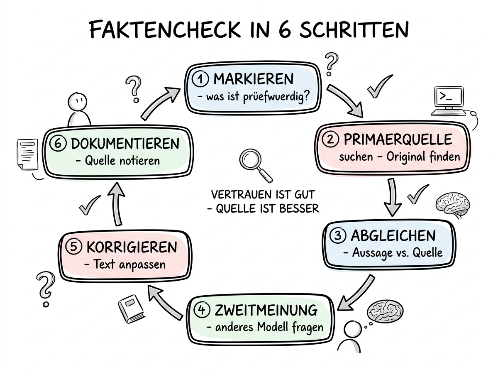

# 04 Halluzinationen erkennen und vermeiden

**Warum KI sich Dinge ausdenkt, wie Sie es merken und welche Routinen Halluzinationen zuverlässig abfangen.**

---

## Warum dieses Tutorial?

Halluzi­nationen sind das bekannteste und zugleich heim­tückischste Risiko der KI-Nutzung. Sie sind bekannt, weil praktisch jeder sie schon erlebt hat: ChatGPT nennt mit voller Überzeugung ein Buch, das es nicht gibt. Claude zitiert einen Paragraphen, der in dem Gesetz gar nicht steht. Gemini erfindet eine Statistik, die so nie veröffentlicht wurde. Das passiert, ohne dass die KI es als Unsicher­heit markieren würde — der Ton bleibt immer sachlich, bestimmt, überzeugend.

Heim­tückisch sind Halluzi­nationen, weil sie nicht lächer­lich klingen, sondern plausibel. Eine erfundene Studie „Müller & Schmidt (2021)" klingt genauso echt wie eine reale Studie „Miller & Cohen (2018)". Eine halluzinierte E-Mail-Adresse „info@bundesregierung.de" sieht aus wie eine echte. Eine erfundene Gesetzesstelle „§ 23 Abs. 4 TMG" folgt dem Schema echter Gesetzeszitate. Wer die Aussagen nicht aktiv prüft, übernimmt sie — und steht dann irgendwann vor dem Problem, dass der Vortrag, der Geschäfts­bericht oder die E-Mail einen Fehler enthält, der auf die KI zurückgeht.

Dieses Kapitel erklärt, warum Halluzinationen entstehen, wie Sie sie erkennen und welche Routinen sie zuverlässig abfangen. Am Ende haben Sie einen Sechs-Schritt-Faktencheck, den Sie in unter zwei Minuten durch­führen können — und der die allermeisten Fehler abfängt, bevor sie Schaden anrichten.

**Was Sie nach diesem Tutorial wissen werden:**

- Warum Sprach­modelle überhaupt halluzi­nieren und warum sich das technisch nicht einfach „abstellen" lässt.
- Die fünf typischen Halluzi­nations-Muster, die in fast allen Modellen auftreten.
- Wie Sie Ihre Prompts so bauen, dass das Halluzi­nations-Risiko sinkt.
- Der sechs­schrittige Faktencheck für den Alltag.
- Die Grenze zwischen „die KI lügt" und „ich habe schlecht geprompted".



## Warum Sprach­modelle halluzinieren

Um Halluzi­nationen zu verstehen, muss man kurz zurück zu dem, was ein Sprach­modell eigentlich ist. Detailliert ist das in Kapitel 00 dieses Tutorials beschrieben, hier die Kurz­fassung: Ein Sprach­modell wie GPT-5, Claude Opus 4.6 oder Gemini ist nicht ein Wissens­system, sondern ein **Wahrscheinlich­keits­modell über Sprache**. Es wurde darauf trainiert, das wahr­scheinlichste nächste Wort in einem Text vorher­zusagen, und zwar auf der Basis von hunderten Milliarden Text-Beispielen aus dem Internet und aus Büchern.

Das Entscheidende: Das Modell hat keinen Unter­schied zwischen „Fakten" und „Erfindungen" gelernt. Es hat gelernt, **welche Wort­folgen in einem bestimmten Kontext plausibel klingen**. Wenn Sie eine Frage stellen, zu der das Modell keine robuste Information in seinem Training­daten gesehen hat, dann wird es trotzdem eine Antwort generieren — und zwar in dem Stil, in dem eine echte Antwort aussehen würde. Das nennen wir Halluzination.

Daraus folgen zwei wichtige Erkennt­nisse:

**Erstens:** Halluzi­nationen sind kein Fehler des Modells. Sie sind ein struktu­relles Merkmal der Funktions­weise. Ein Modell, das nur das „wahrscheinlichste nächste Wort" kennt, wird immer auch plausibel klingende Erfindungen produzieren. Man kann die Rate der Halluzi­nationen senken (durch bessere Trainings­methoden, durch Retrieval-Augmented-Generation, durch Tool-Use), aber man kann sie nicht auf Null bringen.

**Zweitens:** Das Modell weiß selbst nicht, wann es halluzi­niert. Wenn Sie fragen „Bist du sicher?", bekommen Sie normaler­weise ein „Ja, ich bin sicher" — egal ob die ursprüng­liche Antwort richtig oder falsch war. Das Modell hat kein Meta­wissen über den Wahrheits­gehalt seiner eigenen Aussagen. Neuere Modelle sind darin etwas besser geworden (Claude Opus 4.6 markiert häufiger Unsicher­heit, Gemini verweist öfter auf Quellen), aber die Grund­logik bleibt gleich: **Das Modell kann seine eigene Zuverlässigkeit nicht einschätzen.**

Diese zwei Punkte sind die Grundlage für alles, was folgt. Jede praktische Maßnahme gegen Halluzi­nationen bedeutet: Sie als Mensch übernehmen die Rolle, die das Modell technisch nicht übernehmen kann.

## Die fünf typischen Halluzi­nations-Muster

In der Praxis tauchen Halluzi­nationen immer wieder in denselben Mustern auf. Wer sie kennt, kann sie viel schneller erkennen.

### Muster 1: Erfundene Quellen und Referenzen

Die Klassikerin. Sie bitten um eine wissen­schaftliche Aussage, und die KI liefert sie mit einer Quellen­angabe: „Laut einer Studie von Schneider et al. (2022) im Journal of Marketing Research ..." Die Studie existiert nicht. Der Autor existiert (oder auch nicht). Die Zeit­schrift existiert, aber die Ausgabe enthält die Studie nicht.

Dieses Muster tritt besonders häufig auf, wenn Sie nach konkreten Zahlen, Statistiken oder wissen­schaftlichen Ergeb­nissen fragen. Die KI hat gelernt, dass „seriöse" Antworten Quellen haben — und generiert deshalb Quellen, wenn der Text eine haben „sollte".

**Erken­nungs­hilfe:** Jede Referenz, die konkret klingt (Autoren­name, Jahr, Zeit­schrift oder Buchtitel) muss unabhängig geprüft werden. Google Scholar, die Website der Zeit­schrift oder einfach die Google-Suche liefern die Antwort in dreißig Sekunden.

### Muster 2: Halluzinierte Gesetzes- und Vorschriften­angaben

Besonders heikel, weil gerade im rechts­nahen Bereich viele Menschen die Antworten einer KI ernst nehmen. Die KI zitiert einen Paragraphen mit Absatz und Satz, und der Paragraph existiert nicht — oder existiert, hat aber einen ganz anderen Inhalt. Klassisches Beispiel: „Nach § 14 Abs. 2 Satz 3 UWG darf keine ..."

Dieses Muster ist besonders gefährlich, weil es in der Regel nicht sofort auffällt. Wer einen Para­graphen in einem Geschäfts­brief zitiert, prüft ihn selten nach. Wer den Brief aber nach dem Versand prüft, stellt dann vielleicht fest, dass es den Paragraphen in der zitierten Form nicht gibt.

**Erken­nungs­hilfe:** Gesetzes­zitate immer in einer offiziellen Quelle nachschlagen. Für deutsches Recht ist das https://www.gesetze-im-internet.de, für EU-Recht https://eur-lex.europa.eu. Dreißig Sekunden, keine Ausreden.

### Muster 3: Falsche technische Details und APIs

In der Software­entwicklung tritt das häufig auf: Claude nennt eine Funktion einer Bibliothek, die es so nicht gibt. Die Parameter sind plausibel, die Signatur sieht aus wie der Rest der Bibliothek, aber die Funktion existiert nicht. Wer den Code dann ausführt, bekommt einen „Function not found"-Fehler.

Für Nicht-Entwickler­innen ist das relevant, weil es zeigt: **Selbst in sehr klar definierten Domänen halluzi­nieren Modelle.** Eine API-Dokumentation ist eine mathematisch exakte Sache — die Funktion existiert oder nicht. Und trotzdem erfinden Modelle regelmäßig Funktionen, wenn sie nicht genau wissen, ob es die in der fraglichen Version gibt.

**Erken­nungs­hilfe:** Bei technischen Angaben immer in der offiziellen Dokumentation des Anbieters prüfen. Bei Code: einfach ausführen. Der Compiler lügt nicht.

### Muster 4: Datums- und Zeit­angaben, die nicht stimmen können

Sprach­modelle haben ein „Knowledge Cutoff" — einen Stichtag, ab dem sie keine neuen Informationen mehr gesehen haben. Trotzdem äußern sie sich häufig zu Ereignissen nach diesem Stichtag, als hätten sie sie erlebt. Manchmal raten sie einfach. Manchmal erfinden sie Details.

Besonders problematisch: Zahlen, die sich regelmäßig ändern. Einwohner­zahlen von Städten, Markt­anteile von Unter­nehmen, Preise von Produkten, Politiker-Amts­zeiten. Ein Modell, das im März 2025 trainiert wurde, „weiß" nichts über Wahlen im November 2025 — wird aber vielleicht trotzdem über sie schreiben, wenn Sie danach fragen.

**Erken­nungs­hilfe:** Für alles Zeit- und Daten­abhängige entweder explizit nach dem Knowledge Cutoff fragen („Was war dein letzter Trainings­stand?") oder ein Modell verwenden, das Web-Suche integriert hat (Perplexity, Claude mit Web-Suche, ChatGPT mit Browsing).

### Muster 5: Plausible Halb­wahrheiten

Der heimtückischste Fall. Die KI liefert eine Antwort, die in Teilen stimmt und in anderen Teilen leicht danebenliegt. Eine Einwohner­zahl, die um 15 % falsch ist. Ein Geburts­datum, das ein Jahr daneben liegt. Eine Studie, deren Autoren stimmen, aber deren Kern­aussage falsch wiedergegeben ist. Eine Stadt, die in der falschen Region verortet wird.

Diese Halluzi­nationen sind am schwer­sten zu erkennen, weil sie kein offensicht­liches „Das gibt es nicht"-Signal senden. Sie wirken richtig, weil das meiste Richtige stimmt. Nur eine Zahl, ein Name, ein Detail ist daneben.

**Erken­nungs­hilfe:** Die einzige zuver­lässige Methode ist der unab­hängige Cross-Check. Und zwar besonders bei allem, was Sie weiter­verwenden wollen — in einem Vortrag, einer E-Mail, einer Entscheidung.

## Prompt-Techniken, die Halluzi­nationen reduzieren

Sie können das Halluzi­nations-Risiko deutlich senken, indem Sie Ihre Prompts bewusst gestalten. Diese Techniken sind in Kapitel 01 dieses Tutorials ausführ­licher beschrieben; hier die wichtigsten speziell gegen Halluzi­nationen.

### Kontext bereitstellen statt aus dem Gedächtnis fragen

**Schlecht:**

```
Schreibe mir eine Zusammen­fassung des Datenschutzes bei Cowork.
```

**Gut:**

```
Hier ist ein Auszug aus der Cowork-Dokumentation:

[Text einfügen]

Schreibe mir auf dieser Basis eine Zusammen­fassung des Datenschutzes,
ausschließlich gestützt auf den obigen Text. Wenn etwas nicht im Text
steht, schreibe „nicht im Dokument erwähnt" statt zu raten.
```

Der Unter­schied: Im ersten Fall muss die KI aus ihrem Gedächtnis heraus antworten, und das Gedächtnis ist ungenau und veraltet. Im zweiten Fall hat sie ein konkretes Dokument vor sich, das sie nur zusammen­fassen muss. Halluzi­nationen werden dadurch drastisch seltener.

Diese Technik nennt man **Retrieval-Augmented Generation** (RAG), wenn es automatisiert passiert. Manuell heißt sie: „Gib der KI die Quellen, statt sie raten zu lassen."

### Explizit nach Unsicherheit fragen

**Schlecht:**

```
Wie hoch ist das Grundgehalt eines Lehrers in Bayern 2025?
```

**Gut:**

```
Wie hoch ist das Grund­gehalt eines Lehrers in Bayern im Jahr 2025?
Wenn du dir nicht sicher bist, sage das bitte explizit und nenne
die Unsicher­heit. Nenne auch das Jahr, zu dem deine Information
verlässlich ist.
```

Moderne Modelle reagieren auf diese Auf­forderung durchaus — sie markieren dann tatsäch­lich häufiger Unsicher­heit und nennen ihren Wissens­stand. Es ist keine Garantie, aber es verbessert die Trefferquote spürbar.

### Struktu­rierte Ausgabe mit Quellen­feld

**Schlecht:**

```
Nenne mir drei Vorteile von Photovoltaik.
```

**Gut:**

```
Nenne mir drei Vorteile von Photovoltaik. Für jeden Vorteil möchte
ich folgendes Schema:

- Vorteil: [kurz]
- Begründung: [1-2 Sätze]
- Quellen­lage: [„allgemein anerkannt" / „umstritten" / „spekulativ"]
- Quelle, falls konkret: [Name, Jahr]
```

Die Struktur zwingt das Modell, Meta­informationen zu liefern — und lässt es bei unsicheren Angaben zumindest das Feld „Quellen­lage" als „spekulativ" oder „umstritten" markieren. Das ist kein Beweis für Korrekt­heit, aber es ist ein Signal, wo Sie prüfen sollten.

### Drei unabhängige Versuche — sogenannte „Temperatur-Proben"

Bei kritischen Fragen können Sie dieselbe Frage dreimal stellen — ideal in neuen, frischen Chats, damit die KI nicht einfach die vorherige Antwort wiederholt. Wenn alle drei Antworten über­einstimmen, ist die Wahr­scheinlichkeit höher, dass es sich um robustes Wissen handelt. Wenn sie auseinander­gehen, ist das ein deut­liches Zeichen, dass die Antwort unsicher ist.

Das ist kein Beweis — auch drei identische halluzi­nierte Antworten sind möglich, besonders wenn der Trainings­text der KI einen bestimmten Fehler enthält. Aber drei divergente Antworten sind ein klares Stopp­signal.

## Der sechs­schrittige Faktencheck

Das ist der praktische Kern dieses Teils. Der Faktencheck ist kein Misstrauens­votum, sondern ein Arbeits­schritt wie das Korrektur­lesen. Er dauert, wenn er geübt ist, weniger als zwei Minuten.

**Schritt 1: Markieren, was geprüft werden muss.**

Gehen Sie den KI-Output durch und markieren Sie alle Aussagen, die:

- konkrete Zahlen enthalten
- Namen von Personen, Unter­nehmen, Orten nennen
- Datums­angaben enthalten
- Zitate oder Quellen nennen
- rechtliche oder technische Details behaupten

Alles, was markiert ist, braucht eine Prüfung. Alles, was nicht markiert ist — allgemeine Aussagen, Meinungen, Struktur — ist weniger kritisch.

**Schritt 2: Für jede markierte Aussage eine Primär­quelle suchen.**

Primär­quellen sind:

- Für Gesetze: https://www.gesetze-im-internet.de oder https://eur-lex.europa.eu
- Für Studien: Google Scholar, die Website der Zeit­schrift, Semantic Scholar
- Für Unter­nehmen: deren offizielle Website, Presse­mitteilungen
- Für Personen: offizielle Seiten, Wikipedia als Einstieg, dann weiter
- Für aktuelle Ereignisse: Nachrichten­medien, möglichst mehrere unabhängig voneinander
- Für Produkt­preise und -details: die Anbieter-Website

Wenn Sie keine Primär­quelle finden, ist das selbst schon ein Warn­signal. Nicht jede korrekte Aussage ist im Web auffind­bar, aber die meisten konkreten Fakten schon.

**Schritt 3: Abgleichen — stimmt die Aussage exakt?**

Nicht nur „ungefähr". Zahl stimmt genau? Jahr stimmt? Autoren­name in der richtigen Schreib­weise? Wenn die KI „Müller et al. (2019) in Nature" schreibt und die reale Studie von 2021 ist und im Journal of Psychology Research erschien, dann ist die Aussage falsch — auch wenn „Müller" stimmt.

**Schritt 4: Bei unklarer Quellen­lage: Zweit­meinung von einer anderen KI oder einem anderen Menschen.**

Eine zweite KI kann den Fakt gegenprüfen, wenn Sie keine Primär­quelle finden. Besonders nützlich: Claude gegen ChatGPT gegen Gemini, mit derselben Frage. Wenn alle drei überein­stimmen, ist die Wahr­scheinlich­keit höher. Wenn sie abweichen, müssen Sie die Aussage streichen oder anders formulieren.

Bei wirklich kritischen Aussagen — solchen mit rechtlichen oder finanziellen Folgen — ersetzt auch die zweite KI nicht den menschlichen Fach­experten. Ein Blick in die Rechts­abteilung oder zur Kollegin mit dem passenden Fach­wissen ist dann nicht optional.

**Schritt 5: Korrigieren, entfernen oder kennzeichnen.**

Je nach Ergebnis des Faktenchecks:

- **Stimmt exakt:** Stehen lassen.
- **Stimmt fast, kleine Abweichung:** Mit der korrekten Zahl/Angabe ersetzen.
- **Stimmt nicht, keine bessere Quelle gefunden:** Aussage streichen. Lieber weniger sagen als falsches sagen.
- **Stimmt nicht, aber Sie wollen darauf eingehen:** Als „laut KI-Generierung, Quellen­lage unklar" kenn­zeichnen — und dann prüfen, ob die Aussage überhaupt noch in den Text passt.

**Schritt 6: Dokumentieren, was Sie geprüft haben.**

Für beruf­liche Kontexte — besonders bei Texten, die veröffent­licht werden — lohnt sich eine knappe Notiz: „Fakten geprüft am 5.4.2026 gegen Primär­quelle X". Das schützt Sie, wenn später jemand fragt, woher die Zahl kommt. Es zwingt Sie auch zu einer bewussten Qualitäts­sicherung, die sich in Ihrem Arbeits­prozess etabliert.

Der Zyklus ist bewusst als Kreis dar­gestellt (siehe Illustration oben): Nach dem sechsten Schritt geht es zurück zu Schritt 1, wenn Sie den Text weiter­bearbeiten. Jede neue KI-Generierung braucht einen neuen Check.

## Wann Sie der KI vertrauen können — und wann nicht

Es gibt Bereiche, in denen Sie einer modernen KI relativ gelassen vertrauen können, und andere, in denen Sie paranoid sein sollten. Die Trenn­linie zu kennen, spart enorm viel Zeit.

**Tendenziell zuverlässig:**

- Stil- und Sprach­fragen: „Klingt der Satz gut?", „Formuliere mir das freundlicher".
- Struk­turelle Vorschläge: „Wie könnte ich das gliedern?", „Was fehlt in diesem Konzept?".
- Brainstorming und Ideen­generierung: Hier ist das Ziel nicht Wahrheit, sondern Breite.
- Zusammen­fassungen von Texten, die Sie der KI mitgegeben haben (nicht aus dem Gedächtnis).
- Erklärungen von Konzepten, die seit Jahren stabil sind (was ist ein Transformer, wie funktioniert eine for-Schleife).
- Übersetzungen zwischen gängigen Sprachen.

**Tendenziell unzuverlässig — paranoid sein:**

- Konkrete Zahlen, Statistiken, Daten.
- Rechtliche Details, Paragraphen, Urteile.
- Wissen­schaftliche Quellen­angaben.
- Namen und biographische Details lebender Personen.
- Aktuelle Ereignisse nach dem Knowledge Cutoff.
- Medizinische oder pharma­zeutische Dosierungen und Anwendungen.
- Finanzielle Zahlen, Kurse, Steuer­sätze.
- API-Details und Versions­spezifikationen von Software-Bibliotheken.
- Historische Details, die nicht zum Allgemein­wissen gehören.

Die Trennung ist intuitiv, wenn Sie sie einmal bewusst gesehen haben: **Wo es um kreative, strukturelle oder sprach­liche Arbeit geht, ist die KI stark. Wo es um Fakten­treue über einen langen Wissens­bestand geht, ist sie schwach.**

## Halluzi­nationen und die verschiedenen Modelle 2026

Es gibt zwischen den aktuellen Modellen spürbare Unter­schiede in der Halluzi­nations-Anfälligkeit. Stand April 2026 sieht der grobe Eindruck so aus:

- **Claude Opus 4.6** von Anthropic markiert in der Praxis Unsicher­heit vergleichs­weise häufig und weigert sich öfter, unsichere Fakten zu nennen. Das macht Claude subjektiv als „konservativ" wahr­nehmbar, aber es reduziert halluzi­nierte Quellen.
- **GPT-5 von OpenAI** halluzi­niert deutlich weniger als GPT-4 und hat interne Such­fähigkeiten, die viele Fakten­fragen zuver­lässig beantworten. Trotzdem bleibt das Muster erhalten: Ohne explizite Nutzung der Such­funktion greift das Modell auf sein Gedächtnis zurück.
- **Gemini 2.x / Google** ist durch die Integration mit Google-Suche bei aktuellen Ereignissen oft verläss­licher als reine Sprach­modelle. Für historische Fakten oder wissen­schaftliche Details gilt aber dieselbe Vorsicht.
- **Perplexity** ist faktisch ein RAG-System: Es sucht erst im Web, zitiert dann die Quellen. Bei Fakten­fragen ist es deshalb die zuver­lässigste erste Anlauf­stelle. Prüfen Sie trotzdem die Quellen, weil Perplexity die Web-Ergebnisse nur zusammen­fasst — und die Web-Ergebnisse können auch falsch sein.
- **Lokale Modelle** (Llama, Mistral, Qwen) halluzi­nieren in der Regel stärker als die führenden Cloud-Modelle, weil sie kleiner und schwächer auf Fakten­treue getunt sind.

Die Details ändern sich schnell. Die Grund­empfehlung ändert sich nicht: **Egal welches Modell — faktencheck.**

## Stärken und Schwächen auf einen Blick

**Stärken des Faktencheck-Ansatzes:**

- Fängt die große Mehrheit aller Halluzi­nationen zuver­lässig ab.
- Lässt sich als Routine etablieren, dauert in geübter Form unter zwei Minuten.
- Funktioniert mit jeder KI und jedem Modell.
- Schützt Sie auch vor eigenen Denk­fehlern, nicht nur vor KI-Fehlern.

**Schwächen:**

- Kostet Zeit und unter­bricht den Arbeits­fluss.
- Ist anfällig, wenn Sie unter Zeit­druck stehen — gerade dann wird er oft weggelassen.
- Erfordert Such­kompetenz: Wer nicht weiß, wo man nach Primär­quellen sucht, bekommt schlechte Ergebnisse.
- Schützt nicht vor Halluzi­nationen in Bereichen, in denen Sie selbst kein Fach­wissen haben und die Prüfung nur oberflächlich möglich ist.

## Zusammen­fassung in 60 Sekunden

Halluzi­nationen entstehen, weil Sprach­modelle auf „das wahr­scheinlichste nächste Wort" trainiert sind, nicht auf „die Wahrheit". Sie sind struktu­rell nicht auf Null zu bringen. Die fünf typischen Muster sind erfundene Quellen, halluzinierte Gesetze, falsche technische Details, falsche Datumsangaben und plausible Halb­wahrheiten. Prompt-Techniken wie Kontext mitgeben, explizit nach Unsicher­heit fragen und struktu­rierte Ausgabe verlangen reduzieren das Risiko. Der praktische Kern ist der sechs­schrittige Faktencheck: markieren → Primär­quelle suchen → abgleichen → Zweit­meinung → korrigieren → dokumentieren. Bei kreativen, sprach­lichen und strukturellen Aufgaben können Sie gelassen bleiben; bei Zahlen, Gesetzen, Studien und aktuellen Ereignissen paranoid. Kein Modell ist frei von Halluzi­nationen — die Methoden dieses Kapitels gelten für alle gleich.

## Nächste Schritte

Halluzi­nationen waren das fach­liche Haupt­thema. In Teil 05 geht es um das **Urheber­recht**: Wem gehört der Output einer KI? Dürfen Sie ein Claude-generiertes Logo kommer­ziell nutzen? Was ist mit einem Text, bei dem der Kunde nicht wissen soll, dass er von der KI stammt? Und wie ist es mit Trainings­daten — darf eine KI Ihren Blog­beitrag ohne Zustimmung „gelesen" haben?

- **Weiter zu:** [05 Urheberrecht und KI-generierte Inhalte](./05%20Urheberrecht.md)
- **Vertiefung:** Kapitel 01 (Prompt Engineering Text) hat ein eigenes Kapitel zu Halluzi­nationen, das sich speziell auf die Prompt-Techniken konzentriert.
- **Querverweis:** Kapitel 00 (Grundlagen LLMs) erklärt die technischen Hinter­gründe, die für das tiefere Verständnis von Halluzi­nationen nützlich sind.
