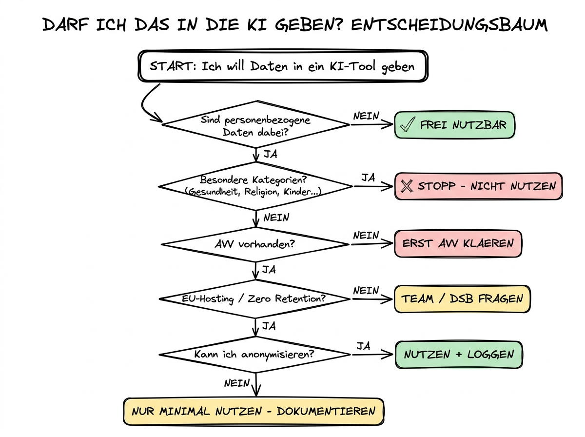

# 07 Praxisleitfaden — Checklisten und Entscheidungshilfen

**Die Arbeits­werkzeuge für den Alltag: Checklisten, Entscheidungs­baum, Muster-Prompts und eine Team-Leitlinie zum Über­nehmen.**

---

## Warum dieses Tutorial?

Die vorherigen sechs Teile haben Sie auf das Thema vorbereitet. Dieser letzte Teil ist der, der neben Ihrem Schreibtisch liegen sollte, wenn Sie morgen früh mit KI arbeiten. Er bündelt alles, was Sie wissen müssen, in Form von Check­listen, Entscheidungs­hilfen und Muster-Vorlagen — so, dass Sie in kritischen Momenten nicht lange suchen müssen.

Dieses Kapitel ist bewusst redundant zu den vorherigen Teilen: Sie werden Konzepte wieder­sehen, die schon in 02, 03 oder 04 auftauchten. Das ist Absicht. Eine Check­liste ist nur nützlich, wenn sie für sich steht und nicht auf zehn anderen Abschnitten aufbaut, die Sie erst nachschlagen müssen.

Nutzen Sie dieses Kapitel, wie Sie es brauchen: Kopieren Sie die Check­listen in Ihr eigenes System. Stellen Sie sie als Poster in Ihr Büro. Schicken Sie die Team-Leitlinie als Word-Dokument an Ihre Kollegen­schaft. Ausdrucken und an die Wand heften ist legitim. Das Ziel ist, dass Sie morgen Nachmittag unter Zeit­druck nicht nach­denken müssen, sondern zugreifen können.

**Was Sie nach diesem Tutorial wissen werden:**

- Sie haben eine Tages­routine im Kopf, die die wichtigsten Ethik- und Sicherheits­fragen auto­matisch abdeckt.
- Sie besitzen Copy-paste-fertige Prompts, die häufige Risiko­situationen abfedern.
- Sie können einen Entscheidungs­baum durchlaufen, der Ihnen in unter einer Minute die Kern­frage beantwortet: „Darf ich das hier gerade machen?"
- Sie haben eine Team-Leitlinie zum Adaptieren, mit der Ihr Team oder Ihre Abteilung die Grund­sätze gemeinsam leben kann.



## Die Tages­routine: drei Fragen, 30 Sekunden

Jeden Tag werden Sie mit KI arbeiten. Die folgende Routine ist so knapp, dass sie nach einer Woche zur Gewohnheit wird. Stellen Sie sich bei jeder nicht-trivialen KI-Inter­aktion diese drei Fragen:

**1. Was für Daten kommen rein? (Ampel)** Rot, gelb oder grün? Bei Rot: abbrechen oder anonymi­sieren. Bei Gelb: nur mit Business-Tarif und AVV. Bei Grün: weiter.

**2. Was für Aussagen kommen raus? (Faktencheck)** Enthält der Output konkrete Zahlen, Quellen, Namen, Gesetze, Daten­angaben? Wenn ja: Faktencheck einplanen, bevor der Output weiter­verwendet wird.

**3. Was passiert mit dem Output? (Konsequenz)** Bleibt er bei mir, geht er an eine Person, wird er veröffent­licht, beeinflusst er eine Entscheidung über einen Menschen? Je weiter außen, desto gründlicher muss die Prüfung sein.

Das ist der komplette Kern. Alles Weitere in diesem Kapitel ist Verfeinerung.

## Checkliste: Bevor Sie eine Datei in Cowork oder Claude Code öffnen

Diese Checkliste läuft im Kopf ab, wenn Sie einen Ordner als Arbeits­ordner auswählen oder eine Datei hochladen.

- [ ] Ist der Ordner-Inhalt bewusst gewählt, oder sind zufällige alte Dateien drin?
- [ ] Liegen im Ordner personen­bezogene Daten, die ich nicht bewusst teilen will (Bewerbungen, Gehalts­listen, private E-Mails, Chat-Verläufe)?
- [ ] Liegen im Ordner Gesund­heits­daten, Berufs­geheimnisse oder ähnliche „rote" Kategorien?
- [ ] Liegen im Ordner API-Schlüssel, Passwörter, `.env`-Dateien oder andere Secrets?
- [ ] Nutze ich einen Tarif mit AVV (Claude Team/Enterprise oder vergleichbar)?
- [ ] Ist mein Arbeit­geber oder Datenschutz­beauftragter mit dem Einsatz des Tools einverstanden?
- [ ] Habe ich die Nutzungs­bedingungen des Tools gelesen oder zumindest über­flogen?

Wenn Sie eine dieser Fragen mit „nein" oder „unsicher" beantworten, ist der richtige Schritt: Anhalten, klären, dann weiter­machen. Der Zeit­verlust eines Moments der Klarheit ist immer kleiner als der Zeit­verlust eines Daten­schutz­vorfalls.

## Checkliste: Bevor Sie einen KI-Output veröffent­lichen

Diese Checkliste gilt für alles, was Sie aus Ihrer internen KI-Arbeit heraus in die Welt schicken — Blog­beiträge, Newsletter, Präsen­tationen, Kunden­mails mit nennens­werter Substanz.

- [ ] Habe ich alle konkreten Fakten (Zahlen, Namen, Daten, Gesetze, Quellen) unabhängig geprüft?
- [ ] Habe ich mindestens eine Primär­quelle für jede wichtige Aussage?
- [ ] Sind alle zitierten Studien oder Urteile real?
- [ ] Ist der Ton konsistent und angemessen für die Zielgruppe?
- [ ] Enthält der Text versteckte Stereotypen oder einseitige Darstel­lungen?
- [ ] Ist der Text auch für eine kritische Leserin angenehm oder würde sie stutzen?
- [ ] Wenn der Text an Kundinnen geht: Würde ich ihn aus ihrer Perspektive gut finden?
- [ ] Ist eine Kennzeichnung als KI-unter­stützt angemessen oder sogar verpflichtend (z.B. in wissen­schaftlichen Kontexten)?
- [ ] Bei Bildern: Sind Persön­lich­keits­rechte beachtet? Bei bekannten Personen: explizite Zustim­mung?
- [ ] Sind realistische KI-Bilder bei Bedarf als solche gekennzeichnet (AI-Act-Transparenz­pflicht)?

## Checkliste: Wenn Sie ein Hoch­risiko-System einführen

Diese Checkliste gilt nur, wenn Sie in einem der AI-Act-Hoch­risiko-Felder arbeiten: Personal­auswahl, Kreditvergabe, Bildungs­bewertung, medizinische Diagnostik, Strafverfolgung. Wenn Sie hier landen, ist die folgende Liste Minimum, nicht Vollständigkeit — bitte holen Sie auch juristische Begleitung.

- [ ] Ist der Anbieter bereit, mir eine AI-Act-Konformitäts­erklärung oder ein vergleich­bares Dokument zu liefern?
- [ ] Wurde eine Grund­rechte-Folgen­abschätzung durchgeführt?
- [ ] Ist eine DSGVO-Daten­schutz-Folgen­abschätzung (DSFA) vorhanden?
- [ ] Ist der Betriebs­rat einge­bunden (bei Personal­themen mitbestimmungs­pflichtig)?
- [ ] Sind Log-Aufbe­wahrungs-Prozesse aufgesetzt (mindestens sechs Monate)?
- [ ] Gibt es eine klare Regelung, welcher Mensch wann wie in die auto­matische Ent­scheidung eingreifen kann?
- [ ] Sind die betrof­fenen Personen über den Einsatz informiert?
- [ ] Ist eine Bias-Analyse der Trainings- und Test­daten durchgeführt und dokumentiert?
- [ ] Gibt es einen Verantwort­lichen, der für die Über­wachung des Systems persönlich zuständig ist?

## Der Entscheidungs­baum: „Darf ich das hier gerade machen?"

Der folgende Baum ist das praktische Herz­stück dieses Kapitels. Er läuft in fünf Fragen ab und endet mit einer klaren Handlungs­anweisung.

**Frage 1: Enthalten meine Eingaben personen­bezogene Daten?**

- Nein → Weiter bei Frage 3.
- Ja → Weiter bei Frage 2.

**Frage 2: Verwende ich einen KI-Dienst, mit dem ich einen Auftrags­verarbeitungs­vertrag habe?**

- Nein → **STOPP.** Wechseln Sie auf einen Business-/Enterprise-Tarif oder anonymi­sieren Sie die Daten vollständig.
- Ja → Weiter bei Frage 3.

**Frage 3: Handelt es sich um besonders sensible Daten (Gesundheits­daten, Berufs­geheimnisse, Art.-9-Kategorien)?**

- Nein → Weiter bei Frage 4.
- Ja → **STOPP.** Besondere Kategorien brauchen eigene Rechts­grundlagen und sind in normalem KI-Einsatz praktisch nicht zu legalisieren. Suchen Sie juristische Begleitung oder verzichten Sie.

**Frage 4: Entscheidet die KI autonom über einen Menschen (Bewerbung, Kredit, Note, Zugangs­berechtigung)?**

- Nein → Weiter bei Frage 5.
- Ja → **STOPP.** Voll­automatische Entschei­dungen sind nach DSGVO Art. 22 in den allermeisten Fällen verboten. Bauen Sie mensch­liche Über­prüfung ein oder setzen Sie das System um. Hoch­risiko nach AI Act ab August 2026 — Compliance-Vorbereitung nötig.

**Frage 5: Verwende ich den Output direkt in einer Publikation oder Entscheidung ohne Faktencheck?**

- Nein, ich mache Faktencheck → **GO.** Sie sind im sicheren Bereich.
- Ja → **Anhalten.** Nicht stoppen, aber den Faktencheck aus Teil 04 durchlaufen, bevor Sie weiter­verwenden.

Dieser Entscheidungs­baum ist in der Illustration am Anfang dieses Kapitels visualisiert. Die Logik ist robust: Sie kommt durch die vier häufigsten Fehler­situationen (fehlender AVV, sensible Daten, vollautomatische Ent­scheidungen, ungeprüfter Output) und filtert sie heraus. Die 80 % Ihrer KI-Nutzung, die in den sicheren Bereich fallen, durchlaufen den Baum in unter zehn Sekunden.

## Muster-Prompts für typische Risiko­situationen

Die folgenden Prompts sind als Bausteine gedacht. Kopieren Sie sie in Ihre Arbeit, passen Sie sie an, ergänzen Sie Ihre konkreten Details.

### Muster-Prompt 1: Faktencheck eines vorhandenen Textes

```
Im folgenden Text sind einige Fakten, die ich überprüfen möchte.

Bitte markiere alle konkreten Aussagen, die mit Quellen belegt
werden sollten:
- Zahlen und Statistiken
- Personen­namen und biografische Details
- Datums­angaben
- Zitate oder Referenzen
- Rechtliche Angaben

Für jede markierte Aussage gib an:
1. Wie sicher du dir bist, dass die Aussage stimmt (hoch / mittel / niedrig)
2. Welche Primär­quelle man konsul­tieren sollte
3. Ob die Aussage umstritten ist oder als allgemein anerkannt gilt

Hier ist der Text:

[Text einfügen]
```

### Muster-Prompt 2: Bias-Check für eine Personal­entscheidung

```
Ich habe eine kurze Beschreibung mehrerer Kandidatinnen und Kandidaten
für eine Stelle. Ich möchte keine automatische Vorauswahl, aber ich
möchte deine Hilfe dabei, möglichen Bias in meiner eigenen Wahr­nehmung
zu erkennen.

Schaue dir die Beschreibungen an und frage mich: Worin unter­scheiden
sich die Kandidatinnen und Kandidaten in Merkmalen, die für die Stelle
eigentlich nicht relevant sein sollten (Alter, Geschlecht, Herkunft,
Karriere­lücken, Ausbildungs­pfad)?

Nenne mir drei Dinge, die ich bei meiner eigenen Bewertung gedanklich
neutralisieren sollte, damit meine Entscheidung auf beruflichen
Qualifikationen basiert.

Triff bitte ausdrück­lich keine Entscheidung. Ich übernehme die Verant­wortung.

Hier sind die Beschreibungen:

[einfügen]
```

### Muster-Prompt 3: Ausgewogene politische Darstellung

```
Ich schreibe einen Text zum Thema [X]. Das Thema ist politisch umstritten.

Bitte liefere mir:
1. Die drei stärksten Argumente für Position A
2. Die drei stärksten Argumente für Position B
3. Die drei stärksten Argumente für eine dritte, mittlere Position
4. Die zentralen Annahmen, auf denen jede Position basiert
5. Eine Liste von Fakten, die für alle Positionen unbestritten sind

Keine eigene Wertung, keine Schluss­folgerung. Ich möchte die Darstel­lung
der Positionen, nicht deine Meinung dazu.
```

### Muster-Prompt 4: Prüfung eines KI-Textes auf Stereotypen

```
Im folgenden Text wurden Personen beschrieben. Prüfe, ob die
Beschrei­bungen Stereo­typen enthalten:

- Werden Rollen oder Berufe mit einem bestimmten Geschlecht verknüpft,
  wo das nicht nötig wäre?
- Werden Menschen bestimmter Herkunft mit bestimmten Eigenschaften
  verknüpft?
- Sind die Altersangaben oder Beschreibungen konsistent über
  die verschiedenen Personen?

Gib mir eine Liste der Stellen, an denen ich den Text verändern sollte,
um ihn stereotyp­freier zu machen, ohne dass die Aussage darunter leidet.

Hier ist der Text:

[einfügen]
```

### Muster-Prompt 5: DSGVO-Ampel für einen Upload

```
Ich überlege, die folgenden Daten in ein KI-Tool einzugeben.
Sag mir bitte:

1. Welche Ampel­farbe (rot / gelb / grün) das aus DSGVO-Sicht hat
2. Welche Kategorien personen­bezogener Daten enthalten sind
3. Ob besondere Kategorien nach Art. 9 DSGVO dabei sind
4. Welche Bedingungen erfüllt sein müssten, damit der Upload zulässig ist
5. Welche Anonymi­sierung praktikabel wäre, um die Ampel auf Grün zu bringen

Die Daten sind:

[einfügen — oder: eine Beschreibung der Daten, nicht die Daten selbst]
```

Der letzte Punkt ist wichtig: Wenn Sie die Ampel selbst bewerten wollen, machen Sie das anhand einer **Beschreibung** der Daten, nicht indem Sie die sensiblen Daten selbst hochladen. Sonst haben Sie das Problem, das Sie eigentlich lösen wollten.

## Eine Team-Leitlinie zum Über­nehmen

Die folgende Vorlage können Sie in ein internes Wiki, ein Confluence-Doku­ment oder eine einfache E-Mail an Ihr Team kopieren. Passen Sie die Beispiele an Ihre Organisation an.

---

**Interne Leitlinie: KI-Nutzung in [Organisation]**

*Stand: [Datum], Ver­antwort­lich: [Name]*

Wir nutzen KI produktiv, weil sie uns klüger und schneller macht. Wir nutzen sie verant­wortungs­voll, weil wir die Erwartungen unserer Kundinnen und unserer Mitarbeiter­innen ernst nehmen. Diese Leitlinie beschreibt, was für alle gilt.

**1. Zugelassene Werk­zeuge.** In unserer Organisation verwenden wir die folgenden KI-Tools: [Liste]. Wir haben mit den Anbietern Auftrags­verarbeitungs­verträge abgeschlossen. Die Nutzung anderer KI-Tools mit realen Unternehmens­daten ist nicht zulässig.

**2. Was darf rein und was nicht.** In die zugelassenen Tools darf:
- öffentlich zugängliche Information
- anonymi­sierte oder fiktive Daten
- interne Dokumente, die keine personen­bezogenen Daten enthalten
- personen­bezogene Daten im normalen Umfang (Kunden­kontakte, Lieferanten, interne E-Mails)

Nicht hineinkommen:
- Gesundheits­daten, biometrische Daten, Angaben zu Religion oder sexueller Orientierung
- Berufs­geheimnisse (bei uns: [Liste])
- Passwörter, API-Schlüssel, Zugangs­daten
- Dokumente mit Vertrau­lich­keits­stufe „streng vertrau­lich"

**3. Die Ampel vor jedem Upload.** Bevor Sie Daten in ein KI-Tool laden, gehen Sie die Ampel aus Kapitel 14 unseres internen KI-Tutorials durch. Rot → nicht hochladen. Gelb → einmal kurz überlegen, ob es wirklich sein muss, und dann über ein Business-Tool hochladen. Grün → freie Fahrt.

**4. Faktencheck-Pflicht.** Jeder KI-Output, der nach außen geht (Kundenkommunikation, Publikation, offizielle Dokumente), wird vorher auf Fakten geprüft. Konkret: alle Zahlen, Namen, Daten, rechtlichen Angaben und Quellen­zitate werden gegen eine Primär­quelle verifiziert. Der Faktencheck wird knapp dokumentiert.

**5. Entscheidungen über Menschen.** KI darf bei uns keine autonomen Entschei­dungen über Menschen treffen. Sie darf Analysen und Empfehlungen liefern. Den finalen Beschluss fasst immer ein Mensch, der den Vorgang versteht und die Verant­wortung trägt. Das gilt besonders für Personal­entscheidungen, Kunden­bewertungen und Vertrags­angelegen­heiten.

**6. Transparenz.** Wir kennzeichnen in unserer öffent­lichen Kommuni­kation, wenn wesentliche Inhalte KI-unterstützt entstanden sind. „Wesentlich" heißt: mehr als nur Tipp­fehler-Korrektur. In internen Doku­menten ist Kenn­zeichnung optional, aber begrüßt.

**7. Schulung und Nachfragen.** Jede Mitarbei­terin und jeder Mitarbeiter, die regelmäßig mit KI arbeitet, durchläuft eine interne Einführung (Kapitel 00 bis 14 unseres Tutorials) und darf jeder­zeit bei [Name, E-Mail] nachfragen, wenn etwas unklar ist. Das ist auch unsere AI-Literacy-Dokumentation nach Art. 4 AI Act.

**8. Wenn etwas schiefgeht.** Wenn Sie versehentlich sensible Daten in ein nicht zulässiges Tool gegeben haben oder ein KI-generierter Output einen Fehler produziert hat: Melden Sie es sofort bei [Name]. Wir behandeln solche Meldungen ohne Schuld­zuweisung und nutzen sie, um unsere Prozesse zu verbessern.

**9. Über­prüfung dieser Leitlinie.** Diese Leitlinie wird halbjähr­lich geprüft, weil sich sowohl die Technik als auch die Rechts­lage schnell weiter­entwickeln. Änderungs­vorschläge gerne an [Name].

---

Diese Vorlage ist als Start­punkt gedacht. Kürzen Sie, was für Ihre Organisation nicht passt. Ergänzen Sie branchen­spezifische Details. Tauschen Sie die Beispiele gegen Ihre realen Tools und Namen. Die Mustervorlage ist in etwa das, was eine ordentliche Aufsichts­behörde bei einer KMU-Prüfung sehen möchte: knapp, klar und konse­quent angewendet.

## Muster-E-Mail an Ihren Datenschutz­beauftragten

Wenn Sie mit KI starten wollen, ist ein frühes Gespräch mit dem oder der Datenschutz­beauftragten gut investierte Zeit. Hier ein Muster, das Sie anpassen und versenden können:

```
Betreff: KI-Einsatz [Tool­name] — Vorabstim­mung Datenschutz

Hallo [Name],

wir würden gern im Team das Tool [XY] für folgende Aufgaben
einsetzen:

- [kurze Beschrei­bung 1]
- [kurze Beschrei­bung 2]

Stand unserer Recherche:
- Der Anbieter stellt einen Auftrags­verarbeitungs­vertrag zur Verfügung
  (Link: [URL])
- Die Daten werden [in der EU / in den USA unter DPF / Zero Data
  Retention] verarbeitet
- Wir planen, die Ampel aus unserer internen KI-Leitlinie konsequent
  anzuwenden und keine roten Kategorien einzugeben

Können Sie bitte prüfen, ob es aus Ihrer Sicht weitere Schritte
braucht (DSFA, Ergänzung des Verarbeitungs­verzeichnisses, Betriebs­rats-
information)?

Gerne stimme ich mich mit Ihnen in einem 15-Minuten-Call ab.

Vielen Dank vorab,
[Name]
```

Das wirkt professio­nell und nimmt Ihrem Datenschutz­beauftragten viel Recherche­arbeit ab. Die meisten Datenschutz­beauftragten freuen sich über Anfragen in dieser Form, weil sie zeigen, dass Sie Ihre Hausauf­gaben gemacht haben und nicht einfach „irgendwas" machen wollen.

## Sechs Merk­sätze für den Schreibtisch

Wenn Sie nichts anderes aus diesem Kapitel mitnehmen, dann diese sechs Sätze. Drucken Sie sie aus, wenn Sie möchten. Hängen Sie sie neben den Monitor.

1. **Nichts Sensibles in ein Tool ohne Auftrags­verarbeitungs­vertrag.**
2. **Jede konkrete Zahl, jede Quelle, jede Gesetzes­stelle unab­hängig prüfen.**
3. **Kein vollautomatisches Entscheiden über Menschen.**
4. **Immer die Gegen­frage stellen, bevor Sie sich bestätigt fühlen.**
5. **Kennzeichnen Sie, wenn die Empfängerin es wissen sollte.**
6. **Wenn Sie unsicher sind, fragen Sie jemanden — nicht die KI, sondern einen Menschen, der Verant­wortung trägt.**

## Stärken und Schwächen eines Leitfadens wie diesem

**Stärken:**

- Gibt Ihnen Hand­lungs­fähig­keit in konkreten Situationen.
- Kostet wenig Zeit in der Anwendung, sobald die Routine sitzt.
- Liefert eine Dokumentation, die Sie gegenüber Dritten (Aufsicht, Kunden, Vorgesetzte) vorzeigen können.

**Schwächen:**

- Ersetzt keine individu­elle Rechts­prüfung bei komplexen Fällen.
- Wird im Laufe der Zeit veralten und muss gepflegt werden.
- Funktioniert nur, wenn Sie ihn tatsäch­lich anwenden — eine im Schrank abgelegte Leitlinie ist nutzlos.

## Zusammen­fassung in 60 Sekunden

Dieses Kapitel war der Werkzeugkasten: eine Tages­routine aus drei Fragen, Check­listen für Cowork-Uploads, Publikationen und Hoch­risiko-Einsätze, ein Entscheidungs­baum mit fünf Fragen, fünf Muster-Prompts für typische Situationen und eine Team-Leitlinie zum Adaptieren. Die Kern­botschaft: Verantwortungs­volle KI-Nutzung ist kein Bruch mit der produk­tiven Nutzung, sondern die Bedin­gung dafür, dass sie langfristig funktioniert. Die wenigen Minuten, die Sie in eine Ampel, einen Faktencheck oder eine Kenn­zeichnung investieren, ersparen Ihnen Stunden bei einem Vorfall. Und sie sind der Unter­schied zwischen „wir haben KI produktiv einge­führt und beherr­schen sie" und „wir nutzen halt irgend­wie ChatGPT und hoffen, dass nichts passiert".

## Nächste Schritte und Abschluss des Kapitels

Sie haben damit Kapitel 14 abgeschlossen — das ethisch-rechtliche Rückgrat dieses Tutorial-Repos. Die drei nächsten Empfehlungen:

**1. Nehmen Sie sich eine Stunde und adaptieren Sie die Team-Leitlinie.** Machen Sie aus der Vorlage ein Dokument, das zu Ihrer Organisation passt. Verschicken Sie es im Team. Das ist der konkreteste Schritt, den Sie aus diesem Kapitel ableiten können.

**2. Legen Sie eine „Faktencheck-Dokumentation" an.** Ein einfaches Dokument, in dem Sie fortlaufend festhalten, welche Fakten Sie bei welchen KI-Outputs geprüft haben. Das dient als Nachweis Ihrer Sorgfalts­pflicht und als Routine­builder.

**3. Sprechen Sie mit Ihrem Datenschutz­beauftragten über den aktuellen Stand Ihres KI-Einsatzes.** Nutzen Sie die Muster-E-Mail, wenn Sie möchten. Ein früher Kontakt ist immer besser als ein später.

Wenn Sie Lust auf mehr haben, sind Ihre logischen Nächste-Kapitel-Ziele:

- **Kapitel 09 (KI-Tool-Landschaft 2026)** für einen detail­lierten Tool- und Anbieter­vergleich
- **Kapitel 10 (Claude-Infrastruktur)** für die konkrete Arbeit mit Cowork und Claude Code — jetzt mit dem Rüstzeug aus Kapitel 14
- **Kapitel 03 (GPTs und Projekte)**, speziell die Persona „KI-Recht­sexpertin", als inter­aktiver Sparring­spartner für konkrete Rechts­fragen

Und wenn in Zukunft neue Kapitel erscheinen — Kapitel 11 (KI & Daten), 12 (KI-Agenten), 13 (Content-Workflow), 15 (KI im Team) — wenden Sie die Grund­sätze aus diesem Kapitel dort weiter an. Das Rüst­zeug bleibt dasselbe; die Anwendungs­felder ändern sich.

Danke, dass Sie sich durch ein Kapitel gearbeitet haben, das auf den ersten Blick trocken klingt. Die Wahrheit ist: Dieses Kapitel ist das, was den Unter­schied zwischen gelegent­licher KI-Spielerei und professio­neller KI-Praxis ausmacht. Sie haben die Grundlage jetzt.
